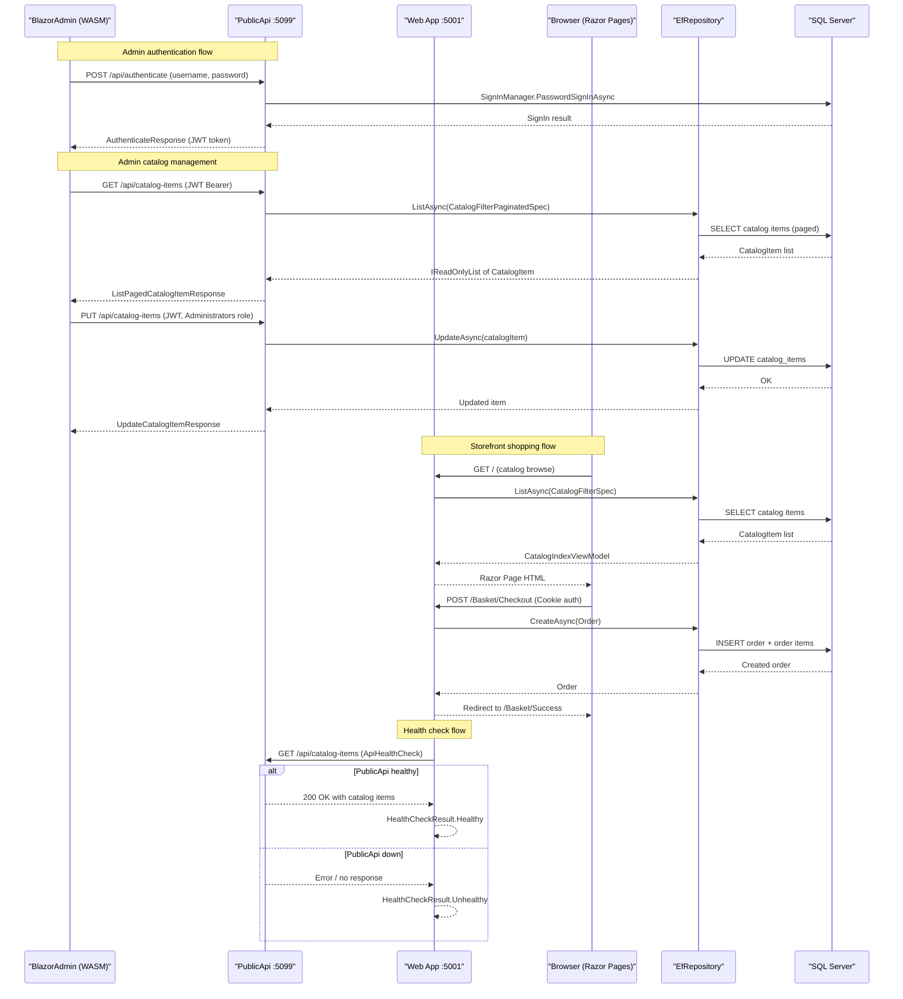

# API & Service Communication Contracts

eShopOnWeb exposes a REST API through two independently deployable services: an ASP.NET Core Razor Pages web app and a dedicated Public API service, with a Blazor WebAssembly admin client consuming the Public API over HTTP/JSON.

## Service Catalog

| Service | Port | Category | Purpose |
|---------|------|----------|---------|
| Web (eShopWeb) | 5001 (HTTPS 44315) | API Layer / BFF | Razor Pages storefront + internal API controllers for basket, order, and user management |
| PublicApi | 5099 | API Layer | External REST API for catalog management and authentication; consumed by BlazorAdmin |
| BlazorAdmin | (served via Web) | Business | Blazor WebAssembly admin SPA; calls PublicApi for catalog CRUD and auth |

## API Endpoints Inventory

### PublicApi Service

| Method | Path | Request Type | Response Type | Auth Required |
|--------|------|-------------|---------------|--------------|
| POST | /api/authenticate | AuthenticateRequest (username, password) | AuthenticateResponse (token, result flags) | None |
| GET | /api/catalog-items | Query: pageSize, pageIndex, catalogBrandId, catalogTypeId | ListPagedCatalogItemResponse | None |
| GET | /api/catalog-items/{catalogItemId} | Path: catalogItemId (int) | GetByIdCatalogItemResponse | None |
| POST | /api/catalog-items | CreateCatalogItemRequest | CreateCatalogItemResponse | JWT (Administrators role) |
| PUT | /api/catalog-items | UpdateCatalogItemRequest | UpdateCatalogItemResponse | JWT (Administrators role) |
| DELETE | /api/catalog-items/{catalogItemId} | Path: catalogItemId (int) | DeleteCatalogItemResponse | JWT (Administrators role) |
| GET | /api/catalog-types | None | ListCatalogTypesResponse | None |
| GET | /api/catalog-brands | None | ListCatalogBrandsResponse | None |

### Web Service (Internal MVC Controllers)

| Method | Path | Request Type | Response Type | Auth Required |
|--------|------|-------------|---------------|--------------|
| GET/POST | /Basket/Index | — / BasketViewModel | Razor Page | Cookie |
| GET/POST | /Basket/Checkout | — / BasketViewModel | Razor Page | Cookie |
| GET | /Basket/Success | — | Razor Page | Cookie |
| GET | /Order | — | Razor Page | Cookie (Buyers role) |
| GET | /Admin/Index | — | Razor Page | Cookie (Administrators role) |
| GET/POST | /Admin/EditCatalogItem | id (int) | Razor Page | Cookie (Administrators role) |

## Management & Observability Endpoints

| Service | Endpoint | Purpose | Custom Metrics |
|---------|----------|---------|---------------|
| Web | /health | Aggregate health status (JSON) | — |
| Web | /home_page_health_check | Checks home page returns catalog items | Fetches home page, looks for product content |
| Web | /api_health_check | Checks PublicApi catalog-items endpoint | Calls PublicApi /api/catalog-items |
| PublicApi | /swagger | Swagger UI for API exploration | — |
| PublicApi | /swagger/v1/swagger.json | OpenAPI v1 specification | — |

## DTOs & Contracts

All DTOs are defined in the `PublicApi` project and in `BlazorShared`. Serialization uses `System.Text.Json` (ASP.NET Core default). Swashbuckle annotations (`[SwaggerOperation]`) are applied to document operation IDs, summaries, and tags. A custom `CustomSchemaFilters` class is registered to augment the OpenAPI schema.

**Request DTOs (request body or query parameters):**
- `AuthenticateRequest` — username and password for token issuance
- `ListPagedCatalogItemRequest` — pagination and filter parameters (query string)
- `GetByIdCatalogItemRequest` — path-bound catalog item ID
- `CreateCatalogItemRequest` — new catalog item data
- `UpdateCatalogItemRequest` — updated catalog item data (includes ID)
- `DeleteCatalogItemRequest` — path-bound catalog item ID

**Response DTOs:**
- `AuthenticateResponse` — JWT token and sign-in result flags (IsLockedOut, IsNotAllowed, RequiresTwoFactor)
- `ListPagedCatalogItemResponse` — paged list of `CatalogItemDto`
- `GetByIdCatalogItemResponse` — single `CatalogItemDto`
- `CreateCatalogItemResponse` / `UpdateCatalogItemResponse` / `DeleteCatalogItemResponse` — operation result wrappers
- `ListCatalogTypesResponse` / `ListCatalogBrandsResponse` — lists of `CatalogTypeDto` / `CatalogBrandDto`

**Shared DTOs (BlazorShared):**
- `CatalogItemDto` — catalog item projection shared between PublicApi and BlazorAdmin
- `CatalogTypeDto` / `CatalogBrandDto` — reference data projections

DTOs are plain C# classes (not records); no immutability guarantee is enforced. Full field definitions are in `data-architecture.md`.

## Communication Patterns

**Synchronous (HTTP/REST):**
- BlazorAdmin (Blazor WebAssembly) → PublicApi: `HttpClient` injected via DI; base URL configured from `appsettings.json` `baseUrls.apiBase`. All calls are HTTPS in production.
- Web → PublicApi: The `ApiHealthCheck` makes a raw `HttpClient.GetAsync` call to `/api/catalog-items` to verify liveness. No shared `HttpClientFactory` is used; each health-check creates a new `HttpClient` instance (potential socket exhaustion risk).
- No gRPC, message queues, or event-driven patterns are present.

**Resilience policies:**
No explicit circuit breaker, retry, or timeout policies (Polly or similar) are configured. The application relies on SQL Server's built-in retry (`sqlOptions.EnableRetryOnFailure()`) in production mode only. HTTP client calls have no timeout configuration.

**Service discovery:**
Services are addressed by hardcoded base URL from `appsettings.json` (`baseUrls.apiBase`, `baseUrls.webBase`). No service registry (Consul, Eureka, Kubernetes DNS) is used. The Web service uses `baseUrlConfig.WebBase` trimmed and validated to configure CORS in PublicApi.

**API gateway:**
No API gateway is present. BlazorAdmin calls PublicApi directly. The Web app has no gateway layer.

**Security posture:**
- **PublicApi**: JWT ****** bearer tokens issued by `/api/authenticate` using a symmetric HMAC-SHA-256 key (`AuthorizationConstants.JWT_SECRET_KEY`). Issuer and audience validation are **disabled** (`ValidateIssuer = false`, `ValidateAudience = false`). HTTPS metadata is **not required** for JWT (`RequireHttpsMetadata = false`). Write endpoints (POST/PUT/DELETE catalog items) require the `Administrators` role. Read endpoints are unauthenticated. CORS is configured to allow only the `webBase` origin.
- **Web**: Cookie authentication with `HttpOnly`, `Secure`, and `SameSite=Lax` flags. Role-based access on Admin and Order pages.
- **Security risk**: The JWT signing key is hardcoded as a constant (`AuthorizationConstants.JWT_SECRET_KEY`) and `ValidateIssuer`/`ValidateAudience` are both disabled, which weakens token security in production.

## Service Technology Matrix

| Service | Web Framework | Data Access | Discovery | Gateway | Health Checks | Cache | Metrics |
|---------|-------------|-------------|-----------|---------|--------------|-------|---------|
| Web | ASP.NET Core Razor Pages / MVC | EF Core (via Infrastructure) | None (hardcoded URLs) | None | /health, /home_page_health_check, /api_health_check | In-process decorator | None |
| PublicApi | ASP.NET Core Minimal API (Ardalis.ApiEndpoints) | EF Core (via Infrastructure) | None | None | None | MemoryCache | Swagger/OpenAPI |
| BlazorAdmin | Blazor WebAssembly | None (calls PublicApi) | None | None | None | Blazored.LocalStorage | None |

## Service Communication Sequence

