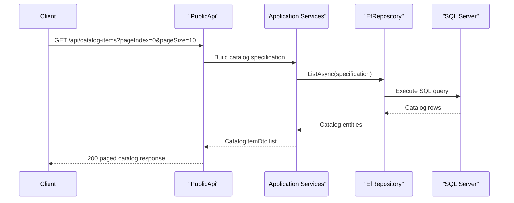

# API & Service Communication Contracts

The solution exposes HTTP endpoints through both the Web host and the Public API host, with predominantly synchronous request-response communication over HTTPS.

## Service Catalog

| Service | Port | Category | Purpose |
|---|---|---|---|
| Web (`src/Web`) | 44315 (config) | API Layer | MVC/Razor customer experience and authenticated user flows |
| PublicApi (`src/PublicApi`) | 5099 (config) | API Layer | Catalog CRUD/listing and token issuance endpoints |
| SQL Server (`docker-compose`) | 1433 | Infrastructure | Persistent catalog/order/basket/identity storage |

## API Endpoints Inventory

| Service | Method | Path | Request Type | Response Type |
|---|---|---|---|---|
| PublicApi | GET | `/api/catalog-items` | query: pageSize,pageIndex,catalogBrandId,catalogTypeId | paged catalog item DTO list |
| PublicApi | GET | `/api/catalog-items/{catalogItemId}` | path parameter | catalog item DTO / 404 |
| PublicApi | POST | `/api/catalog-items` | `CreateCatalogItemRequest` | created catalog item DTO |
| PublicApi | PUT | `/api/catalog-items` | `UpdateCatalogItemRequest` | updated catalog item DTO / 404 |
| PublicApi | DELETE | `/api/catalog-items/{catalogItemId}` | path parameter | 200/404 result |
| PublicApi | GET | `/api/catalog-brands` | none | catalog brand DTO list |
| PublicApi | GET | `/api/catalog-types` | none | catalog type DTO list |
| PublicApi | POST | `/api/authenticate` | login request body | JWT token response |
| Web | GET | `/User` | authenticated context | user info payload |
| Web | POST | `/User/Logout` | none | logout result |
| Web | GET | `/Order/MyOrders` | authenticated context | order view models |
| Web | GET | `/Order/Detail/{orderId}` | path parameter | order detail view model |

## Management & Observability Endpoints

| Service | Endpoint | Custom Metrics (if any) |
|---|---|---|
| Web | `/health` | standard health check payload |
| Web | `/home_page_health_check` | tagged home-page health probe |
| Web | `/api_health_check` | tagged API dependency health probe |
| PublicApi | `/swagger`, `/swagger/v1/swagger.json` | OpenAPI metadata exposure |

## DTOs & Contracts

Public API contracts are implemented with request/response DTO classes such as `CatalogItemDto`, `CatalogBrandDto`, `CatalogTypeDto`, `CreateCatalogItemRequest`, `UpdateCatalogItemRequest`, and paged list request models. Web host contracts include view models used by MVC and Razor pages for order and basket flows. JSON serialization relies on ASP.NET Core defaults (`System.Text.Json`) and Swagger annotations in API endpoints. There is no protobuf or GraphQL schema in this codebase.

## Communication Patterns

Communication is primarily synchronous HTTP between clients and the two ASP.NET hosts. Internal layers communicate via direct service and repository method calls. There is no message broker or async event bus configured. Resilience is mostly delegated to SQL Server retry-on-failure options in production connection configuration; explicit circuit breaker or bulkhead policy implementation is not present. Service discovery is static (configured base URLs), and gateway-style aggregation is minimal. API security is present via ASP.NET Identity, cookie authentication for Web, and JWT bearer setup for PublicApi; HTTPS redirection is enabled in both hosts.

## Service Technology Matrix

| Service | Web | Data Access | Discovery | Gateway | Actuator | Cache | Metrics |
|---|---|---|---|---|---|---|---|
| Web | MVC + Razor Pages + Blazor | EF Core + Identity EF | None | No | Health checks | Memory cache | Health endpoints |
| PublicApi | Minimal APIs + Controllers | EF Core + Identity EF | None | No | Swagger endpoints | Memory cache | Swagger/OpenAPI |

## Service Communication Sequence

