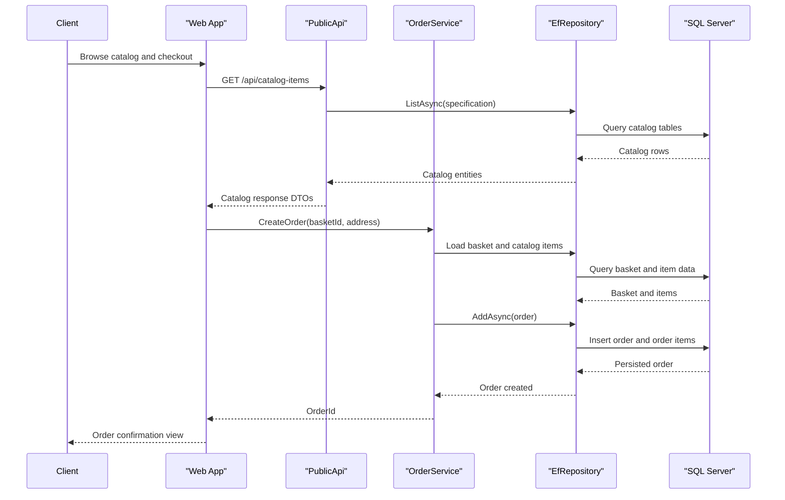

# API & Service Communication Contracts

This codebase exposes a customer-facing web experience and a dedicated public API for catalog and authentication operations. Communication is predominantly synchronous HTTP with repository-backed domain services.

## Service Catalog

| Service | Port | Category | Purpose |
|---|---|---|---|
| Web | 5001/5000 (dev), 5106 (docker) | API Layer | MVC/Razor storefront and Blazor host for customer flows |
| PublicApi | 5099/5098 (dev), 5200 (docker) | API Layer | Catalog and authentication HTTP endpoints for clients |
| ApplicationCore | N/A (library) | Business | Domain services and contracts for basket/order/catalog logic |
| Infrastructure | N/A (library) | Infrastructure | EF Core repositories, DbContexts, and identity implementation |
| SQL Server (container) | 1433 | Infrastructure | Persistence backend for catalog and identity data |

## API Endpoints Inventory

| Service | Method | Path | Request Type | Response Type |
|---|---|---|---|---|
| PublicApi | POST | /api/authenticate | AuthenticateRequest | AuthenticateResponse |
| PublicApi | GET | /api/catalog-items | Query params (pageSize, pageIndex, catalogBrandId, catalogTypeId) | ListPagedCatalogItemResponse |
| PublicApi | GET | /api/catalog-items/{catalogItemId} | Path parameter | CatalogItemDto |
| PublicApi | POST | /api/catalog-items | CreateCatalogItemRequest | CreateCatalogItemResponse |
| PublicApi | PUT | /api/catalog-items | UpdateCatalogItemRequest | IResult (200/404) |
| PublicApi | DELETE | /api/catalog-items/{catalogItemId} | Path parameter | IResult (200/404) |
| PublicApi | GET | /api/catalog-brands | None | CatalogBrandDto[] |
| PublicApi | GET | /api/catalog-types | None | CatalogTypeDto[] |
| Web | GET | /Order/MyOrders | Query string | OrdersViewModel |
| Web | GET | /Order/Detail/{orderId} | Path parameter | OrderDetailViewModel |

## Management & Observability Endpoints

| Service | Endpoint | Custom Metrics (if any) |
|---|---|---|
| Web | /health | ASP.NET Core health check aggregate response |
| Web | /home_page_health_check | Tagged readiness check |
| Web | /api_health_check | Tagged API dependency check |
| PublicApi | /swagger/v1/swagger.json | OpenAPI contract endpoint |
| PublicApi | /swagger | Swagger UI for manual API exploration |

## DTOs & Contracts

Public API contracts are implemented with request/response DTO classes such as `AuthenticateRequest`, `AuthenticateResponse`, `CreateCatalogItemRequest`, `UpdateCatalogItemRequest`, and paged catalog response DTOs. The API layer maps domain entities to outward-facing DTOs using AutoMapper profiles. Domain entities (for example `CatalogItem`, `Basket`, `Order`) remain service-level persistence models, while endpoint DTOs define external wire contracts. The project uses System.Text.Json and Swashbuckle/OpenAPI generation for serialization and contract publication.

## Communication Patterns

The solution primarily uses synchronous HTTP communication: browser clients call Web and PublicApi endpoints, and API handlers invoke domain services and repositories directly in-process. No asynchronous broker-based integration was identified. Resilience is present at the SQL connection layer in production (`EnableRetryOnFailure`). Service discovery is not used; endpoints are configured via explicit base URLs per environment. Security posture includes ASP.NET Core Identity for user management, JWT bearer handling in PublicApi, and cookie authentication in Web; HTTPS redirection is enabled in both web hosts.

## Service Technology Matrix

| Service | Web | Data Access | Discovery | Gateway | Actuator | Cache | Metrics |
|---|---|---|---|---|---|---|---|
| Web | MVC + Razor + Blazor host | EF Core via repository services | None | No | Health checks | Memory cache | Health endpoints |
| PublicApi | ASP.NET Core API + Minimal endpoints | EF Core via repository services | None | No | Swagger + exception middleware | Memory cache | Swagger/OpenAPI |
| ApplicationCore | N/A | Repository abstractions | None | No | No | No | No |
| Infrastructure | N/A | EF Core DbContexts + Identity | None | No | No | No | No |

## Service Communication Sequence

