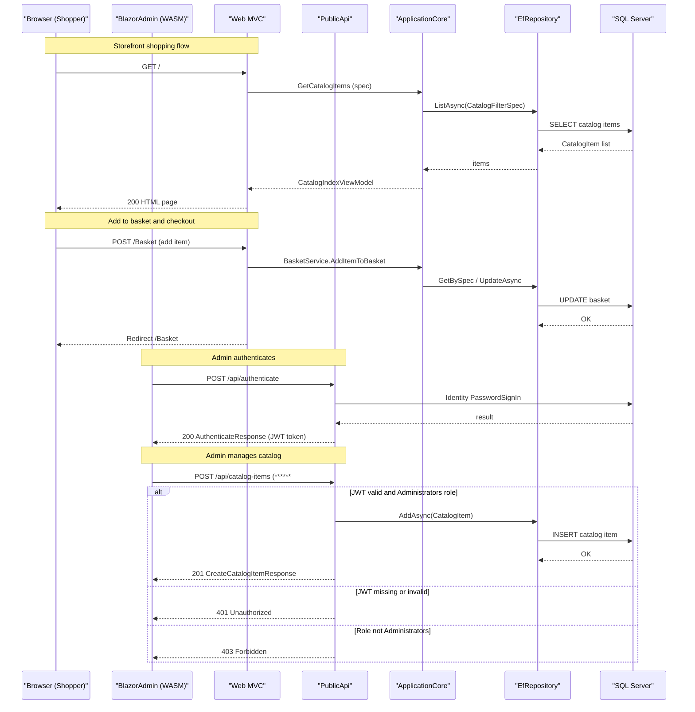

# API & Service Communication Contracts

eShopOnWeb exposes **9 REST API endpoints** across two independently deployable services — the MVC Web storefront (HTTP) and the Public REST API (JWT-secured) — with no asynchronous messaging or inter-service calls between them.

## Service Catalog

| Service | Port (Dev) | Port (Docker) | Category | Purpose |
|---|---|---|---|---|
| Web (MVC Storefront) | 44315 (HTTPS) | 5106:8080 | API Layer / UI | Razor Pages + MVC storefront serving the shopping experience |
| PublicApi (REST API) | 5099 (HTTPS) | 5200:8080 | API Layer | Stateless REST API for catalog management and authentication |
| SQL Server | 1433 | 1433 | Infrastructure | Shared database container (catalog + identity schemas) |

## API Endpoints Inventory

| Service | Method | Path | Request Type | Response Type | Auth |
|---|---|---|---|---|---|
| PublicApi | POST | /api/authenticate | AuthenticateRequest | AuthenticateResponse (+ JWT token) | None (public) |
| PublicApi | GET | /api/catalog-items | ListPagedCatalogItemRequest (query params) | ListPagedCatalogItemResponse | None (public) |
| PublicApi | GET | /api/catalog-items/{catalogItemId} | catalogItemId (path) | GetByIdCatalogItemResponse | None (public) |
| PublicApi | POST | /api/catalog-items | CreateCatalogItemRequest | CreateCatalogItemResponse | JWT (Administrators role) |
| PublicApi | PUT | /api/catalog-items | UpdateCatalogItemRequest | UpdateCatalogItemResponse | JWT (Administrators role) |
| PublicApi | DELETE | /api/catalog-items/{catalogItemId} | catalogItemId (path) | DeleteCatalogItemResponse | JWT (Administrators role) |
| PublicApi | GET | /api/catalog-brands | none | ListCatalogBrandsResponse | None (public) |
| PublicApi | GET | /api/catalog-types | none | ListCatalogTypesResponse | None (public) |
| Web (MVC) | GET/POST | /Basket, /Order, /Account, /Admin | Razor Page model bindings | Razor views (HTML) | Cookie (where required) |

## Management & Observability Endpoints

| Service | Endpoint | Purpose | Custom Metrics |
|---|---|---|---|
| Web | /health | Aggregate health check (all tags) | None |
| Web | /home_page_health_check | Targeted home-page liveness probe | None |
| Web | /api_health_check | Targeted downstream API reachability probe | None |
| PublicApi | /swagger | Swagger UI for API exploration | None |
| PublicApi | /swagger/v1/swagger.json | OpenAPI v1 JSON specification | None |

No Prometheus metrics, Application Insights, or custom metric annotations are configured in either service.

## DTOs & Contracts

All data transfer objects are conventional C# classes (not records) with mutable properties, serialized via `System.Text.Json` (ASP.NET Core 8 default).

**PublicApi DTOs (service-level — catalog domain):**
- `AuthenticateRequest` / `AuthenticateResponse` — login credentials in, JWT token out; `AuthenticateResponse` carries `Token`, `IsLockedOut`, `IsNotAllowed`, `RequiresTwoFactor`
- `CatalogItemDto` — flattened catalog item representation for API responses, including a composed `PictureUri`
- `CatalogBrandDto` / `CatalogTypeDto` — read-only lookup values for filter dropdowns
- `ListPagedCatalogItemRequest` — query parameter binding for `pageSize`, `pageIndex`, `catalogBrandId`, `catalogTypeId`
- `CreateCatalogItemRequest` / `UpdateCatalogItemRequest` / `DeleteCatalogItemRequest` — write operation payloads; write endpoints are Administrators-only
- Base classes `BaseRequest` / `BaseResponse` / `BaseMessage` provide a shared `CorrelationId()` for request tracking

**BlazorAdmin DTOs (client-side — gateway-level consumers):**
The Blazor WASM admin panel calls the PublicApi over HTTP/REST using `System.Net.Http.Json`. It reuses the `BlazorShared` project's request/response models, acting as an API consumer layer rather than exposing its own contract.

**Swagger/OpenAPI**: The PublicApi registers a full Swagger doc via `Swashbuckle.AspNetCore 6.5.0` with `EnableAnnotations()`. `CustomSchemaFilters` customizes schema generation. No `openapi.yaml` or `.proto` files are present.

## Communication Patterns

**Synchronous communication only.** There is no message queue, event bus, or asynchronous messaging in this application. All inter-layer communication is via direct method calls through dependency-injected interfaces.

- **Client → Web**: Browser or Blazor WASM makes HTTP requests to the MVC storefront or REST API respectively.
- **BlazorAdmin → PublicApi**: The Blazor WebAssembly admin panel issues HTTP REST calls (via `HttpClient` / `System.Net.Http.Json`) to the PublicApi. CORS is configured on the PublicApi to allow requests from the configured `WebBase` URL.
- **Web/PublicApi → ApplicationCore**: Services are resolved via ASP.NET Core's built-in DI. `MediatR 12.0.1` is used in the Web project to dispatch `GetMyOrders` and `GetOrderDetails` queries from `OrderController` to in-process handler classes.
- **ApplicationCore → Infrastructure**: Domain interfaces (`IRepository<T>`, `IBasketService`, etc.) are satisfied by Infrastructure implementations (`EfRepository<T>`, `BasketService`, etc.).

**Resilience policies**: No circuit breaker, retry policy, or timeout configuration (e.g., Polly) is implemented. The only retry behavior is SQL Server connection retry-on-failure (`EnableRetryOnFailure()`) configured on the EF Core `DbContext` in production.

**Service discovery**: There is no service registry. The PublicApi URL is configured statically via `baseUrls.apiBase` in `appsettings.json` (default: `https://localhost:5099/api/`). Docker Compose uses fixed host port mappings (`5200:8080`).

**Startup dependency chain**: Both `eshopwebmvc` and `eshoppublicapi` declare `depends_on: sqlserver` in Docker Compose, but no health-check wait is configured — services may start before the database is ready.

**Security posture**:
- **Web (MVC)**: Cookie authentication (`CookieAuthenticationDefaults.AuthenticationScheme`) with `HttpOnly`, `Secure`, and `SameSite=Lax` flags. Authenticated Razor Pages/controllers are guarded with `[Authorize]`. `ASPNETCORE_ENVIRONMENT` controls developer exception page exposure.
- **PublicApi**: JWT ****** (`JwtBearerDefaults.AuthenticationScheme`). Read endpoints (GET catalog items, brands, types) are publicly accessible with no authentication requirement. Write endpoints (POST/PUT/DELETE catalog items) require a valid JWT with the `Administrators` role. `RequireHttpsMetadata = false` is set — HTTPS metadata validation is disabled (see `config.RequireHttpsMetadata = false` in `Program.cs`), which is a risk in non-dev deployments.
- **Transport**: HTTPS is configured for local development via `UseHttpsRedirection()`. Docker Compose containers run on plain HTTP internally (port 8080); HTTPS termination is expected at the load balancer/ingress level in production.

## Service Technology Matrix

| Service | Web Framework | Data Access | Discovery | Gateway | Health Checks | Cache | Metrics |
|---|---|---|---|---|---|---|---|
| Web (MVC) | ASP.NET Core 8 MVC + Razor Pages | EF Core 8 (SqlServer / InMemory) | None (static URLs) | None | /health, /home_page_health_check, /api_health_check | MemoryCache (basket cookies) | None |
| PublicApi | ASP.NET Core 8 Minimal API + Ardalis.ApiEndpoints | EF Core 8 (SqlServer / InMemory) | None (static config) | None | None | MemoryCache | Swagger UI / OpenAPI |
| BlazorAdmin | Blazor WebAssembly 8 | None (HTTP client to API) | None | None | None | Blazored.LocalStorage | None |

## Service Communication Sequence

