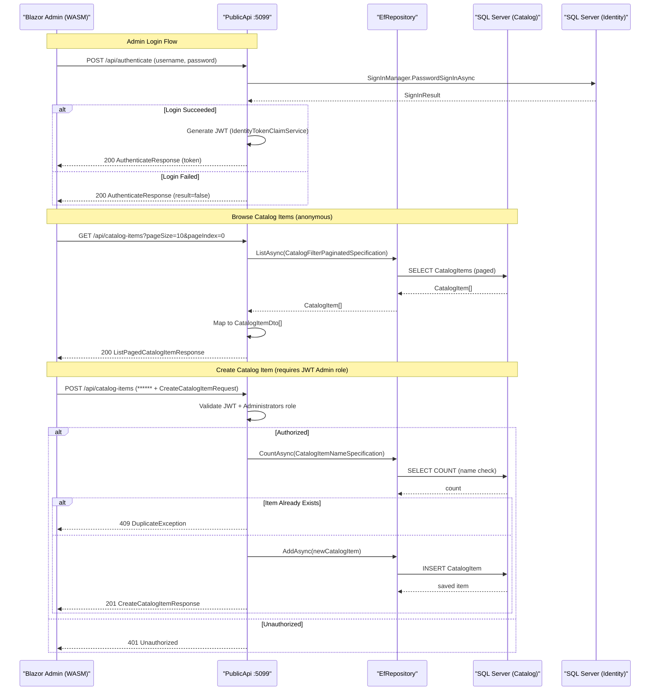

# API & Service Communication Contracts

eShopOnWeb exposes 10 REST API endpoints across two services (Web MVC and Public API), using synchronous HTTP communication with JWT authentication for write operations and anonymous access for read catalog operations.

## Service Catalog

| Service | Port | Category | Purpose |
|---------|------|----------|---------|
| Web (ASP.NET Core MVC) | 5001 (HTTPS) / 5000 (HTTP) | API Layer + Business | Storefront UI, basket/order MVC controllers, internal API for Blazor admin |
| PublicApi (ASP.NET Core Web API) | 5099 (HTTPS) / 5098 (HTTP) | API Layer | REST catalog management API consumed by Blazor WebAssembly admin |
| SQL Server (Catalog DB) | 1433 | Infrastructure | Persists catalog items, orders, baskets |
| SQL Server (Identity DB) | 1433 | Infrastructure | ASP.NET Core Identity for user management |

## API Endpoints Inventory

| Service | Method | Path | Request Type | Response Type | Auth |
|---------|--------|------|-------------|--------------|------|
| PublicApi | POST | /api/authenticate | AuthenticateRequest (body) | AuthenticateResponse (JWT token) | Anonymous |
| PublicApi | GET | /api/catalog-items | ListPagedCatalogItemRequest (query params: pageSize, pageIndex, catalogBrandId, catalogTypeId) | ListPagedCatalogItemResponse | Anonymous |
| PublicApi | GET | /api/catalog-items/{catalogItemId} | GetByIdCatalogItemRequest (path param) | GetByIdCatalogItemResponse / 404 | Anonymous |
| PublicApi | POST | /api/catalog-items | CreateCatalogItemRequest (body) | CreateCatalogItemResponse (201) | JWT - Administrators role |
| PublicApi | PUT | /api/catalog-items | UpdateCatalogItemRequest (body) | UpdateCatalogItemResponse / 404 | JWT - Administrators role |
| PublicApi | DELETE | /api/catalog-items/{catalogItemId} | DeleteCatalogItemRequest (path param) | DeleteCatalogItemResponse / 404 | JWT - Administrators role |
| PublicApi | GET | /api/catalog-brands | (none) | ListCatalogBrandsResponse | Anonymous |
| PublicApi | GET | /api/catalog-types | (none) | ListCatalogTypesResponse | Anonymous |
| Web (MVC) | GET | /order/my-orders | (authenticated session) | MyOrders View | Cookie Auth |
| Web (MVC) | GET | /order/detail/{orderId} | orderId (path) | OrderDetail View / 400 | Cookie Auth |
| Web (MVC) | GET/POST | /basket | Basket session cookie | Basket Razor Page View | Anonymous / Cookie |

## Management & Observability Endpoints

| Service | Endpoint | Purpose | Custom Metrics |
|---------|----------|---------|---------------|
| Web | /health | Aggregated health check (all tags) | None |
| Web | /home_page_health_check | Validates home page returns expected content | None |
| Web | /api_health_check | Validates PublicApi is reachable | None |
| PublicApi | /swagger | Swagger UI for API documentation and testing | None |
| PublicApi | /swagger/v1/swagger.json | OpenAPI JSON spec | None |

## DTOs and Contracts

**PublicApi DTOs (service-level):**

- `CatalogItemDto` — response DTO for catalog item data; mutable class used in list, get, create, update responses
- `ListPagedCatalogItemRequest` / `ListPagedCatalogItemResponse` — paged catalog query; request carries correlation ID
- `GetByIdCatalogItemRequest` / `GetByIdCatalogItemResponse` — single item fetch; request carries correlation ID
- `CreateCatalogItemRequest` / `CreateCatalogItemResponse` — new item creation; response carries created DTO
- `UpdateCatalogItemRequest` / `UpdateCatalogItemResponse` — item update; response carries updated DTO
- `DeleteCatalogItemRequest` / `DeleteCatalogItemResponse` — item deletion; carries only correlation ID in response
- `CatalogBrandDto` / `ListCatalogBrandsResponse` — brand list for filter dropdowns
- `CatalogTypeDto` / `ListCatalogTypesResponse` — type list for filter dropdowns
- `AuthenticateRequest` / `AuthenticateResponse` — login credentials in; JWT token + lock status out

**Common DTO Base Pattern:**
All request/response pairs carry a `CorrelationId()` (GUID) for distributed tracing. All requests derive from `BaseRequest` and responses from `BaseResponse`. This is a consistent pattern across all endpoints.

**Serialization:**
`System.Text.Json` is used as the default JSON serializer (ASP.NET Core 8 default). AutoMapper maps between `CatalogItem` domain entities and `CatalogItemDto`. No custom JSON converters or `[JsonPropertyName]` overrides were detected.

**OpenAPI:**
Swashbuckle 6.5.0 provides Swagger UI and OpenAPI v3 spec generation for PublicApi. The `AuthenticateEndpoint` uses `[SwaggerOperation]` annotations. The Web MVC controllers are marked `[ApiExplorerSettings(IgnoreApi = true)]` and therefore excluded from the spec.

## Communication Patterns

**Synchronous Communication:**
All service interactions are synchronous HTTP/HTTPS REST calls. The Blazor WebAssembly admin panel makes direct HTTP calls to the PublicApi using `HttpClient` configured with the `apiBase` URL from `appsettings.json` (default: `https://localhost:5099/api/`). There is no API gateway, service mesh, or proxy between the admin SPA and the API.

**Asynchronous Communication:**
No asynchronous messaging patterns (message queues, event bus, pub/sub) are present. There is no Kafka, RabbitMQ, Azure Service Bus, or similar broker integration.

**Resilience Patterns:**
No circuit breaker or retry policies (e.g., Polly) are configured. The only notable resilience configuration is `EnableRetryOnFailure()` on the EF Core SQL Server connections in production mode (handles transient SQL failures). There are no timeout configurations, bulkhead patterns, or fallback behaviors implemented at the HTTP client level. `CatalogItemListPagedEndpoint` contains a hardcoded `await Task.Delay(1000)` simulating slow responses — this is a demo artifact and should be removed before production use.

**Service Discovery:**
No dynamic service discovery (Consul, Eureka, Azure Service Discovery) is used. Services communicate via hardcoded base URLs configured in `appsettings.json` (`baseUrls.apiBase`, `baseUrls.webBase`). In Docker Compose, `host.docker.internal` hostname resolution is used.

**Security Posture:**
- **PublicApi**: Read endpoints (`GET /api/catalog-items`, `/api/catalog-brands`, `/api/catalog-types`) are publicly accessible with no authentication. Write endpoints (`POST`, `PUT`, `DELETE` on catalog items) require a valid JWT token in the `Authorization: Bearer` header with the `Administrators` role claim. JWT tokens are issued via `POST /api/authenticate` and signed with a symmetric key defined in `AuthorizationConstants.JWT_SECRET_KEY` (hardcoded constant — a significant security risk in production).
- **Web MVC**: Order-related pages require cookie authentication (`[Authorize]` on `OrderController`). Basket and catalog browsing are publicly accessible.
- **HTTPS**: Both services support HTTPS in development via self-signed certificates. The PublicApi has `RequireHttpsMetadata = false` in JWT validation — this means JWT tokens are accepted over HTTP (insecure in production).
- **CORS**: The PublicApi restricts cross-origin requests to the `webBase` origin only.

## Service Technology Matrix

| Service | Web Framework | Data Access | Discovery | Gateway | Health Checks | Cache | API Docs |
|---------|--------------|-------------|-----------|---------|--------------|-------|---------|
| Web (MVC) | ASP.NET Core MVC 8 + Razor Pages | EF Core 8 (SQL Server / InMemory) | None (hardcoded URL) | No | HomePageHealthCheck, ApiHealthCheck | In-process MemoryCache | No |
| PublicApi | ASP.NET Core Minimal API 8 | EF Core 8 (SQL Server / InMemory) | None (hardcoded URL) | No | None | In-process MemoryCache | Swagger/OpenAPI v3 |

## Service Communication Sequence

