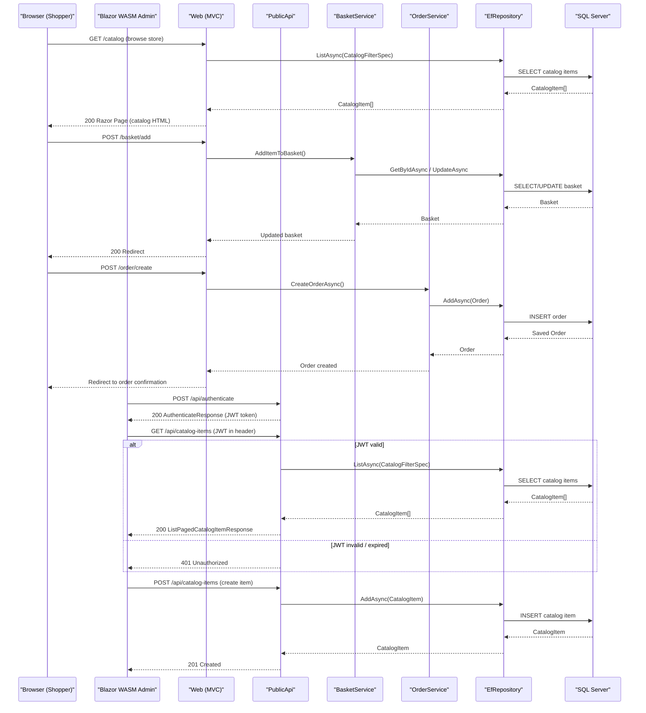

# API & Service Communication Contracts

eShopOnWeb exposes two deployable HTTP services — a server-rendered MVC web application and a REST/Minimal API (`PublicApi`) — with a total of 14 catalogued API endpoints using synchronous HTTP communication and no asynchronous messaging layer.

## Service Catalog

| Service | Port | Category | Purpose |
|---------|------|----------|---------|
| Web (MVC + Razor Pages) | 5001 (HTTPS), 5000 (HTTP) | API Layer / Business | Storefront UI with cookie-authenticated MVC controllers and Blazor WASM host |
| PublicApi (Minimal API) | 5099 (HTTPS), 5098 (HTTP) | API Layer | JWT-secured REST API for catalog management and authentication |
| SQL Server (Docker) | 1433 | Infrastructure | Relational database for catalog and identity data |

## API Endpoints Inventory

### PublicApi Service (`:5099`)

| Method | Path | Request Type | Response Type | Notes |
|--------|------|-------------|---------------|-------|
| POST | `/api/authenticate` | `AuthenticateRequest` (username, password) | `AuthenticateResponse` (token, result flags) | Issues JWT; uses Swashbuckle annotation |
| GET | `/api/catalog-items` | Query: pageSize, pageIndex, catalogBrandId, catalogTypeId | `ListPagedCatalogItemResponse` (items, pageCount) | Paged catalog listing |
| GET | `/api/catalog-items/{catalogItemId}` | Path: catalogItemId (int) | `GetByIdCatalogItemResponse` | Single item lookup |
| POST | `/api/catalog-items` | `CreateCatalogItemRequest` (name, price, pictureUri, etc.) | `CreateCatalogItemResponse` — HTTP 201 | Creates catalog item |
| PUT | `/api/catalog-items` | `UpdateCatalogItemRequest` | `UpdateCatalogItemResponse` | Updates catalog item |
| DELETE | `/api/catalog-items/{catalogItemId}` | Path: catalogItemId (int) | `DeleteCatalogItemResponse` | Deletes catalog item |
| GET | `/api/catalog-types` | None | `CatalogTypeListResponse` | Lists all catalog types |
| GET | `/api/catalog-brands` | None | `CatalogBrandListResponse` | Lists all catalog brands |

### Web Service (`:5001`) — MVC Controllers

| Method | Path | Request Type | Response Type | Notes |
|--------|------|-------------|---------------|-------|
| GET | `/Order` | None | Razor View | Lists current user's orders |
| GET | `/Order/{orderId}` | Path: orderId (int) | Razor View | Order detail |
| GET | `/User` | None | Razor View | User profile |
| POST | `/User/Logout` | None | Redirect | Signs out the user |
| GET/POST | `/Manage/*` | Form fields | Razor Views | Account management actions (profile, password, 2FA, etc.) |

## Management & Observability Endpoints

| Service | Endpoint | Purpose | Custom Metrics |
|---------|----------|---------|----------------|
| Web | `/health` | Aggregated health check (JSON response) | None |
| Web | `/home_page_health_check` | Home page HTTP availability probe | None |
| Web | `/api_health_check` | PublicApi HTTP availability probe | None |
| PublicApi | `/swagger` | Swagger UI | None |
| PublicApi | `/swagger/v1/swagger.json` | OpenAPI v1 JSON spec | None |

No Prometheus metrics export, Application Insights, or custom `[Meter]` registrations are present.

## DTOs & Contracts

**PublicApi** uses a per-endpoint request/response pair pattern (Ardalis.ApiEndpoints / MinimalApi.Endpoint):

- `AuthenticateRequest` / `AuthenticateResponse` — login credentials in, JWT token and sign-in flags out
- `ListPagedCatalogItemRequest` / `ListPagedCatalogItemResponse` — query parameters in, paginated `CatalogItemDto` list out
- `GetByIdCatalogItemRequest` / `GetByIdCatalogItemResponse` — item ID in, single `CatalogItemDto` out
- `CreateCatalogItemRequest` / `CreateCatalogItemResponse` — new item fields in, created item out (HTTP 201)
- `UpdateCatalogItemRequest` / `UpdateCatalogItemResponse` — updated item fields in/out
- `DeleteCatalogItemRequest` / `DeleteCatalogItemResponse` — item ID in, success status out
- `CatalogTypeListResponse` / `CatalogBrandListResponse` — no request body, list of types/brands out
- `CatalogItemDto` — mapping target for `CatalogItem` entity, composed by AutoMapper; used as the canonical transfer object for catalog items

All DTO classes are plain C# classes (not records); they are mutable and use property setters. `BaseRequest` provides a correlation ID; `BaseResponse` carries it through to responses.

**Serialization**: `System.Text.Json` (ASP.NET Core default) is used throughout; no custom converters are registered.

**OpenAPI**: Swashbuckle.AspNetCore 6.5.0 generates the OpenAPI v1 spec for PublicApi. The `AuthenticateEndpoint` uses `[SwaggerOperation]` annotations; Minimal API endpoints use `.Produces<T>()` and `.WithTags()` for documentation.

Full field-level DTO details are in `data-architecture.md`.

## Communication Patterns

**Synchronous (HTTP)**:  
- The Blazor WebAssembly admin UI communicates with both PublicApi (`api/catalog-*`) and the Web host's internal basket API controllers over HTTPS using `HttpClient` (via `HttpClientFactory` / `IAsyncRepository`).
- The Web MVC application communicates internally with application services via direct method calls (in-process); no inter-service HTTP calls occur within the Web project itself.
- No gRPC, GraphQL, or message queue communication exists.

**Asynchronous / Messaging**: None. All communication is synchronous request/response.

**Resilience**: No Polly circuit breaker, retry, or timeout policies are configured. The `CatalogItemListPagedEndpoint` includes a deliberate `await Task.Delay(1000)` (a 1-second artificial delay — likely a development artifact).

**Service Discovery**: No service discovery registry. Services communicate via hardcoded base URLs configured in `appsettings.json` (`baseUrls.apiBase` / `baseUrls.webBase`).

**API Gateway**: No API gateway or reverse proxy is configured; the two services are deployed independently.

**Security posture**:
- **Web service**: Cookie-based authentication via ASP.NET Core Identity; `[Authorize]` decorates protected Razor Pages and MVC controllers. HTTPS enforced in production.
- **PublicApi**: JWT ****** (`Microsoft.AspNetCore.Authentication.JwtBearer`); endpoints require a valid JWT. Token issuance via `/api/authenticate`.
- Both services enforce HTTPS. No mutual TLS between services.
- No OAuth2 / OpenID Connect provider integration; authentication is self-hosted via ASP.NET Core Identity.

**Startup dependency chain**: In Docker Compose, both `eshopwebmvc` and `eshoppublicapi` declare `depends_on: sqlserver`. No readiness probe or wait mechanism is configured — if SQL Server is not fully ready, the app will fail on first DB access and retry on the next request. See `configuration-inventory.md` for full details.

## Service Technology Matrix

| Service | Web Framework | Data Access | Discovery | Gateway | Health Checks | Cache | API Docs |
|---------|--------------|-------------|-----------|---------|---------------|-------|---------|
| Web | ASP.NET Core MVC + Razor Pages + Blazor WASM Host | EF Core 8 (SQL Server) | None (hardcoded URLs) | None | Custom `IHealthCheck` at `/health` | IMemoryCache (in-process) | None |
| PublicApi | ASP.NET Core Minimal API (Ardalis.ApiEndpoints) | EF Core 8 (SQL Server) | None | None | None | None | Swashbuckle OpenAPI v1 |

## Service Communication Sequence

