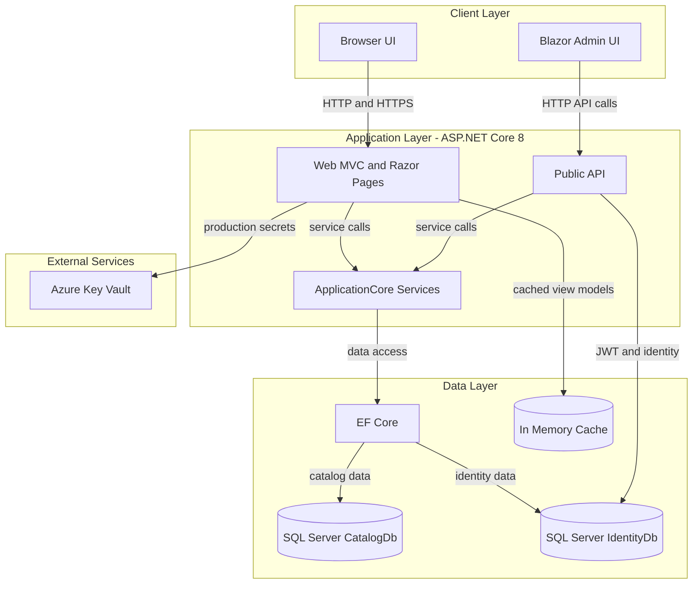
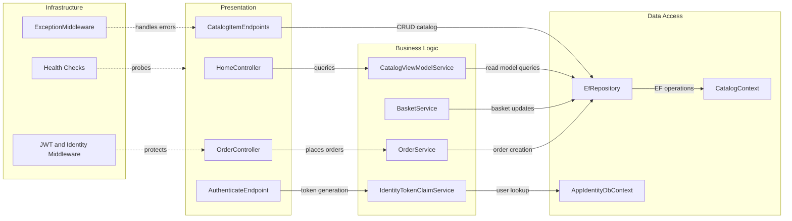

# Architecture Diagram

This solution is a multi-project .NET 8 e-commerce sample with separate web UI, public API, core domain, and infrastructure/data projects. The diagrams below summarize runtime data flow and key component relationships.

## Application Architecture

### Technology Stack Summary

| Layer | Technology | Version | Purpose |
|---|---|---|---|
| Presentation | ASP.NET Core MVC, Razor Pages, Blazor | .NET 8 | Customer storefront and admin UI |
| API | ASP.NET Core Web API + MinimalApi.Endpoint + Swagger | .NET 8 | Catalog and auth endpoints |
| Business | ApplicationCore with MediatR and Ardalis.Specification | .NET 8 | Domain logic, specifications, service abstractions |
| Data Access | EF Core SQL Server + ASP.NET Core Identity | EF Core 8.x | Persistence for catalog/order/basket and users |
| Configuration/Security | Azure Key Vault + JWT + ASP.NET Core Identity | Azure.Identity 1.10.4 | Secret loading and token-based auth |

### Data Storage & External Services

The application persists catalog, basket, order, and identity information in SQL Server databases (CatalogDb and IdentityDb) via EF Core. It also uses in-memory caching for selected web-side read paths and can pull production connection secrets from Azure Key Vault.

### Key Architectural Decisions

- Uses a clean separation between `ApplicationCore` (domain/services) and `Infrastructure` (EF Core and identity persistence).
- Uses generic repository and specification pattern (`IRepository<>`, `IReadRepository<>`, `EfRepository<>`) for data access abstraction.
- Supports environment-based configuration where Docker/Development use local SQL settings and Production can resolve secrets from Azure Key Vault.

## Component Relationships

### Component Inventory

| Component | Layer | Type | Responsibility |
|---|---|---|---|
| HomeController | Presentation | MVC Controller | Renders storefront pages and catalog browsing views |
| OrderController | Presentation | MVC Controller | Handles customer order listing and order detail flow |
| CatalogItemEndpoints | Presentation | Minimal API Endpoints | Exposes catalog CRUD and listing APIs |
| AuthenticateEndpoint | Presentation | API Endpoint | Authenticates user credentials and returns JWT |
| CatalogViewModelService | Business Logic | Application Service | Builds catalog query/view models for UI |
| BasketService | Business Logic | Domain Service | Manages basket creation, merge, and quantity updates |
| OrderService | Business Logic | Domain Service | Creates orders from basket and catalog pricing |
| IdentityTokenClaimService | Business Logic | Security Service | Creates token claims for authenticated users |
| EfRepository | Data Access | Repository | Generic repository over EF Core with specification support |
| CatalogContext | Data Access | DbContext | Owns catalog, basket, and order aggregates |
| AppIdentityDbContext | Data Access | Identity DbContext | Owns ASP.NET Core Identity user and role data |
| ExceptionMiddleware | Infrastructure | Middleware | Converts unhandled exceptions to API-friendly responses |
