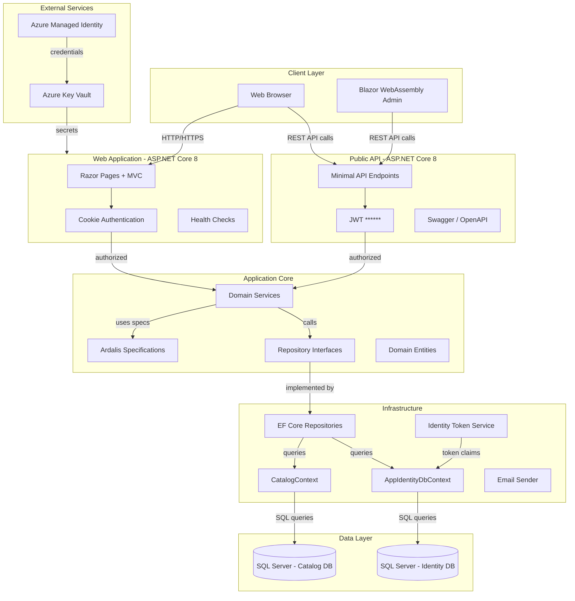
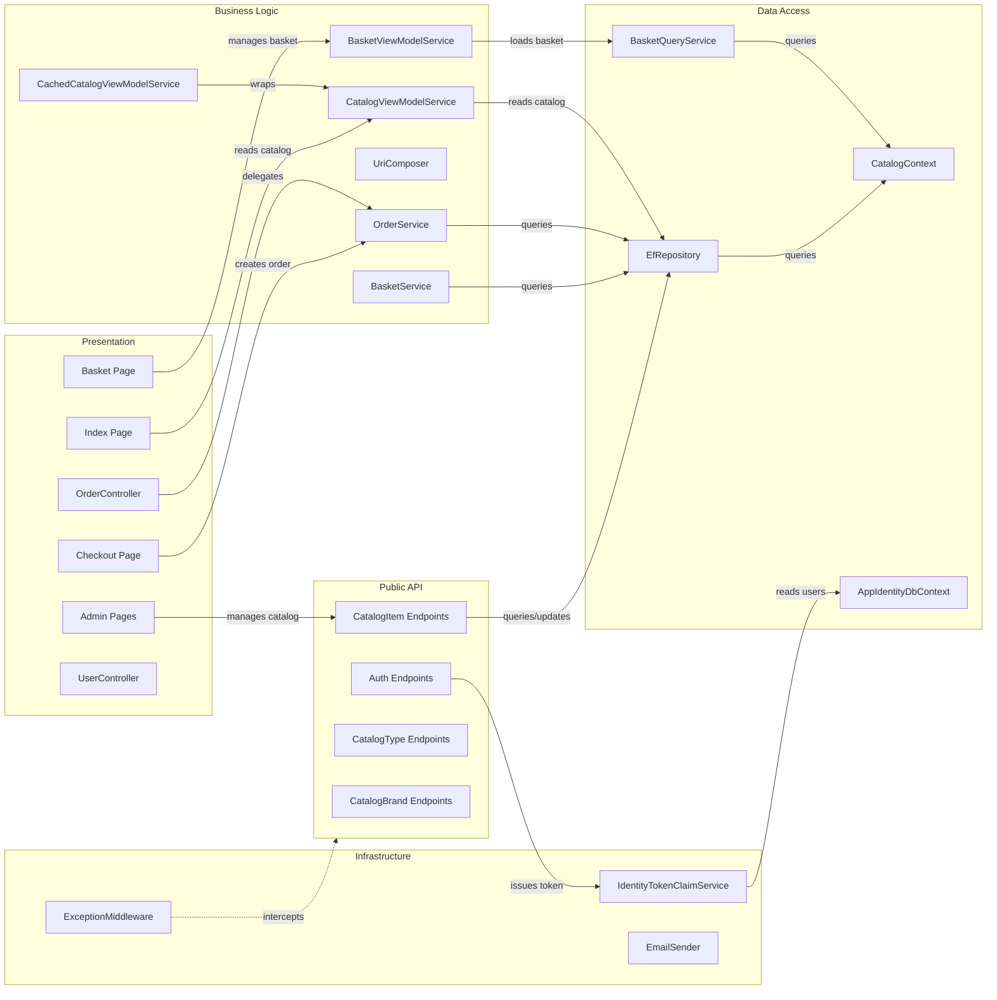

# Architecture Diagram

eShopOnWeb is a reference ASP.NET Core e-commerce application demonstrating clean architecture principles with a layered design, dual frontends (Razor Pages and Blazor WebAssembly), and a REST API.

## Application Architecture

### Technology Stack Summary

| Layer | Technology | Version | Purpose |
|-------|-----------|---------|---------|
| Presentation | ASP.NET Core Razor Pages | .NET 8 | Server-side web UI for storefront |
| Presentation | Blazor WebAssembly | .NET 8 | Client-side admin SPA |
| API | ASP.NET Core Minimal API (Ardalis.ApiEndpoints) | .NET 8 | RESTful Public API |
| API Documentation | Swashbuckle / Swagger | Latest | API documentation and UI |
| Business Logic | Application Core (Clean Architecture) | .NET 8 | Domain services and entities |
| Data Access | Entity Framework Core | Latest | ORM for SQL Server |
| Data Access | Ardalis.Specification | Latest | Query specification pattern |
| Authentication | ASP.NET Core Identity | .NET 8 | User management and auth |
| Authentication | JWT ****** .NET 8 | API token authentication |
| Messaging | MediatR | Latest | CQRS / in-process messaging |
| Mapping | AutoMapper | Latest | DTO-to-entity mapping |
| Database | SQL Server (LocalDB / Azure SQL) | - | Catalog and Identity storage |
| Secrets | Azure Key Vault + Azure Identity | Latest | Production secrets management |

### Data Storage & External Services

The application uses two SQL Server databases: **CatalogDb** stores catalog items, brands, types, baskets, and orders via `CatalogContext` (EF Core); **Identity** stores users and roles via `AppIdentityDbContext`. In development both use SQL Server LocalDB; in production they connect to Azure SQL via connection strings stored in Azure Key Vault. Azure Identity (`ChainedTokenCredential` with `AzureDeveloperCliCredential` and `DefaultAzureCredential`) is used for passwordless access to Key Vault. There is no separate cache layer; an in-memory EF provider is available for testing.

### Key Architectural Decisions

- **Clean Architecture / Onion Architecture**: The `ApplicationCore` project defines all domain entities, interfaces, and services; `Infrastructure` and `Web` depend on it, never the reverse, enforcing strict dependency inversion.
- **Repository + Specification pattern**: `EfRepository<T>` implements `IRepository<T>` and uses Ardalis.Specification to compose reusable, testable query specs rather than scattering LINQ queries across the codebase.
- **Dual frontend strategy**: A traditional Razor Pages storefront and a Blazor WebAssembly admin panel both consume the same Public API, demonstrating multi-client architecture.

## Component Relationships

### Component Inventory

| Component | Layer | Type | Responsibility |
|-----------|-------|------|---------------|
| Index Page | Presentation | Razor Page | Catalog browsing and filtering |
| Basket Page | Presentation | Razor Page | Shopping basket management |
| Checkout Page | Presentation | Razor Page | Order checkout flow |
| Admin Pages | Presentation | Razor Pages | Catalog item CRUD for admins |
| OrderController | Presentation | MVC Controller | Order history and detail views |
| UserController | Presentation | MVC Controller | User account actions |
| CatalogItem Endpoints | Public API | Minimal API Endpoints | CRUD for catalog items |
| Auth Endpoints | Public API | Minimal API Endpoint | JWT token issuance |
| CatalogType/Brand Endpoints | Public API | Minimal API Endpoints | List catalog types and brands |
| BasketService | Business Logic | Domain Service | Add/remove/update basket items |
| OrderService | Business Logic | Domain Service | Create orders from baskets |
| UriComposer | Business Logic | Service | Build catalog image URIs |
| BasketViewModelService | Business Logic | View Service | Compose basket view models |
| CatalogViewModelService | Business Logic | View Service | Compose catalog view models |
| CachedCatalogViewModelService | Business Logic | Decorator Service | Caches catalog view model results |
| EfRepository | Data Access | Repository | Generic EF Core repository |
| BasketQueryService | Data Access | Query Service | Basket-specific read queries |
| CatalogContext | Data Access | DbContext | EF Core context for catalog data |
| AppIdentityDbContext | Data Access | DbContext | EF Core context for identity data |
| IdentityTokenClaimService | Infrastructure | Service | Generate JWT claims for users |
| EmailSender | Infrastructure | Service | Send transactional emails |
| ExceptionMiddleware | Infrastructure | Middleware | Global API exception handling |
