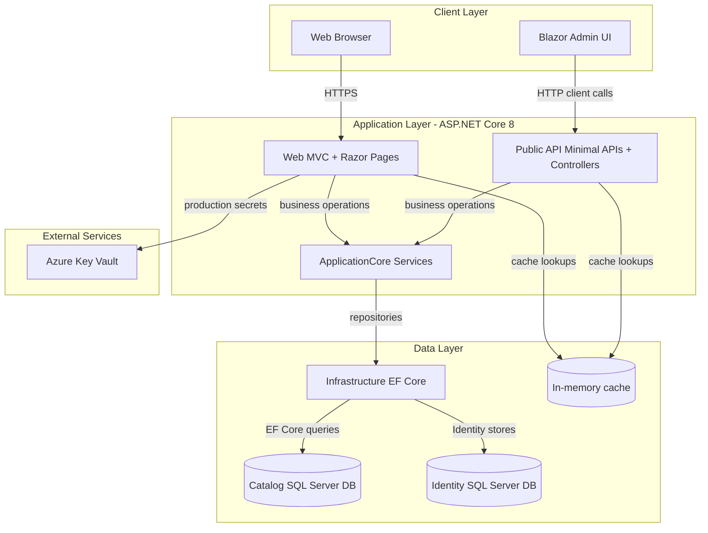
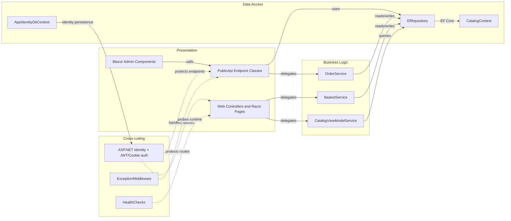

# Architecture Diagram

This repository contains a multi-project .NET 8 e-commerce application with MVC UI, Blazor admin UI, and a Public API backed by SQL Server and ASP.NET Identity.

## Application Architecture

### Technology Stack Summary

| Layer | Technology | Version | Purpose |
|---|---|---|---|
| Presentation | ASP.NET Core MVC + Razor Pages | net8.0 | Customer-facing web app |
| Presentation | Blazor Server + WebAssembly assets | net8.0 | Admin UI capabilities |
| API | ASP.NET Core Minimal APIs + Controllers | net8.0 | Catalog/auth API surface |
| Business | ApplicationCore + Ardalis Specification | 7.x/4.x packages | Domain services and use cases |
| Data Access | EF Core + SQL Server provider | 8.0.2 | Relational persistence |
| Identity | ASP.NET Core Identity + EF stores | 8.0.2 | Authentication and authorization |

### Data Storage & External Services

The application persists catalog/order/basket and identity data in SQL Server databases through EF Core contexts. It uses in-memory caching for frequently accessed data and optionally integrates Azure Key Vault in non-development environments for secret retrieval.

### Key Architectural Decisions

- Uses clean separation across `ApplicationCore`, `Infrastructure`, and host apps (`Web`, `PublicApi`, `BlazorAdmin`).
- Uses generic repository abstractions (`IRepository<>`, `IReadRepository<>`) with EF Core implementation.
- Uses host-specific startup composition in `Program.cs` while sharing common domain and data access libraries.

## Component Relationships

### Component Inventory

| Component | Layer | Type | Responsibility |
|---|---|---|---|
| `OrderController` | Presentation | MVC Controller | Displays authenticated user order data |
| `ManageController` | Presentation | MVC Controller | Identity management actions |
| `CatalogItem*Endpoint` classes | Presentation | Minimal API endpoints | CRUD and listing for catalog items |
| `AuthenticateEndpoint` | Presentation | API Controller endpoint | Issues JWT tokens |
| `OrderService` | Business | Domain service | Creates orders from baskets |
| `BasketService` | Business | Domain service | Basket lifecycle operations |
| `EfRepository<T>` | Data Access | Repository implementation | Generic persistence abstraction |
| `CatalogContext` | Data Access | DbContext | Catalog/order/basket entity persistence |
| `AppIdentityDbContext` | Data Access | Identity DbContext | Identity user/role persistence |
| `ExceptionMiddleware` | Infrastructure | Middleware | Uniform API exception handling |
