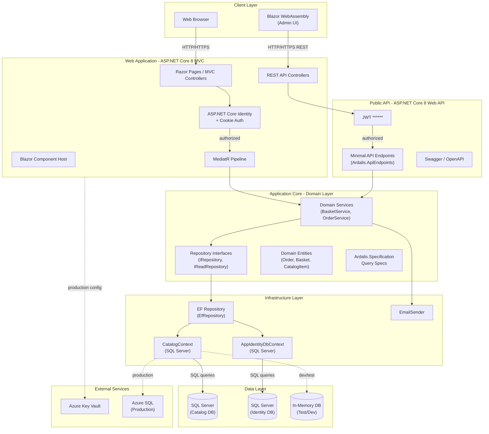
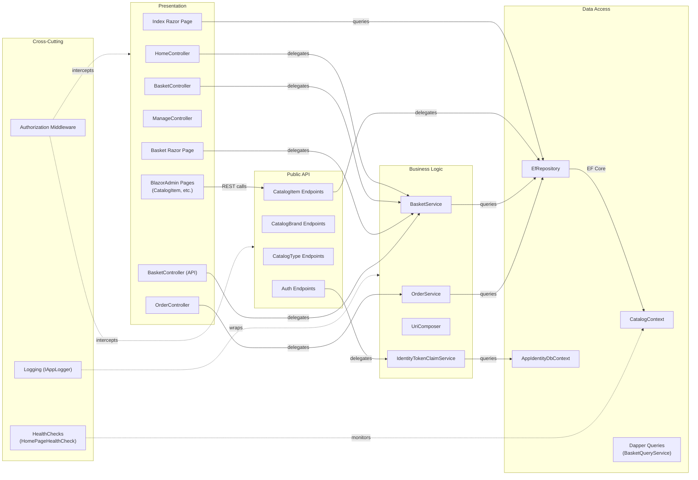

# Architecture Diagram

eShopOnWeb is a reference ASP.NET Core 8 e-commerce application implementing Clean Architecture with multiple frontends (MVC/Razor Pages, Blazor WebAssembly admin panel) and a REST API.

## Application Architecture

### Technology Stack Summary

| Layer | Technology | Version | Purpose |
|-------|-----------|---------|---------|
| Presentation (Web) | ASP.NET Core MVC + Razor Pages | 8.0.2 | Server-side web UI for storefront |
| Presentation (Admin) | Blazor WebAssembly | 8.0.2 | Client-side admin panel |
| Public API | ASP.NET Core Web API (MinimalApi.Endpoint) | 8.0.2 | REST API for catalog management |
| Application Core | C# Domain Services + MediatR | 12.0.1 | Business logic orchestration |
| Repository Abstraction | Ardalis.Specification + EF Core | 7.0.0 | Query specification pattern |
| Data Access | Entity Framework Core (SQL Server) | 8.0.x | ORM for catalog and identity |
| Authentication (Web) | ASP.NET Core Identity + Cookie Auth | 8.0.2 | User management and session |
| Authentication (API) | JWT ****** 8.0.2 | Token-based API authentication |
| Configuration (Prod) | Azure Key Vault + Azure Identity | 1.10.4 | Secrets management |
| Mapping | AutoMapper | 12.0.1 | DTO to domain mapping |

### Data Storage and External Services

The application uses two SQL Server databases: `CatalogDb` for products, brands, types, orders, and baskets; and an `Identity` database for ASP.NET Core Identity user management. In development and testing, both databases can be replaced with Entity Framework in-memory providers. In production, secrets (connection strings) are stored in Azure Key Vault and fetched via `ChainedTokenCredential` using Azure Developer CLI or Managed Identity. There are no message brokers or distributed caches — session state is managed via cookies and in-process memory cache.

### Key Architectural Decisions

- **Clean Architecture**: ApplicationCore has zero external dependencies (no EF Core, no HTTP clients); all infrastructure concerns are in the Infrastructure project and injected through interfaces, making domain logic independently testable.
- **Repository + Specification Pattern**: Uses Ardalis.Specification so query logic lives in typed `Specification` classes rather than scattered LINQ, improving testability and reuse.
- **Dual frontend strategy**: The storefront is server-rendered MVC/Razor Pages while the admin panel is a Blazor WebAssembly SPA hosted within the same ASP.NET Core process, sharing the same JWT-secured REST API.

## Component Relationships

### Component Inventory

| Component | Layer | Type | Responsibility |
|-----------|-------|------|---------------|
| HomeController | Presentation | MVC Controller | Catalog browsing and product listing |
| OrderController | Presentation | MVC Controller | Order placement and order history |
| BasketController | Presentation | MVC Controller | Shopping basket CRUD for web UI |
| ManageController | Presentation | MVC Controller | User account management |
| Index Razor Page | Presentation | Razor Page | Landing page with catalog display |
| Basket Razor Page | Presentation | Razor Page | Shopping basket UI |
| BlazorAdmin Pages | Presentation | Blazor Component | Admin catalog item management SPA |
| CatalogItem Endpoints | Public API | Minimal API Endpoint | CRUD for catalog items |
| CatalogBrand Endpoints | Public API | Minimal API Endpoint | CRUD for catalog brands |
| CatalogType Endpoints | Public API | Minimal API Endpoint | CRUD for catalog types |
| Auth Endpoints | Public API | Minimal API Endpoint | JWT token issuance |
| BasketService | Business Logic | Domain Service | Basket item add/update/delete logic |
| OrderService | Business Logic | Domain Service | Order creation from basket |
| UriComposer | Business Logic | Service | URI composition for catalog images |
| IdentityTokenClaimService | Business Logic | Service | JWT token generation for users |
| EfRepository | Data Access | Generic Repository | EF Core-backed IRepository implementation |
| CatalogContext | Data Access | DbContext | EF Core context for catalog and orders |
| AppIdentityDbContext | Data Access | DbContext | EF Core context for ASP.NET Identity |
| BasketQueryService | Data Access | Query Service | Dapper-based read queries for basket |
| HomePageHealthCheck | Cross-Cutting | Health Check | Validates home page availability |
| IAppLogger | Cross-Cutting | Logging Abstraction | Typed logging wrapper |
