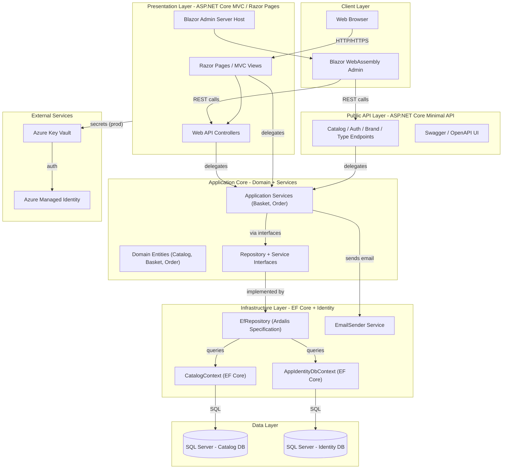
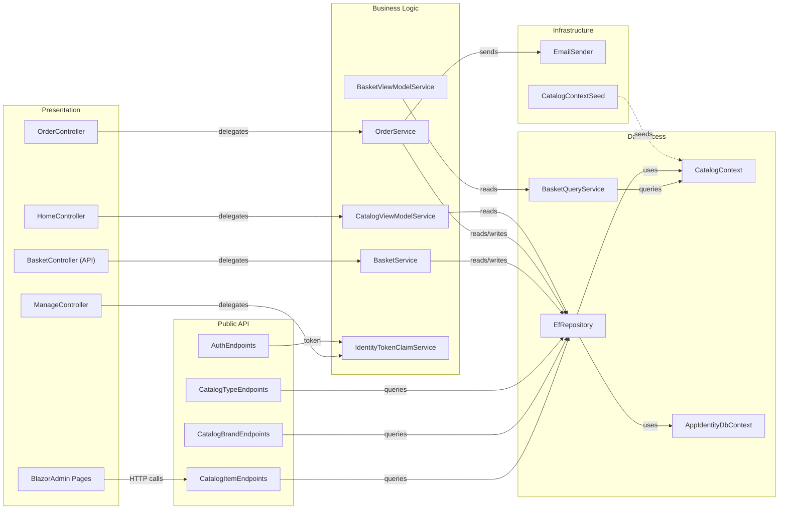

# Architecture Diagram

eShopOnWeb is a reference ASP.NET Core application implementing a multi-layer e-commerce store, with a Razor Pages / MVC web frontend, a Blazor WebAssembly admin UI, and a minimal REST API (PublicApi).

## Application Architecture

### Technology Stack Summary

| Layer | Technology | Version | Purpose |
|-------|-----------|---------|---------|
| Presentation (Web) | ASP.NET Core MVC + Razor Pages | .NET 8/9 | Server-side web UI for storefront |
| Presentation (Admin) | Blazor WebAssembly | .NET 8/9 | Client-side admin interface |
| Public API | ASP.NET Core Minimal API (Ardalis.ApiEndpoints) | .NET 8/9 | REST API for catalog and auth |
| Application Core | C# Domain Model + MediatR | Latest | Business logic, domain entities, interfaces |
| Data Access | Entity Framework Core + Ardalis.Specification | Latest | ORM, repository pattern |
| Identity | ASP.NET Core Identity + EF Core | Latest | Authentication and authorization |
| Database | SQL Server (LocalDB dev / Azure SQL prod) | - | Catalog and identity storage |
| Configuration (prod) | Azure Key Vault + Azure Identity | Latest | Secrets management |
| Mapping | AutoMapper | Latest | DTO ↔ entity mapping |

### Data Storage & External Services

The application uses two SQL Server databases: `CatalogDb` (stores catalog items, brands, and types, as well as basket and order data) and an Identity database (stores user accounts and roles via ASP.NET Core Identity). In development, SQL Server LocalDB is used; in production the connection strings are retrieved from Azure Key Vault via `DefaultAzureCredential` / `AzureDeveloperCliCredential`. There are no external caches or message brokers; email notifications are sent via a configurable `IEmailSender` abstraction backed by `EmailSender`.

### Key Architectural Decisions

- **Clean Architecture / Onion pattern**: `ApplicationCore` has no infrastructure dependencies; `Infrastructure` and `Web` depend on `ApplicationCore` interfaces, not concrete implementations.
- **Repository + Specification pattern**: `EfRepository<T>` (Ardalis.Specification.EntityFrameworkCore) provides a generic, testable data access layer driven by composable `Specification` objects.
- **Dual frontend strategy**: A traditional Razor Pages / MVC storefront coexists with a Blazor WebAssembly admin panel served from the same ASP.NET Core host, communicating via the PublicApi REST layer.

## Component Relationships

### Component Inventory

| Component | Layer | Type | Responsibility |
|-----------|-------|------|----------------|
| HomeController | Presentation | MVC Controller | Renders catalog listing page |
| OrderController | Presentation | MVC Controller | Handles order creation and history |
| BasketController | Presentation | API Controller | REST basket operations for Blazor admin |
| ManageController | Presentation | MVC Controller | User account management |
| BlazorAdmin Pages | Presentation | Blazor WASM Components | Admin catalog item management UI |
| CatalogItemEndpoints | Public API | Minimal API Endpoint | CRUD for catalog items |
| AuthEndpoints | Public API | Minimal API Endpoint | JWT token issuance |
| CatalogBrandEndpoints | Public API | Minimal API Endpoint | Read catalog brands |
| CatalogTypeEndpoints | Public API | Minimal API Endpoint | Read catalog types |
| BasketService | Business Logic | Domain Service | Add/remove basket items, checkout |
| OrderService | Business Logic | Domain Service | Create orders from baskets |
| CatalogViewModelService | Business Logic | View Service | Paginated catalog view models |
| BasketViewModelService | Business Logic | View Service | Basket summary view models |
| IdentityTokenClaimService | Business Logic | Security Service | Generate JWT tokens for Identity users |
| EfRepository | Data Access | Generic Repository | EF Core CRUD + Ardalis Specification queries |
| CatalogContext | Data Access | DbContext | Catalog, basket, order entities |
| AppIdentityDbContext | Data Access | DbContext | ASP.NET Core Identity entities |
| BasketQueryService | Data Access | Query Service | Basket detail queries via EF Core |
| EmailSender | Infrastructure | Service | Sends transactional email via IEmailSender |
| CatalogContextSeed | Infrastructure | Seed Helper | Seeds initial catalog data on startup |
