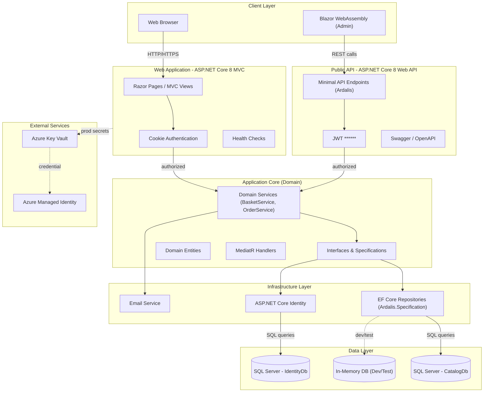
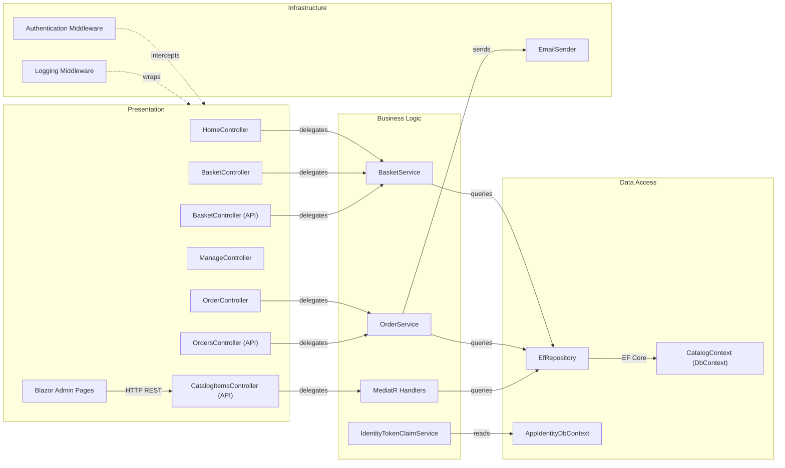

# Architecture Diagram

eShopOnWeb is a reference ASP.NET Core 8 e-commerce application that demonstrates clean architecture principles with a web storefront, a Blazor WebAssembly admin panel, and a REST Public API.

## Application Architecture

### Technology Stack Summary

| Layer | Technology | Version | Purpose |
|---|---|---|---|
| Presentation (Web) | ASP.NET Core MVC + Razor Pages | 8.0.2 | Server-side e-commerce storefront |
| Presentation (Admin) | Blazor WebAssembly | 8.0.2 | Client-side admin panel (catalog management) |
| Public API | ASP.NET Core Web API + Ardalis.ApiEndpoints | 8.0.2 / 4.1.0 | REST API with Swagger documentation |
| Business Logic | Application Core (Clean Architecture) | .NET 8 | Domain services, entities, specifications |
| Messaging | MediatR | 12.0.1 | In-process command/event dispatching |
| Data Mapping | AutoMapper | 12.0.1 | Entity-to-DTO mapping |
| Data Access | Entity Framework Core + Ardalis.Specification | 8.0.2 / 7.0.0 | Repository pattern over SQL Server |
| Identity | ASP.NET Core Identity + EF Core | 8.0.2 | User management and authentication |
| Auth (Web) | Cookie Authentication | 8.0.2 | Session-based auth for MVC storefront |
| Auth (API) | JWT ****** 8.0.2 | Token-based auth for REST API |
| Database | SQL Server (LocalDB / Azure SQL) | — | Catalog and identity data stores |
| Secrets (Prod) | Azure Key Vault + Azure Identity | 1.3.1 / 1.10.4 | Secure configuration in production |

### Data Storage & External Services

The application uses two SQL Server databases: **CatalogDb** stores product catalog items, brands, and types along with order and basket data, while **IdentityDb** stores ASP.NET Core Identity user records. An in-memory EF Core provider is available for development and testing. In production deployments on Azure, connection strings are retrieved from **Azure Key Vault** using **Azure Managed Identity** (via `ChainedTokenCredential`).

### Key Architectural Decisions

- **Clean Architecture with explicit layers**: ApplicationCore holds all domain logic and defines interfaces; Infrastructure implements them; Web and PublicApi are the entry points, ensuring no framework dependencies leak into the domain.
- **Repository pattern via Ardalis.Specification**: Generic `EfRepository<T>` combined with `Specification` objects provides composable, testable data access without proliferating custom repository classes.
- **Dual authentication strategy**: The MVC web storefront uses cookie-based authentication while the REST Public API uses JWT ****** with a shared Identity store backing both.

## Component Relationships

### Component Inventory

| Component | Layer | Type | Responsibility |
|---|---|---|---|
| HomeController | Presentation | MVC Controller | Renders storefront home/catalog pages |
| BasketController | Presentation | MVC Controller | Handles shopping basket add/remove/checkout |
| OrderController | Presentation | MVC Controller | Displays order history for authenticated users |
| ManageController | Presentation | MVC Controller | User account management |
| CatalogItemsController (API) | Presentation | API Endpoint | CRUD for catalog items via REST |
| BasketController (API) | Presentation | API Endpoint | Basket operations via REST |
| OrdersController (API) | Presentation | API Endpoint | Order retrieval via REST |
| Blazor Admin Pages | Presentation | Blazor WASM Pages | Admin UI for catalog item management |
| BasketService | Business Logic | Domain Service | Manages basket state and item quantities |
| OrderService | Business Logic | Domain Service | Creates orders from baskets, sends confirmation email |
| IdentityTokenClaimService | Business Logic | Service | Issues JWT tokens for authenticated users |
| MediatR Handlers | Business Logic | Command/Query Handlers | Handle catalog queries and commands |
| EfRepository | Data Access | Generic Repository | EF Core + Ardalis.Specification data access |
| CatalogContext | Data Access | DbContext | EF Core context for catalog and orders |
| AppIdentityDbContext | Data Access | DbContext | EF Core context for ASP.NET Identity |
| EmailSender | Infrastructure | Service | Sends order confirmation emails |
| Authentication Middleware | Infrastructure | Middleware | Validates cookies and JWT tokens |
| Logging Middleware | Infrastructure | Middleware | Request/response logging |
