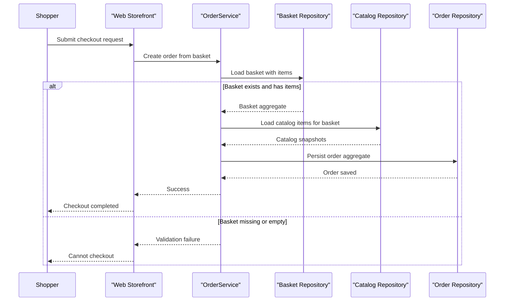

# Core Business Workflows

The application supports core online store workflows including catalog browsing, basket management, and order checkout for authenticated users.

## Domain Entities

| Entity | Service / Bounded Context | Description | Key Relationships |
|---|---|---|---|
| CatalogItem | Catalog | Product available for browsing and purchase | Linked to CatalogBrand and CatalogType |
| Basket | Basket | Customer shopping basket state | Contains BasketItem entries |
| Order | Ordering | Finalized purchase transaction | Contains OrderItem entries built from basket |
| Buyer | Buyer | Purchasing identity aggregate | Associated with orders |
| ApplicationUser | Identity | Authenticated user account | Used for access-controlled workflows |

## Service-to-Domain Mapping

| Service | Domain Context | Owned Entities | External Dependencies |
|---|---|---|---|
| Web | Customer storefront | Basket, Order views, user session | ApplicationCore services, repositories, identity |
| PublicApi | Catalog management API | CatalogItem/CatalogBrand/CatalogType contracts | Repositories, auth token service |
| ApplicationCore | Domain logic | Basket, Order, Catalog, Buyer behavior | Repository interfaces, URI composer |
| Infrastructure | Persistence | EF mappings for catalog/order/basket/identity | SQL Server, EF Core |

## Primary Workflows

### Workflow 1: Browse catalog and manage basket

Users browse catalog pages, apply brand/type filters, and add items to their basket. The web layer calls catalog and basket services, which query repositories and update basket aggregates.

### Workflow 2: Checkout and create order

Authenticated users submit checkout details. `OrderService.CreateOrderAsync` validates basket presence and non-empty items, resolves catalog snapshot data, creates order items, and persists a new order aggregate.

### Workflow 3: Maintain catalog via Public API

API clients call catalog endpoints to list, create, update, or delete catalog items. Endpoint handlers perform repository operations and return DTO responses.

## Cross-Service Data Flows

The storefront and API share underlying domain/data libraries rather than exchanging messages through an external broker. The Web host reads order and basket data through repository-backed services, while PublicApi exposes catalog and auth operations over HTTP. If SQL Server is unavailable, dependent workflows fail early since no fallback data store is configured for production mode.

## Business Workflow Sequence

## Business Rules & Decision Logic

- Checkout requires an existing basket and at least one basket item (`Guard.Against.Null` and empty-basket guard).
- Order creation snapshots catalog item name and image URI at purchase time for order history consistency.
- Catalog mutation endpoints return not-found outcomes when requested items do not exist.
- Authenticated routes are enforced for user/order management workflows.
