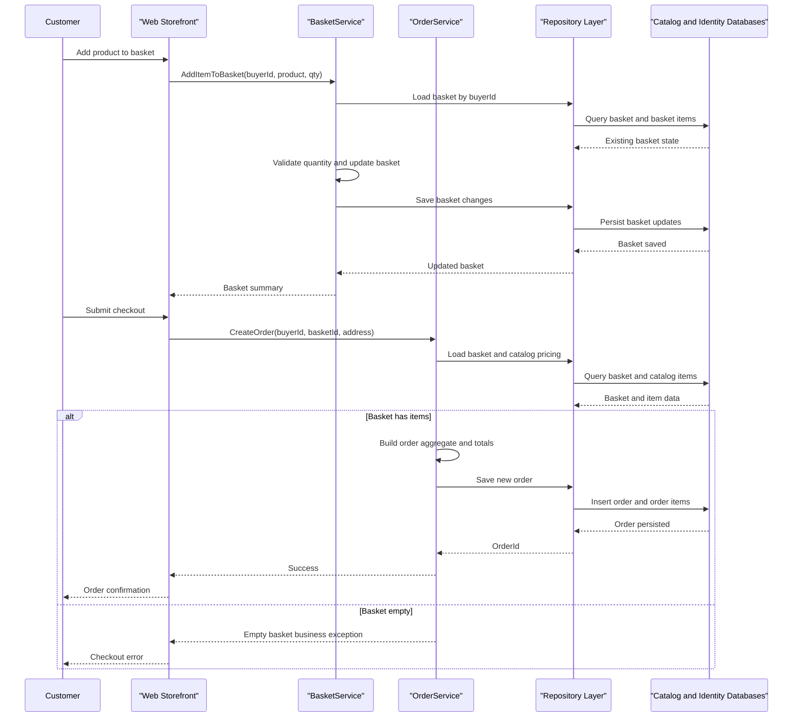

# Core Business Workflows

The application supports an online storefront domain where users browse a product catalog, manage baskets, authenticate, and place orders. Business behavior is organized around catalog, basket, and order aggregates with identity-backed user access.

## Domain Entities

| Entity | Service / Bounded Context | Description | Key Relationships |
|---|---|---|---|
| CatalogItem | Catalog | Product available for browsing and purchase | Linked to CatalogBrand and CatalogType |
| CatalogBrand | Catalog | Product brand taxonomy | One brand to many catalog items |
| CatalogType | Catalog | Product type/category taxonomy | One type to many catalog items |
| Basket | Basket | User shopping container before checkout | One basket to many basket items |
| BasketItem | Basket | Item selection with quantity and unit price | References catalog item and basket |
| Order | Ordering | Confirmed purchase aggregate | One order to many order items |
| OrderItem | Ordering | Snapshot of purchased catalog details and quantity | Belongs to order; captures ordered item details |
| ApplicationUser | Identity | Authenticated user account | Used by web/API auth and token creation |

## Service-to-Domain Mapping

| Service | Domain Context | Owned Entities | External Dependencies |
|---|---|---|---|
| Web | Storefront and checkout orchestration | Basket, Order (through services), view models | PublicApi endpoints, Identity, Catalog repositories |
| PublicApi | Catalog and auth contracts | Catalog entities and auth DTO contracts | Identity managers, repository services |
| ApplicationCore | Domain business logic | Basket and Order behaviors, specifications | Repository abstractions |
| Infrastructure | Persistence and identity | CatalogContext entities and identity tables | SQL Server and EF Core |

## Primary Workflows

### Workflow 1: Browse Catalog and Filter Products

Customers open storefront pages, apply brand/type filters, and retrieve paged catalog data. The workflow builds filter specifications, queries repositories, maps results to view models, and returns product listings.

### Workflow 2: Manage Basket and Merge Anonymous Basket

Users add items to baskets, update quantities, and optionally merge an anonymous basket into an authenticated basket. Business logic ensures quantities remain valid and removes empty basket entries.

### Workflow 3: Checkout and Place Order

Authenticated users submit checkout information, basket and catalog prices are reloaded, and an order aggregate is created and persisted. The order captures item snapshots and shipping address before returning an order confirmation flow.

## Cross-Service Data Flows

Web-to-API traffic handles catalog and authentication interactions over HTTP. Domain composition remains largely in-process inside the solution, where Web and PublicApi delegate to shared ApplicationCore services and Infrastructure repositories. If catalog/API dependencies fail, middleware and health checks surface failure states to callers rather than silently continuing business operations.

## Business Workflow Sequence

## Business Rules & Decision Logic

- Basket item quantity must be positive; zero-quantity entries are removed before persistence.
- Checkout requires a non-empty basket; empty checkout path raises an `EmptyBasketOnCheckoutException`.
- Order totals are computed from captured unit prices and units in order items at creation time.
- Catalog updates enforce guard clauses on required fields and non-negative pricing.
- Authentication and authorization are required for protected checkout and account-management flows.
