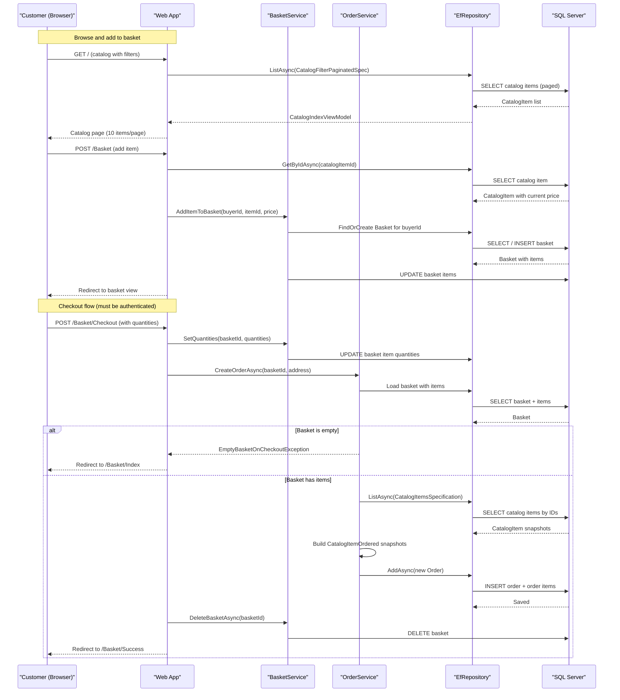

# Core Business Workflows

eShopOnWeb is an online retail storefront where customers browse a product catalog, manage a shopping basket, and place orders, while administrators manage catalog inventory through a separate admin panel.

## Domain Entities

| Entity | Service / Bounded Context | Description | Key Relationships |
|--------|--------------------------|-------------|-------------------|
| CatalogItem | Catalog Management | A product available for purchase with name, description, price, and picture | Belongs to a CatalogBrand and CatalogType |
| CatalogBrand | Catalog Management | A brand that classifies catalog items (e.g., ".NET") | One brand has many CatalogItems |
| CatalogType | Catalog Management | A product category (e.g., "T-Shirt") | One type has many CatalogItems |
| Basket | Basket Management | A shopping basket identified by a buyer ID (authenticated user email or anonymous GUID) | Contains many BasketItems |
| BasketItem | Basket Management | A line item in a basket linking to a catalog item with quantity and price snapshot | Belongs to a Basket; references a CatalogItem by ID |
| Order | Order Management | A completed purchase record capturing buyer ID, shipping address, and order date | Contains many OrderItems; immutable after creation |
| OrderItem | Order Management | A line item in an order with a CatalogItemOrdered snapshot, unit price, and quantity | Belongs to an Order; contains a CatalogItemOrdered value object |
| CatalogItemOrdered | Order Management | An immutable value object snapshot of catalog item details at the time of order | Owned by OrderItem; prevents catalog changes from affecting historical orders |
| Buyer | Buyer Management | Represents a registered buyer with a link to the Identity user | Has many PaymentMethods |
| PaymentMethod | Buyer Management | A stored payment reference (tokenized card details) | Belongs to a Buyer |
| ApplicationUser | Identity (ASP.NET Core Identity) | An authenticated user account; BuyerId in domain corresponds to user email | Manages authentication and roles |

## Service-to-Domain Mapping

| Service | Domain Context | Owned Entities | External Dependencies |
|---------|--------------|----------------|-----------------------|
| Web (Razor Pages) | Storefront — Catalog Browse, Basket, Checkout, Order History | Basket, BasketItem, Order, OrderItem, CatalogItem (read) | PublicApi (health check); Identity (authentication) |
| PublicApi | Catalog Administration | CatalogItem (CRUD), CatalogBrand (read), CatalogType (read) | Identity (JWT auth via IdentityTokenClaimService) |
| BlazorAdmin | Admin SPA — Catalog Management | None directly; reads/writes via PublicApi REST calls | PublicApi (all catalog operations) |
| Infrastructure / CatalogContext | Persistence — all domain entities | CatalogItem, CatalogBrand, CatalogType, Basket, BasketItem, Order, OrderItem | SQL Server |
| Infrastructure / AppIdentityDbContext | Identity Persistence | ApplicationUser, IdentityRole (Administrators) | SQL Server |

## Primary Workflows

### Workflow 1: Browse Catalog and Add Item to Basket

A visitor (anonymous or authenticated) browses the catalog, optionally filtering by brand or type, and adds a product to their basket.

**Steps:**
1. User loads the catalog home page (`/Index`); the `CatalogViewModelService` (or its caching decorator) fetches a paged and filtered list of `CatalogItem` records.
2. User selects a product and posts it to the basket page (`POST /Basket`).
3. The `IndexModel` fetches the full `CatalogItem` by ID to obtain the current price.
4. If the user is unauthenticated, the basket is identified by a GUID stored in the `eShop` cookie (10-year expiry).
5. `BasketService.AddItemToBasket` finds or creates the basket for the buyer ID (cookie GUID or user email), then adds the item — merging with an existing basket item if the same product is already present.
6. The user is redirected back to the basket view.

**Business rule**: The price used in the basket item is fetched from the catalog at the time of "Add to Basket", not at checkout; price changes between add and checkout are not retroactively applied to the basket.

---

### Workflow 2: User Authentication and Anonymous Basket Transfer

An anonymous user who has items in their basket signs in; their anonymous basket is merged into their account basket.

**Steps:**
1. User submits login credentials (`POST /Identity/Account/Login`).
2. `SignInManager.PasswordSignInAsync` validates credentials (lockout enabled after failures).
3. On success: `TransferAnonymousBasketToUserAsync` checks whether the `eShop` cookie contains a GUID (anonymous basket ID).
4. If a GUID is found, `BasketService.TransferBasketAsync` is called: the anonymous basket items are copied into the user's basket (or a new user basket is created), and the anonymous basket is deleted.
5. The `eShop` cookie is deleted.
6. If the account is locked out or requires two-factor authentication, the user is redirected to the appropriate page instead.

**Business rule**: Only GUID-valued cookies (anonymous sessions) are transferred; if the cookie contains a username, no transfer occurs.

---

### Workflow 3: Checkout and Order Placement

An authenticated user reviews their basket, confirms quantities, and submits the order.

**Steps:**
1. User navigates to `/Basket/Checkout` (requires authentication — `[Authorize]`).
2. The checkout page loads the current basket state.
3. User submits the form with final quantities (`POST /Basket/Checkout`).
4. `BasketService.SetQuantities` updates basket item quantities from the form; items with quantity zero are removed (`RemoveEmptyItems`).
5. `OrderService.CreateOrderAsync` is called with the basket ID and a shipping address.
6. The service validates that the basket is not empty (`Guard.Against.EmptyBasketOnCheckout`).
7. Catalog items are fetched to build `CatalogItemOrdered` snapshots (preserving product name and picture URI at order time).
8. An `Order` aggregate is created with the buyer ID, shipping address, and order items.
9. The order is persisted to the database.
10. The basket is deleted (`BasketService.DeleteBasketAsync`).
11. The user is redirected to the `/Basket/Success` confirmation page.
12. If the basket is empty (race condition or direct URL access), an `EmptyBasketOnCheckoutException` is thrown; the user is redirected back to the basket page.

**Business rule**: The shipping address is currently hardcoded (`123 Main St., Kent, OH, United States, 44240`) — address capture is not implemented in the UI.

---

### Workflow 4: Admin Catalog Management (via BlazorAdmin + PublicApi)

An administrator manages catalog items through the Blazor WebAssembly admin panel.

**Steps:**
1. Admin authenticates via `POST /api/authenticate` and receives a JWT token.
2. BlazorAdmin stores the token in `Blazored.LocalStorage`.
3. Admin views paged catalog items (`GET /api/catalog-items?pageSize=N&pageIndex=N`).
4. Admin creates, updates, or deletes a catalog item. Write operations require the JWT to contain the `Administrators` role claim.
5. The endpoint validates the request, then calls the `EfRepository` to persist the change.
6. Catalog images are managed via `BlazorInputFile`; uploaded picture names update `CatalogItem.PictureUri`.

## Cross-Service Data Flows

The application does not use a true microservice architecture; both the Web storefront and PublicApi are separate deployable units but share the same SQL Server database. There is no cross-service data aggregation via REST at the domain level — the Web app accesses the database directly through `EfRepository`, while BlazorAdmin calls the PublicApi.

The one cross-service data flow is the **health check**: the Web service's `ApiHealthCheck` calls `GET /api/catalog-items` on the PublicApi to verify that service is alive. If the PublicApi is unavailable, the Web's `/health` endpoint reports unhealthy, but the storefront itself continues to function (the health check failure does not cause a circuit break in the storefront).

**Basket-to-Order identity bridge**: The `BuyerId` field in both `Basket` and `Order` is the user's email address (from ASP.NET Core Identity). The domain does not directly reference `ApplicationUser` entities — identity is bridged by passing the email string across context boundaries.

## Business Workflow Sequence

## Business Rules & Decision Logic

### Validation Rules

- **Login**: Email and password are required; email must be a valid email format (`[Required]`, `[EmailAddress]` data annotations).
- **Basket item quantity**: Must be between 0 and `int.MaxValue` (enforced by `Guard.Against.OutOfRange` in `BasketItem.SetQuantity` and `AddQuantity`).
- **Basket item catalog ID**: Must be > 0 (enforced by `Guard.Against.OutOfRange` in `CatalogItemOrdered` constructor).
- **Empty basket at checkout**: A basket with zero items throws `EmptyBasketOnCheckoutException`; the guard `Guard.Against.EmptyBasketOnCheckout` enforces this before order creation.
- **CatalogItem name and description**: Required and have maximum lengths (50 and 50 characters respectively); price must be positive (enforced at update via `Guard.Against.NegativeOrZero`).

### Decision Logic

- **Anonymous vs authenticated basket**: If the user is authenticated, the basket BuyerId is their email; otherwise a GUID is assigned and stored in the `eShop` cookie.
- **Basket item merge on add**: When adding an item already in the basket, quantity is incremented rather than creating a duplicate line item.
- **Anonymous basket transfer on login**: If a GUID-format cookie exists at login time, the anonymous basket is merged with the user basket; if no anonymous basket exists or the cookie is not a GUID, no transfer occurs.
- **Price snapshot at add-to-basket**: Price is captured from the catalog at add time; the basket item `UnitPrice` does not change if the catalog price changes later.
- **Order item snapshot**: `CatalogItemOrdered` is a value object created at order time; it preserves product name and picture URI so historical orders are not affected by future catalog changes.
- **Catalog management authorization**: Only users in the `Administrators` role can create, update, or delete catalog items via the PublicApi (JWT role claim check).

### State Transitions

- **Basket lifecycle**: Created (on first item add) → Items added/updated → Transferred (on login) OR Deleted (on checkout completion)
- **Order lifecycle**: Created and immediately persisted as a completed record; no further state transitions exist in this implementation (no "Pending", "Shipped", "Delivered" states).

### Authorization Rules

- **Administrators role**: Seeded at application startup via `AppIdentityDbContextSeed`. Grants access to catalog CRUD in PublicApi and the `/Admin` Razor Pages.
- **Authenticated users**: Can access checkout, order history, and account management pages.
- **Anonymous users**: Can browse the catalog and manage a basket (via cookie); cannot check out until authenticated.

### Error Handling

- `EmptyBasketOnCheckoutException`: Caught in `CheckoutModel.OnPost`; user redirected to basket page with a warning log entry.
- Login failures: Lockout is enabled (`lockoutOnFailure: true`); locked-out users are redirected to `/Lockout`.
- Two-factor authentication requirement: Detected and redirected to `/LoginWith2fa`.
- Model state invalid at checkout: Returns `BadRequest(400)` (not a redirect).

### Transaction Boundaries

No explicit `TransactionScope` or `BeginTransaction` calls are present. EF Core's default behavior provides implicit per-operation transactions. The checkout sequence (SetQuantities → CreateOrder → DeleteBasket) is **not wrapped in a single transaction** — a failure between `CreateOrderAsync` and `DeleteBasketAsync` would leave the basket intact, allowing the user to attempt checkout again (idempotency risk).
