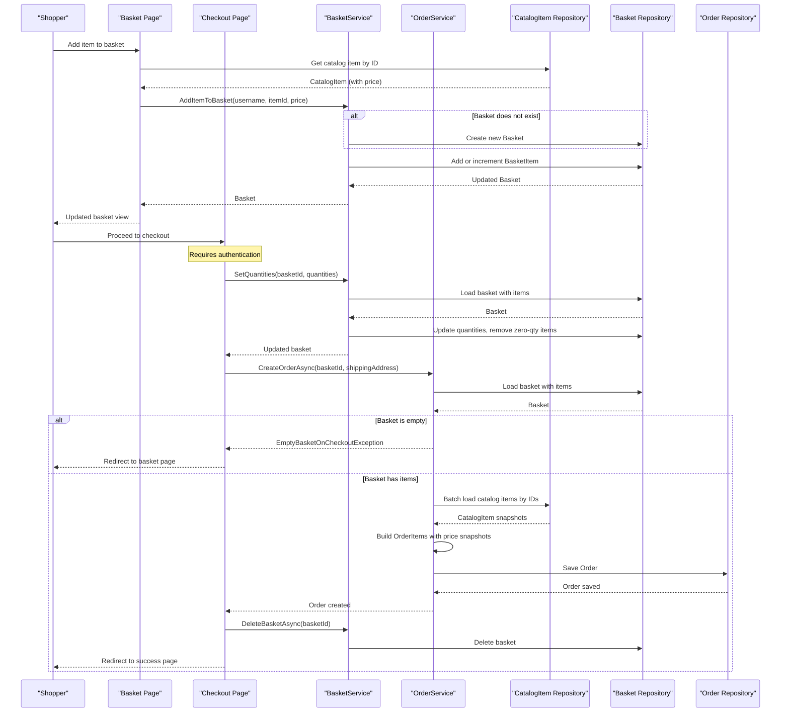

# Core Business Workflows

eShopOnWeb is an online e-commerce store where shoppers can browse a product catalog, manage a shopping basket, and place orders; administrators can manage catalog items via a dedicated admin interface.

## Domain Entities

| Entity | Service / Bounded Context | Description | Key Relationships |
|--------|--------------------------|-------------|-------------------|
| CatalogItem | Catalog Management | A product available for purchase, with name, description, price, and image | Belongs to one CatalogBrand and one CatalogType |
| CatalogBrand | Catalog Management | Brand classification for catalog items | Has many CatalogItems |
| CatalogType | Catalog Management | Type/category classification for catalog items | Has many CatalogItems |
| Basket | Shopping Basket | Represents a shopper's active cart, keyed by buyer ID (username or anonymous cookie) | Contains many BasketItems |
| BasketItem | Shopping Basket | A line item in a basket, linking a catalog item with quantity and unit price | Belongs to one Basket; references CatalogItem by ID |
| Order | Order Management | A completed purchase order, with shipping address and a snapshot of items ordered | Contains many OrderItems; owned by a BuyerId |
| OrderItem | Order Management | A line item in a completed order with price, quantity, and a snapshot of the product | Belongs to one Order; contains CatalogItemOrdered snapshot |
| CatalogItemOrdered | Order Management | Immutable point-in-time snapshot of a product at time of order | Embedded in OrderItem; not a separate table |
| Address | Order Management | Value object representing a shipping destination | Owned by Order (embedded columns) |
| ApplicationUser | Identity / Security | Authenticated user account (ASP.NET Core Identity) | Referenced by Basket.BuyerId and Order.BuyerId |

## Service-to-Domain Mapping

| Service | Domain Context | Owned Entities | External Dependencies |
|---------|---------------|----------------|-----------------------|
| Web (MVC + Razor Pages) | Storefront | Basket, BasketItem (shopping); Order, OrderItem (checkout) | CatalogContext (SQL Server); AppIdentityDbContext (Identity DB) |
| PublicApi (Minimal API) | Catalog Management API | CatalogItem, CatalogBrand, CatalogType (read + write) | CatalogContext (SQL Server); AppIdentityDbContext (Identity DB) |
| BlazorAdmin (WASM) | Admin Catalog Management | None (delegates to PublicApi) | PublicApi REST endpoints for catalog CRUD |
| Infrastructure | Shared persistence | All entities (EF Core mappings) | SQL Server (CatalogDb, IdentityDb) |

Both Web and PublicApi share the same `CatalogContext` database. There is no database-per-service isolation — the bounded context separation is enforced by code, not database topology.

## Primary Workflows

### Workflow 1: Browse Catalog

**Actor**: Anonymous or authenticated shopper.

1. Shopper navigates to the catalog home page (`/`).
2. The `HomeController` calls `CachedCatalogViewModelService.GetCatalogItems(pageIndex, itemsPage, brandId, typeId)`.
3. If a cache entry for the requested page/brand/type combination exists (within the 30-second sliding window), the cached result is returned immediately.
4. On cache miss, `CatalogViewModelService` queries `IRepository<CatalogItem>` using `CatalogFilterPaginatedSpecification` for the current page and `CatalogFilterSpecification` for the total count.
5. Brand and type filter lists are also served from cache (`GetBrands`, `GetTypes`) using their own cache keys.
6. The Razor view renders the catalog page with pagination, brand filter, and type filter UI controls.

### Workflow 2: Add to Basket (Anonymous or Authenticated)

**Actor**: Anonymous visitor or authenticated shopper.

1. Shopper clicks "Add to cart" on a catalog item.
2. The basket page (`/Basket`) calls `IBasketService.AddItemToBasket(username, catalogItemId, price)`.
3. If no basket exists for the given buyer ID, a new `Basket` is created and persisted.
4. The unit price is taken from the catalog item at add-time (price snapshot captured by the caller).
5. If the item is already in the basket, its quantity is incremented; otherwise a new `BasketItem` is added.
6. The basket is updated in the database.

**Anonymous basket**: For unauthenticated users, a GUID is generated and stored in a cookie (`basket`). This cookie-based buyer ID is used as the basket key.

### Workflow 3: Checkout and Place Order

**Actor**: Authenticated shopper (requires `[Authorize]`).

1. Shopper navigates to the checkout page (`/Basket/Checkout`).
2. The checkout page loads the shopper's current basket via `BasketViewModelService`.
3. On POST, the shopper confirms line-item quantities.
4. `BasketService.SetQuantities(basketId, quantities)` updates each item's quantity; items set to 0 are removed (`RemoveEmptyItems()`).
5. `OrderService.CreateOrderAsync(basketId, shippingAddress)` executes:
   a. Loads the basket with all items.
   b. Guards against empty basket (`EmptyBasketOnCheckoutException` thrown if no items remain).
   c. Batch-fetches current catalog items by ID to capture product snapshots.
   d. Constructs `OrderItem` objects, each containing an immutable `CatalogItemOrdered` snapshot (name, picture URI) and the unit price from the basket.
   e. Creates and persists the `Order` aggregate.
6. `BasketService.DeleteBasketAsync(basketId)` removes the basket.
7. On success, the shopper is redirected to the order success page.
8. On `EmptyBasketOnCheckoutException`, the shopper is redirected back to the basket page.

**Note**: The shipping address is currently hardcoded as `123 Main St., Kent, OH, United States, 44240` in `CheckoutModel.OnPost` — no shipping address input is collected from the shopper.

### Workflow 4: User Login and Basket Transfer

**Actor**: Previously anonymous shopper who signs in.

1. Shopper completes ASP.NET Core Identity sign-in.
2. On successful authentication, `BasketService.TransferBasketAsync(anonymousId, userName)` is called.
3. If an anonymous basket exists, its items are merged into the user's named basket (creating one if needed).
4. The anonymous basket is deleted.
5. The shopper's authenticated session now owns the combined basket.

### Workflow 5: Admin Catalog Management (Blazor Admin)

**Actor**: Administrator (requires `Administrators` role).

1. Admin opens the Blazor WebAssembly admin panel (hosted at `/Admin`).
2. BlazorAdmin authenticates against `POST /api/authenticate` and receives a JWT token.
3. Admin browses catalog items via `GET /api/catalog-items` (paged), brands via `GET /api/catalog-brands`, and types via `GET /api/catalog-types`.
4. Admin creates, updates, or deletes catalog items via `POST /api/catalog-items`, `PUT /api/catalog-items`, and `DELETE /api/catalog-items/{id}`.
5. All changes go through `EfRepository<CatalogItem>` and are persisted to the shared `CatalogDb`.

### Workflow 6: View Order History

**Actor**: Authenticated shopper.

1. Shopper navigates to `/Order/MyOrders`.
2. `OrderController` dispatches `GetMyOrders(User.Identity.Name)` via MediatR.
3. The handler queries `IRepository<Order>` using `CustomerOrdersWithItemsSpecification(buyerId)`.
4. Orders with their items and product snapshots are loaded and returned as a view model.
5. Shopper can view individual order details via `/Order/Detail/{orderId}`, dispatching `GetOrderDetails(username, orderId)`.
6. The detail handler verifies order ownership (the order's `BuyerId` must match the authenticated user's name) before returning details.

## Cross-Service Data Flows

Within the Web host, all data flows are in-process: the Razor Pages and MVC controllers call application services, which call repositories, which query the shared SQL Server database. There is no inter-service HTTP call for the main storefront workflows.

The Blazor WebAssembly admin UI introduces a cross-process data flow:
- **Authentication**: BlazorAdmin → `POST /api/authenticate` → `IdentityTokenClaimService` → `AppIdentityDbContext` → JWT issued
- **Catalog CRUD**: BlazorAdmin (with JWT) → PublicApi endpoints → `EfRepository<CatalogItem>` → `CatalogContext` → SQL Server

Both data paths ultimately converge on the same SQL Server instance. When the PublicApi is unavailable, the Blazor admin UI loses catalog management capability entirely — there is no circuit breaker or fallback behavior configured.

## Business Workflow Sequence

## Business Rules & Decision Logic

### Validation Rules

- **Empty basket guard**: `BasketGuards.EmptyBasketOnCheckoutException` — checkout is rejected if the basket has no items after quantity updates.
- **Non-null user identity**: `Guard.Against.Null(User.Identity.Name)` — all authenticated operations require an identified user.
- **Positive quantity**: `BasketItem.SetQuantity` and `AddQuantity` use `Guard.Against.OutOfRange(quantity, 0, int.MaxValue)`.
- **Positive price**: `CatalogItem.UpdateDetails` enforces `Guard.Against.NegativeOrZero(price)`.
- **Non-empty name/description**: `CatalogItem.UpdateDetails` enforces `Guard.Against.NullOrEmpty` on Name and Description.
- **Positive catalog item ID**: `CatalogItemOrdered` constructor enforces `Guard.Against.OutOfRange(catalogItemId, 1, int.MaxValue)`.
- **Admin role**: Catalog admin pages require `[Authorize(Roles = "Administrators")]`; the Public API endpoints require a valid JWT.
- **Checkout authentication**: `CheckoutModel` is decorated with `[Authorize]` — anonymous users cannot complete checkout.

### Decision Logic

- **Anonymous vs authenticated basket**: If a user is not signed in, a cookie-based GUID is used as the buyer ID. On sign-in, the anonymous basket is merged into the user's named basket.
- **Basket creation on demand**: `BasketService.AddItemToBasket` creates a new basket if none exists for the buyer ID — no explicit "create basket" step is needed.
- **Price snapshot at add-time**: The unit price is read from the catalog at the time the item is added to the basket, not at checkout. This means catalog price changes after add-to-basket are not reflected.
- **Product snapshot at checkout**: `OrderService.CreateOrderAsync` re-fetches catalog items to capture the current name and picture URI at order time. If a catalog item has been deleted between add-to-basket and checkout, the order creation will fail (no null-guard for missing catalog items).

### State Transitions

- **Basket lifecycle**: Created (on first add) → Updated (add/remove items, set quantities) → Deleted (after successful checkout or explicit deletion)
- **Order lifecycle**: Created (on checkout) — no further state transitions are modeled (no confirmation, fulfillment, or cancellation states in the current codebase)

### Business Constraints

- **No inventory management**: There is no stock level tracking; any quantity can be added to a basket regardless of availability.
- **Fixed shipping address**: The checkout page hardcodes the shipping address; no user input is collected for the shipping destination.
- **No payment processing**: Orders are created without any payment step — the application is a reference/demo project.
- **Hardcoded artificial delay**: The `CatalogItemListPagedEndpoint` includes a 1-second `Task.Delay` that affects all paged catalog list requests through the PublicApi.

### Cross-Cutting Concerns

- **Transactions**: No explicit `TransactionScope` or `BeginTransaction` is used. EF Core operations are committed atomically per `SaveChangesAsync` call, but the multi-step checkout (SetQuantities → CreateOrder → DeleteBasket) does not run within a single database transaction — a failure after order creation but before basket deletion would leave an orphaned basket.
- **Authorization**: Cookie-based auth for MVC/Razor Pages; JWT for PublicApi. The `Administrators` role gates admin-only pages and Blazor admin routes.
- **Logging**: `IAppLogger<T>` is injected into services; quantity updates are logged at Information level; `EmptyBasketOnCheckoutException` is logged at Warning level.
- **Error handling**: `EmptyBasketOnCheckoutException` (custom exception) is caught in `CheckoutModel.OnPost` and redirects the user to the basket page. Other exceptions propagate to the ASP.NET Core error middleware.
