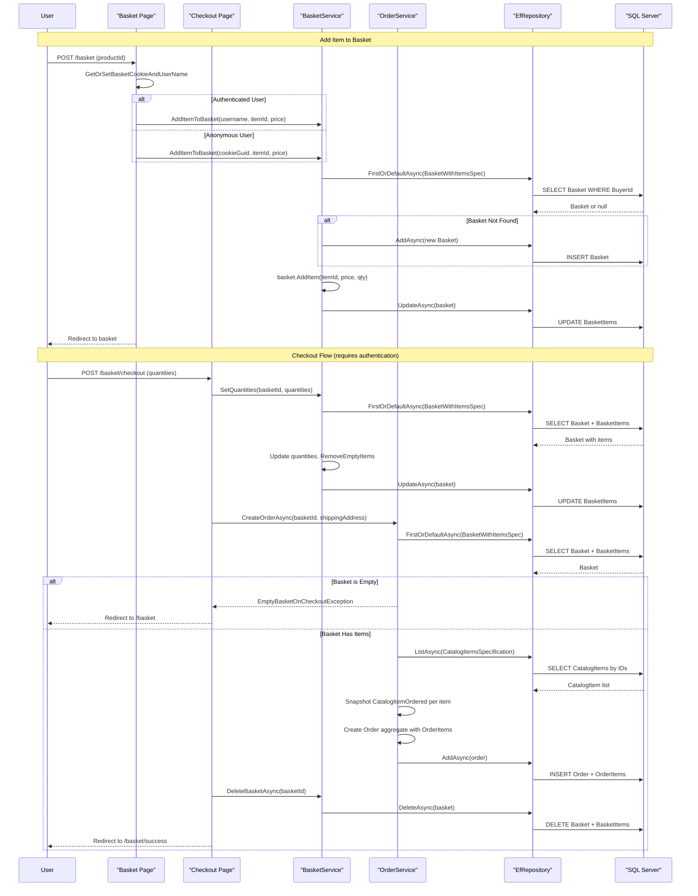

# Core Business Workflows

eShopOnWeb is a reference e-commerce application where customers can browse a product catalog, add items to a shopping basket, and place orders, while administrators can manage the catalog through a dedicated admin panel.

## Domain Entities

| Entity | Service / Bounded Context | Description | Key Relationships |
|--------|--------------------------|-------------|-----------------|
| CatalogItem | Catalog Management | A product available for sale — has name, description, price, and picture | Belongs to one CatalogBrand and one CatalogType |
| CatalogBrand | Catalog Management | A product brand/manufacturer (e.g., ".NET", "Azure") | Parent of many CatalogItems |
| CatalogType | Catalog Management | A product category/type (e.g., "T-Shirt", "Mug") | Parent of many CatalogItems |
| Basket | Shopping Basket | An in-progress collection of items for a buyer, identified by username or anonymous GUID | Contains many BasketItems; owned by one buyer |
| BasketItem | Shopping Basket | A single product+quantity entry in a basket | Belongs to one Basket; references one CatalogItem |
| Order | Order Management | A confirmed purchase created from a basket; immutable once created | Contains many OrderItems; has a shipping Address value object |
| OrderItem | Order Management | A snapshot of a purchased item at the time of order — price and product details frozen | Belongs to one Order; carries CatalogItemOrdered snapshot |
| CatalogItemOrdered | Order Management | A value object snapshot of the product at time of purchase | Owned by OrderItem — not updated if catalog changes later |
| Address | Order Management | A value object for shipping destination (street, city, state, country, zip) | Owned by Order |
| ApplicationUser | Identity / User Management | An ASP.NET Core Identity user with email/password | Can have Administrators role; maps to BuyerId in baskets and orders |

## Service-to-Domain Mapping

| Service | Domain Context | Owned Entities | External Dependencies |
|---------|---------------|---------------|----------------------|
| Web (MVC/Razor Pages) | Shopping + Order Management | Basket, BasketItem, Order, OrderItem | CatalogItem (read-only for price/name lookup); ApplicationUser (via ASP.NET Identity) |
| PublicApi | Catalog Management | CatalogItem, CatalogBrand, CatalogType | ApplicationUser (for JWT authentication only) |
| BlazorAdmin | Catalog Management (admin view) | CatalogItem (via PublicApi REST calls) | PublicApi (REST) |
| Infrastructure / AppIdentityDbContext | Identity | ApplicationUser, ASP.NET Identity tables | None |

**Source of truth:** CatalogItem price and name at time of checkout are looked up from the `CatalogItems` table and snapshotted into `OrderItem.ItemOrdered` (as `CatalogItemOrdered`). This ensures order history is immutable even if the catalog product is later updated or deleted.

## Primary Workflows

### Workflow 1: Anonymous User Browses Catalog and Adds to Basket

1. User visits `/` (Index Razor Page) — catalog items are loaded from the DB (or served from `IMemoryCache` with 30-second sliding TTL)
2. User selects a product and clicks "Add to Basket" (POST to `/basket`)
3. System calls `GetOrSetBasketCookieAndUserName()`:
   - If the user is authenticated: use their username
   - If anonymous and basket cookie exists: use the GUID from cookie
   - If anonymous and no cookie: generate a new GUID, set a 10-year cookie
4. `BasketService.AddItemToBasket(username, catalogItemId, price)` is called:
   - Loads existing basket by `BuyerId` specification
   - If no basket exists: creates a new one and persists it
   - Adds the item (or increments quantity if item already in basket)
   - Updates basket in DB
5. User is redirected to the basket page (`/basket`)

### Workflow 2: User Login and Basket Transfer

1. Anonymous user with items in basket navigates to `/login`
2. User submits email + password — `SignInManager.PasswordSignInAsync` validates credentials
   - If lockout is triggered: redirect to Lockout page
   - If 2FA required: redirect to 2FA page
   - If credentials invalid: show error on login page
3. On successful login: `TransferAnonymousBasketToUserAsync(email)` is called:
   - Loads the anonymous basket (by cookie GUID)
   - If an existing user basket exists: merges items from anonymous basket into user basket
   - If no user basket exists: creates a new basket for the user
   - Deletes the anonymous basket
   - Updates the user basket in DB
4. User is redirected to `returnUrl` (or home page)

### Workflow 3: Checkout and Order Creation

This is the primary end-to-end business workflow. The user must be authenticated (`[Authorize]`).

1. User visits `/basket/checkout` (GET) — current basket is loaded and displayed
2. User confirms checkout (POST to `/basket/checkout`) with item quantities
3. Quantities are updated first: `BasketService.SetQuantities(basketId, quantities)`:
   - Loads basket with items
   - Updates each item's quantity
   - Removes items with quantity = 0 (`RemoveEmptyItems()`)
4. `OrderService.CreateOrderAsync(basketId, shippingAddress)` is called:
   - Loads basket with all items (guard against null basket)
   - **Guard: basket must not be empty** — throws `EmptyBasketOnCheckoutException` if no items
   - Loads matching `CatalogItem` records by ID (for name and picture)
   - Creates `CatalogItemOrdered` snapshot for each item (freezes product name + picture)
   - Creates `OrderItem` entries with unit price from basket (price locked at time of add-to-basket)
   - Creates and persists the `Order` aggregate
5. `BasketService.DeleteBasketAsync(basketId)` — removes the basket after order is created
6. Redirect to `/basket/success`
7. On `EmptyBasketOnCheckoutException`: redirect to `/basket` (no order created)

> **Note:** Shipping address in the reference implementation is hardcoded to `"123 Main St., Kent, OH, United States, 44240"`. In a real deployment, users would enter their address during checkout.

### Workflow 4: Admin Manages Catalog (via Blazor WebAssembly)

1. Admin logs in via `POST /api/authenticate` → receives JWT token
2. BlazorAdmin SPA stores token in browser localStorage via `Blazored.LocalStorage`
3. Admin navigates to catalog management page — `CachedCatalogItemServiceDecorator` checks localStorage cache (1-minute TTL):
   - Cache hit: return cached catalog items
   - Cache miss: call `GET /api/catalog-items` → cache result in localStorage
4. Admin creates/updates/deletes a catalog item (POST/PUT/DELETE to `/api/catalog-items`):
   - Request must include JWT token with `Administrators` role
   - **Duplicate name check** (Create only): throws `DuplicateException` if name already exists
   - Image upload is disabled (security concern); default image `eCatalog-item-default.png` is assigned to new items
   - Item is persisted via `EfRepository`

### Workflow 5: User Views Order History

1. Authenticated user navigates to `/order/my-orders` (`[Authorize]` required)
2. `GetMyOrders` MediatR query is dispatched → `GetMyOrdersHandler` loads all orders for `User.Identity.Name`
3. User clicks on an order → `/order/detail/{orderId}`
4. `GetOrderDetails` MediatR query is dispatched → `GetOrderDetailsHandler`:
   - Loads order by ID with items eagerly loaded
   - Verifies order belongs to requesting user (returns `null` → 400 BadRequest if not found)
   - Maps to `OrderDetailViewModel` including line items, shipping address, and computed total

## Cross-Service Data Flows

**Single-service application:** eShopOnWeb is a monolithic application — all business logic runs within the same process. The Web MVC app and PublicApi are two separately deployable ASP.NET Core services that both connect to the same `CatalogDb` SQL Server database. There is no inter-service HTTP communication between the Web MVC app and the PublicApi at runtime (except the Blazor WASM admin SPA, which calls the PublicApi from the browser).

**Price authority:** The product price shown to the user comes from `CatalogItem.Price` in the database. When a user adds an item to their basket, the current price is fetched from the catalog and stored in `BasketItem.UnitPrice`. At checkout, `OrderItem.UnitPrice` is copied from `BasketItem.UnitPrice` (not re-fetched from catalog) — this means price changes to the catalog after adding to basket do NOT affect the checkout price.

**Product snapshot at order creation:** `CatalogItem` name and picture are re-fetched from the catalog at order creation time (in `OrderService.CreateOrderAsync`) and stored as an immutable `CatalogItemOrdered` value object. This means the order preserves the product name and picture as of the moment the order was placed, even if the catalog item is later updated.

**No circuit breaker fallback:** Since the application is effectively monolithic, there are no cross-service circuit breaker fallbacks. The only degradation pattern is the 30-second server-side memory cache for catalog browsing — if the DB is unavailable during cache TTL, the user continues to see stale catalog data until the cache expires.

## Business Workflow Sequence

## Business Rules and Decision Logic

### Validation Rules

- **Login**: Email must be a valid email address (`[EmailAddress]`); Password is required (`[Required]`)
- **Basket item quantity**: Quantity must be in range `[0, int.MaxValue]` — zero is allowed (items with quantity 0 are removed via `RemoveEmptyItems()`)
- **Basket on checkout**: Basket must have at least one item (`Guard.Against.EmptyBasketOnCheckout`) — throws `EmptyBasketOnCheckoutException`
- **Basket BuyerId**: Maximum 256 characters
- **Catalog item name**: Required; maximum 50 characters
- **Catalog item price**: Required; must be a positive decimal (`decimal(18,2)`)
- **CatalogBrand / CatalogType names**: Required; maximum 100 characters
- **Shipping address fields**: Street (180 chars), City (100), State (60), Country (90), ZipCode (18) — all required except State
- **Catalog item uniqueness**: Duplicate item name check in `CreateCatalogItemEndpoint` — throws `DuplicateException` if name already exists in catalog
- **Order ownership**: `GetOrderDetailsHandler` returns `null` if order is not found — controller returns 400 BadRequest

### State Transitions

| Entity | States / Lifecycle |
|--------|-------------------|
| Basket | Created (anonymous/GUID) → Items added → Quantities updated → Transferred to user on login → Deleted on checkout |
| Order | Created from basket → Immutable (no update/delete operations exposed) |
| Anonymous Basket | Created on first add-to-basket → Merged into user basket on login → Deleted after transfer |

### Business Constraints

- **Price locking**: Item price is captured at add-to-basket time (`BasketItem.UnitPrice`) and is NOT updated if catalog price changes before checkout
- **Product snapshot**: `CatalogItemOrdered` captures product name and picture at order creation — order history is immune to catalog changes
- **Image upload disabled**: New catalog items always receive `eCatalog-item-default.png` as their picture — no user-provided image uploads are accepted (security constraint added in response to a reported vulnerability)
- **Anonymous basket identity**: Anonymous basket is identified by a GUID cookie with a 10-year expiry; basket merge on login prevents cart loss

### Authorization Rules

- **Storefront**: All catalog browsing and basket operations are publicly accessible; checkout requires authentication (`[Authorize]`)
- **Order history**: Requires authentication; controller-level `[Authorize]` and order-level ownership check
- **Catalog management API**: Write operations (create/update/delete catalog items) require a valid JWT token with the `Administrators` role
- **Admin role**: Assigned at seed time to `admin@microsoft.com`; the `demouser@microsoft.com` seed user has no admin role

### Error Handling

| Exception | Trigger | Business Response |
|-----------|---------|-----------------|
| `EmptyBasketOnCheckoutException` | Checkout attempted with 0-item basket | Redirect to basket page with warning logged |
| `DuplicateException` | Create catalog item with duplicate name | HTTP 500 propagated (no custom error handling in endpoint) |
| `BasketNotFoundException` | `DeleteBasketAsync` called for non-existent basket | Guard throws `ArgumentNullException` |
| Null order in `GetOrderDetails` | Order not found or belongs to another user | 400 BadRequest returned |
