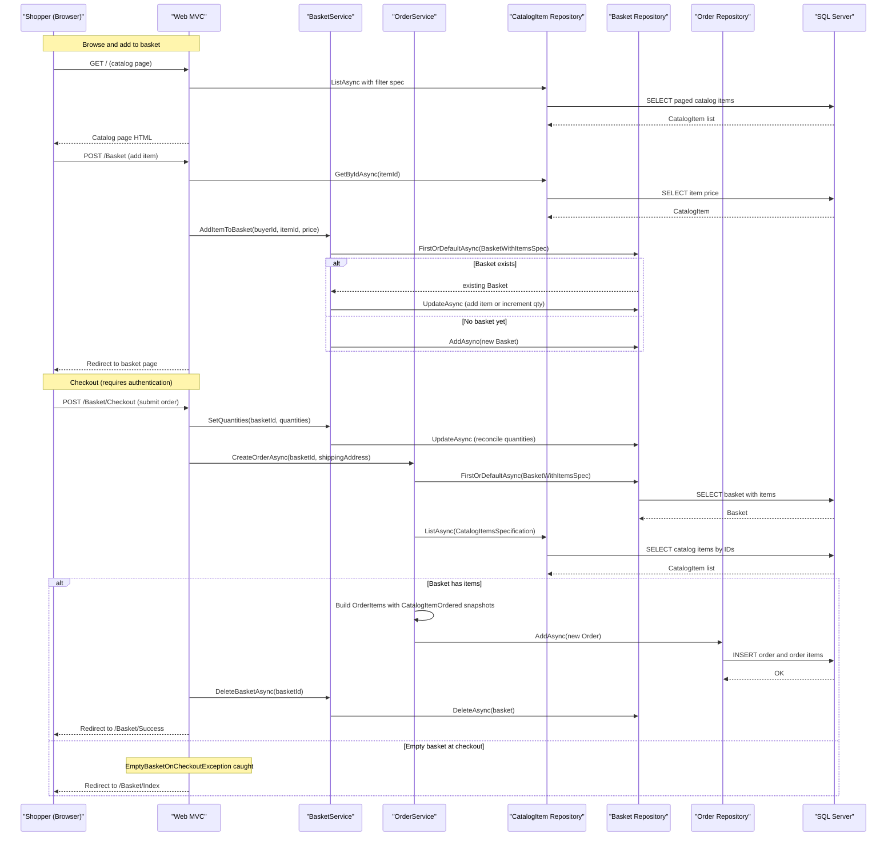

# Core Business Workflows

eShopOnWeb is a reference e-commerce application that allows shoppers to browse a product catalog, manage a shopping basket (anonymously or authenticated), and place orders, while administrators manage the catalog through a Blazor-based admin panel.

## Domain Entities

| Entity | Service / Bounded Context | Description | Key Relationships |
|---|---|---|---|
| CatalogItem | Catalog Management | A product for sale, with name, description, price, picture, brand, and type | Belongs to one CatalogBrand and one CatalogType |
| CatalogBrand | Catalog Management | A brand label for grouping products | Referenced by many CatalogItems |
| CatalogType | Catalog Management | A product category for filtering | Referenced by many CatalogItems |
| Basket | Shopping Basket | A buyer's active shopping basket; identified by username (authenticated) or GUID cookie (anonymous) | Contains many BasketItems; each BasketItem references a CatalogItem |
| BasketItem | Shopping Basket | A line item in the basket with quantity and unit price snapshot | Belongs to one Basket; references one CatalogItem |
| Order | Order Management | A completed purchase placed by a buyer, including a shipping address and a snapshot of all items ordered | Contains many OrderItems; immutable after creation |
| OrderItem | Order Management | A line item in an order; holds a snapshot of the catalog item at purchase time | Belongs to one Order; embeds a CatalogItemOrdered value object |
| CatalogItemOrdered | Order Management | Immutable value object snapshot of the catalog item at order time (id, name, picture URI) | Owned by OrderItem; prevents catalog changes from affecting past orders |
| Buyer | Buyer Profile | Represents a registered buyer identified by their Identity GUID | Can have multiple PaymentMethods |
| PaymentMethod | Buyer Profile | A tokenized payment method (card token + last-4 digits); actual card data delegated to a PCI-compliant processor | Belongs to one Buyer |

## Service-to-Domain Mapping

| Service | Domain Context | Owned Entities | External Dependencies |
|---|---|---|---|
| Web (MVC Storefront) | Catalog browsing, basket, orders, authentication | Reads all entities; orchestrates BasketService and OrderService | ASP.NET Core Identity (IdentityDb), CatalogDb via EF Core |
| PublicApi (REST API) | Catalog management (admin CRUD) | CatalogItem (write), CatalogBrand (read), CatalogType (read) | CatalogDb via EF Core; ASP.NET Core Identity for JWT auth |
| BlazorAdmin (Blazor WASM) | Admin catalog management | No direct DB access — calls PublicApi over REST | PublicApi endpoints |
| ApplicationCore | Shared domain logic | Basket aggregate, Order aggregate | None (pure domain layer) |
| Infrastructure | Persistence and identity | All entities via EfRepository | SQL Server / InMemory EF Core |

**Cross-context exchange**: The `BuyerId` string (the user's email/username) is the foreign key that links basket and order data (CatalogDb) to the ASP.NET Identity user record (IdentityDb). No direct SQL join is performed across the two databases; the username is resolved from the authenticated `HttpContext.User` claim at the API layer.

## Primary Workflows

### Workflow 1: Anonymous and Authenticated Basket Management

A visitor lands on the storefront and can add items to a basket without signing in.

1. **Anonymous basket creation**: On first page visit, if no basket cookie (`Microsoft.eShopWeb.Basket.Cookie`) is present, a GUID is generated and stored as a 10-year cookie. The GUID becomes the `BuyerId` for the basket record.
2. **Browse catalog**: The catalog is displayed paged and filtered by brand/type via `CatalogViewModelService`.
3. **Add to basket**: The visitor clicks "Add to Cart". The Web page fetches the current item price from the catalog repository, then calls `BasketService.AddItemToBasket(username, catalogItemId, price)`. A new `Basket` is created in the database if none exists; otherwise an existing `BasketItem` quantity is incremented.
4. **View basket**: The basket page renders all items with current quantities and computed subtotals.
5. **Update quantities**: The visitor changes quantities; `BasketService.SetQuantities` is called. Zero-quantity items are removed via `Basket.RemoveEmptyItems()`.
6. **User sign-in**: When an authenticated user signs in, `BasketService.TransferBasketAsync(anonymousId, userName)` merges the anonymous basket items into the user's named basket, then deletes the anonymous basket.

### Workflow 2: Checkout and Order Placement

Checkout is gated behind authentication — anonymous users must sign in first.

1. **Authenticate**: User must be signed in (`[Authorize]` on `CheckoutModel`).
2. **Review basket**: `CheckoutModel.OnGet()` loads the basket view model.
3. **Submit order**: User submits the checkout form with item quantities.
4. **Update quantities**: `BasketService.SetQuantities` syncs the final basket state from the form submission.
5. **Guard — empty basket**: `Guard.Against.EmptyBasketOnCheckout` throws `EmptyBasketOnCheckoutException` if the basket has no items. The controller catches this and redirects to `/Basket/Index`.
6. **Resolve catalog items**: `OrderService.CreateOrderAsync` loads each `CatalogItem` referenced in the basket to create a snapshot (`CatalogItemOrdered` value object).
7. **Create order**: A new `Order` aggregate is constructed with `BuyerId`, shipping `Address`, and the list of `OrderItem` records. The order is persisted.
8. **Delete basket**: The basket is deleted after the order is successfully created.
9. **Redirect to success**: User is redirected to `/Basket/Success`.

> Note: The shipping address is currently hardcoded to `"123 Main St., Kent, OH, 44240"` in `CheckoutModel.OnPost`. A real address capture form has not been implemented in this reference app.

### Workflow 3: Catalog Administration (via Blazor Admin + REST API)

Administrators manage products through the Blazor WebAssembly admin panel which calls the PublicApi.

1. **Authenticate (API JWT)**: The admin calls `POST /api/authenticate` with credentials. On success, a JWT token is returned and stored in `Blazored.LocalStorage`.
2. **Browse catalog items**: `GET /api/catalog-items` (paged, filterable) is called to list items.
3. **Create item**: Admin fills the form and submits; `POST /api/catalog-items` is called with `[Authorize(Roles=ADMINISTRATORS)]`. The endpoint creates a new `CatalogItem` and returns 201 with the created item.
4. **Edit item**: `PUT /api/catalog-items` updates an existing item's details. Requires Administrators role.
5. **Delete item**: `DELETE /api/catalog-items/{id}` removes a catalog item. Requires Administrators role.

### Workflow 4: User Authentication and Token Issuance (Web + BlazorAdmin)

1. **Web storefront login**: The user signs in via ASP.NET Core Identity's cookie-based flow. After sign-in, `UserController.GetCurrentUser()` is called by BlazorAdmin to retrieve a JWT token for the API (so the Blazor WASM panel can call the PublicApi).
2. **JWT issuance**: `IdentityTokenClaimService.GetTokenAsync` generates a JWT with the user's claims and roles.
3. **Token used for API calls**: The BlazorAdmin stores the token in `Blazored.LocalStorage` and sends it as `Authorization: ****** on all write API requests.

## Cross-Service Data Flows

eShopOnWeb does **not** implement a microservices architecture with network-level inter-service calls. All services (Web, PublicApi) access the same SQL Server databases directly via EF Core repositories. The only cross-service data flow is:

- **BlazorAdmin → PublicApi**: The Blazor WebAssembly admin panel is a pure client-side consumer that calls the PublicApi over HTTP REST. CORS is configured on the PublicApi to allow requests from the Web base URL. There is no circuit breaker; if the PublicApi is unavailable, the admin panel operations fail with a network error — no fallback behavior is implemented.
- **Web → Identity store**: The Web service resolves the currently authenticated user from `HttpContext.User` (cookie claim). The username is passed as a plain string (`BuyerId`) into basket and order creation — no additional cross-context queries are made to the IdentityDb at order time.

## Business Workflow Sequence

## Business Rules & Decision Logic

### Validation Rules

- **Basket item quantity**: Must be >= 0 (enforced by `BasketItem.SetQuantity` and `AddQuantity` via `Guard.Against.OutOfRange`). Setting quantity to 0 marks the item for removal.
- **Empty basket on checkout**: Checked via `Guard.Against.EmptyBasketOnCheckout` — throws `EmptyBasketOnCheckoutException` if `basket.Items` is empty at checkout time.
- **BuyerId not null**: Enforced by `Guard.Against.Null` and `Guard.Against.NullOrEmpty` in Basket, Order, and Buyer constructors.
- **CatalogItem name/description/price**: `CatalogItem.UpdateDetails` guards against null/empty name, null/empty description, and negative-or-zero price.
- **CatalogItemOrdered ID range**: Constructor validates `catalogItemId >= 1` via `Guard.Against.OutOfRange`.
- **Identity GUID**: `Buyer` constructor validates non-empty `IdentityGuid`.

### Decision Logic

- **Anonymous vs authenticated basket**: Basket identity is determined by whether `HttpContext.User.Identity.IsAuthenticated` is true. Authenticated users use their `Identity.Name` (email). Anonymous users use a GUID from a cookie.
- **Basket transfer on login**: If an anonymous basket exists when the user authenticates, all items are merged into the user's named basket and the anonymous basket is deleted.
- **Price at order time**: The unit price stored in `BasketItem` (set when the item was added) is used to create the `OrderItem` — not the current catalog price. This is intentional to prevent price changes from affecting in-progress baskets.
- **Catalog item snapshot**: `CatalogItemOrdered` (product name, picture URI) is captured at order creation time from the current catalog, ensuring historical order accuracy even if the catalog changes later.

### State Transitions

- **Basket lifecycle**: Created (first item add) → Updated (quantity changes) → Deleted (checkout success or explicit delete).
- **Order lifecycle**: Orders are created in a single step and are immutable after creation. No status field or state machine is implemented.

### Transactions

No explicit `TransactionScope` or EF Core `BeginTransaction` is used. Each `IRepository<T>` operation is a single `SaveChanges` call. The checkout sequence (SetQuantities → CreateOrder → DeleteBasket) is **not atomic** — a failure between steps could leave the basket in a partially updated state.

### Authorization

- **Storefront**: Basket and checkout pages require `[Authorize]` (authenticated user). Catalog browsing is public.
- **PublicApi write endpoints**: POST/PUT/DELETE catalog endpoints require a valid JWT with the `Administrators` role. Read endpoints (GET) are publicly accessible.
- **Logout revocation**: On logout, an in-memory cache entry is created with the user's identity cookie key to support token revocation tracking.
