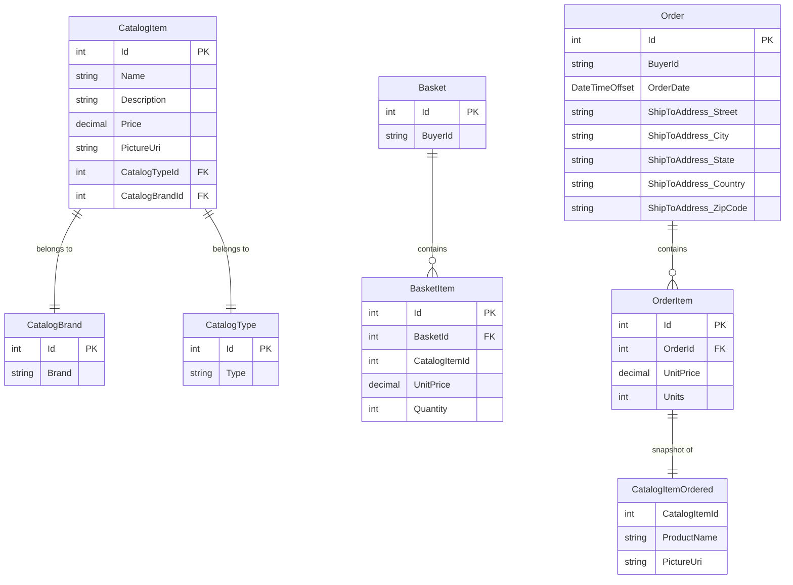

# Data Architecture & Persistence Layer

eShopOnWeb uses EF Core 8 with SQL Server as the primary persistence layer, managing 8 domain entities across two `DbContext` instances — `CatalogContext` (catalog, basket, and order data) and `AppIdentityDbContext` (ASP.NET Core Identity) — within a shared database server.

## Database Configuration

| Service/Module | DB Type | Profile | Driver | Migration Tool | Schema Notes |
|---------------|---------|---------|--------|----------------|--------------|
| Infrastructure (CatalogContext) | SQL Server | Development / Docker | `Microsoft.EntityFrameworkCore.SqlServer` | EF Core Migrations (`catalogContext.Database.Migrate()` on startup) | HiLo sequences for Catalog, CatalogBrand, CatalogType IDs |
| Infrastructure (CatalogContext) | In-Memory | Test | `Microsoft.EntityFrameworkCore.InMemory` | None (schema created in-memory) | Used in unit/functional tests |
| Infrastructure (AppIdentityDbContext) | SQL Server | Development / Docker | `Microsoft.EntityFrameworkCore.SqlServer` | EF Core Identity default migrations | Standard ASP.NET Core Identity schema |
| Infrastructure (AppIdentityDbContext) | In-Memory | Test | `Microsoft.EntityFrameworkCore.InMemory` | None | Used in integration tests |
| PublicApi | SQL Server | All | Same drivers as above | Shared with Web | Connects to same CatalogDb |

**Seed data**: `CatalogContextSeed` programmatically seeds `CatalogBrands`, `CatalogTypes`, and `CatalogItems` on startup if the tables are empty. Seeding uses retry logic (up to 10 retries) to handle SQL Server startup delays.

For raw property key-value pairs (connection strings, environment variables), see `configuration-inventory.md`.

## Data Ownership per Service

| Service | Tables / Entities Owned | ORM Framework | Caching | Notes |
|---------|------------------------|--------------|---------|-------|
| Web + PublicApi (via Infrastructure) | Catalog, CatalogBrand, CatalogType, Basket, BasketItem, Order, OrderItem | EF Core 8 via `CatalogContext` | `IMemoryCache` (in-process, 30s sliding TTL) for catalog view models | Shared logical DB; both Web and PublicApi connect to the same `CatalogDb` |
| Infrastructure (Identity) | AspNetUsers, AspNetRoles, AspNetUserRoles, etc. | EF Core 8 via `AppIdentityDbContext` (inherits `IdentityDbContext`) | None | Standard Identity schema; separate logical DB (`IdentityDb`) |

## Entity Model

**Entity notes:**
- `Address` is an EF Core **owned type** stored as columns on the `Order` table (no separate table).
- `CatalogItemOrdered` is an EF Core **owned type** stored as columns on `OrderItems` — it is a point-in-time snapshot so order history is not affected by catalog changes.
- `Basket.Items` and `Order.OrderItems` use private backing fields; EF Core accesses them via `PropertyAccessMode.Field`.
- `CatalogItem` maps to the `Catalog` table (`builder.ToTable("Catalog")`).
- All entities inherit `BaseEntity` which exposes `int Id` (protected setter).
- `BuyerAggregate` (`Buyer`, `PaymentMethod`) is defined in ApplicationCore but NOT registered in `CatalogContext` or `AppIdentityDbContext` — it is currently not persisted.

## Key Repository Methods

| Repository | Entity | Notable Query Methods | Purpose |
|-----------|--------|----------------------|---------|
| `EfRepository<CatalogItem>` | `CatalogItem` | `ListAsync(CatalogFilterSpecification)` | Filtered catalog list (brand + type) |
| `EfRepository<CatalogItem>` | `CatalogItem` | `ListAsync(CatalogFilterPaginatedSpecification)` | Paged, filtered catalog list |
| `EfRepository<CatalogItem>` | `CatalogItem` | `ListAsync(CatalogItemsSpecification(ids[]))` | Batch lookup by IDs |
| `EfRepository<CatalogItem>` | `CatalogItem` | `FirstOrDefaultAsync(CatalogItemNameSpecification)` | Lookup by name |
| `EfRepository<Basket>` | `Basket` | `FirstOrDefaultAsync(BasketWithItemsSpecification(buyerId))` | Load basket with items by buyer |
| `EfRepository<Basket>` | `Basket` | `FirstOrDefaultAsync(BasketWithItemsSpecification(basketId))` | Load basket with items by ID |
| `EfRepository<Order>` | `Order` | `ListAsync(CustomerOrdersSpecification(buyerId))` | All orders for a buyer (with items) |
| `EfRepository<Order>` | `Order` | `FirstOrDefaultAsync(OrderWithItemsByIdSpec(orderId))` | Single order with items and snapshot |
| `BasketQueryService` | `Basket` | `CountTotalBasketItems(username)` | Aggregate basket item count via DB-side SUM |

All repository methods are inherited from `Ardalis.Specification.EntityFrameworkCore.RepositoryBase<T>` which provides standard CRUD (`GetByIdAsync`, `AddAsync`, `UpdateAsync`, `DeleteAsync`, `ListAsync`, `CountAsync`). `EfRepository<T>` implements both `IRepository<T>` and `IReadRepository<T>`.

## Caching Strategy

| Layer | Provider | Scope | TTL | Eviction | Pattern | Cached Data |
|-------|---------|-------|-----|----------|---------|-------------|
| `CachedCatalogViewModelService` | `IMemoryCache` (ASP.NET Core in-process) | Per-server | 30 seconds (sliding) | Time-based sliding expiration | Cache-aside (`GetOrCreateAsync`) | Catalog brands list, catalog types list, catalog item pages (keyed by page/brand/type) |

**Cache key scheme**: Keys are generated by `CacheHelpers` — e.g., `catalogItems-page{n}-items{m}-brand{b}-type{t}`, `brands`, `types`.

**No distributed cache** (Redis or similar) is configured. Cache is in-process only; in multi-instance deployments each instance has its own cache, which can lead to stale reads across nodes.

**Rationale**: Catalog brand and type lookup lists change infrequently and are read on every page load; a short 30-second sliding cache reduces database round trips without significant staleness risk.

## Data Ownership Boundaries

Both `Web` and `PublicApi` share a single SQL Server catalog database (`CatalogDb`) and a separate identity database (`IdentityDb`). There is no database-per-service isolation; the logical boundary is at the `DbContext` level — both services instantiate `CatalogContext` and `AppIdentityDbContext` pointing at the same server.

**Cross-service data access**: The Blazor WebAssembly admin UI accesses catalog data exclusively through the `PublicApi` REST endpoints (no direct DB access from the browser). The `Web` MVC host accesses data through in-process `ApplicationCore` services backed by `EfRepository`.

**Read/write patterns**: `IRepository<T>` (read + write) and `IReadRepository<T>` (read only) are both implemented by `EfRepository<T>`, providing a clean separation at the interface level. The `BasketQueryService` is a thin query service that bypasses the Specification pattern to perform a DB-side aggregate (SUM) directly via EF Core LINQ.

**CQRS**: No formal CQRS pattern. All reads and writes go through the same `EfRepository<T>` against a single SQL Server instance.

### Data Classification & Sensitivity

| Entity | Sensitive Fields | Classification | Controls in Place |
|--------|-----------------|----------------|-------------------|
| `Order` (ShipToAddress owned type) | Street, City, State, Country, ZipCode | PII (mailing address) | No encryption-at-rest; no field-level masking configured |
| `Order` | BuyerId (username / email) | PII | No encryption-at-rest; no masking |
| `Basket` | BuyerId (username / email) | PII | No encryption-at-rest; no masking |
| `PaymentMethod` | CardId (card reference), Last4 | PCI-adjacent | Code comment states: "actual card data must be stored in a PCI compliant system, like Stripe" — this entity is NOT persisted and appears to be a placeholder |
| ASP.NET Identity (AspNetUsers) | Email, UserName, PasswordHash, SecurityStamp | PII + credential data | Password stored as bcrypt hash (ASP.NET Core Identity default); no additional field-level encryption |
| `CatalogItem`, `CatalogBrand`, `CatalogType` | None | None | N/A |
| `OrderItem` / `CatalogItemOrdered` | ProductName, PictureUri (snapshot) | None | N/A |

**Summary**: The `Order` aggregate stores PII (shipping address, buyer identity) with no encryption-at-rest or masking beyond SQL Server's default storage. ASP.NET Core Identity handles credentials securely via hashing, but no column-level encryption is applied to PII fields. Payment card data is intentionally not stored in this application.
