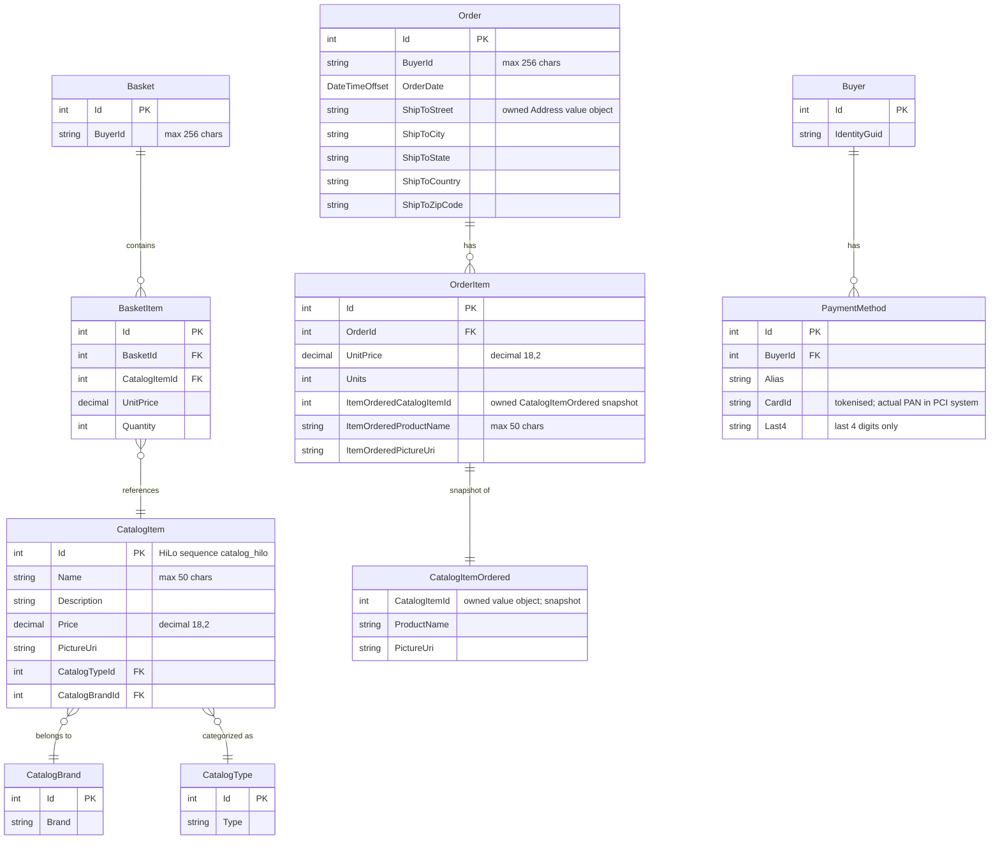

# Data Architecture & Persistence Layer

eShopOnWeb uses **EF Core 8** as its sole ORM with two SQL Server databases (CatalogDb and IdentityDb), managing **11 entities** across three domain aggregates plus the standard ASP.NET Core Identity schema.

## Database Configuration

| Service/Module | DB Type | Profile | Driver | Migration Tool | Seed Data |
|---|---|---|---|---|---|
| Infrastructure (CatalogContext) | SQL Server | Development / Docker | EF Core SqlServer provider (Microsoft.EntityFrameworkCore.SqlServer 8.0.2) | EF Core Migrations (3 migration files) | `CatalogContextSeed` programmatic seeder (catalog items, brands, types) |
| Infrastructure (CatalogContext) | In-Memory | Test / CI | EF Core InMemory provider | None (schema created in-memory) | Test data only |
| Infrastructure (AppIdentityDbContext) | SQL Server | Development / Docker | EF Core SqlServer provider | EF Core Migrations (1 migration file) | `AppIdentityDbContextSeed` programmatic seeder (default admin user) |
| Infrastructure (AppIdentityDbContext) | In-Memory | Test / CI | EF Core InMemory provider | None | Minimal test identity data |

For the full property key inventory (connection string keys, Azure SQL keys, environment variable names) see `configuration-inventory.md`.

## Data Ownership per Service

| Service | Tables Owned | ORM Framework | Caching | Notes |
|---|---|---|---|---|
| Infrastructure / CatalogContext | Catalog, CatalogBrand, CatalogType, Baskets, BasketItems, Orders, OrderItems, Buyers, PaymentMethods | EF Core 8 | ASP.NET Core MemoryCache (basket lookups) | All catalog and commerce tables in one DB schema (CatalogDb) |
| Infrastructure / AppIdentityDbContext | AspNetUsers, AspNetRoles, AspNetUserRoles, AspNetUserClaims, etc. | EF Core 8 (via IdentityDbContext) | None | Standard ASP.NET Core Identity schema in a separate IdentityDb |

## Entity Model

## Key Repository Methods

All data access goes through the single generic `EfRepository<T>` which implements both `IRepository<T>` and `IReadRepository<T>`. Query composition is delegated to **Ardalis.Specification** objects passed to the repository methods inherited from `RepositoryBase<T>`.

| Service | Repository / Specification | Notable Methods | Purpose |
|---|---|---|---|
| ApplicationCore / Infrastructure | `EfRepository<Basket>` | `GetBySpecAsync(BasketWithItemsSpecification)` | Loads a basket with its `Items` eagerly included, filtered by `buyerId` or `basketId` |
| ApplicationCore / Infrastructure | `EfRepository<CatalogItem>` | `ListAsync(CatalogFilterPaginatedSpecification)`, `CountAsync(CatalogFilterSpecification)` | Paged, filtered catalog browsing; supports filtering by brand and type |
| ApplicationCore / Infrastructure | `EfRepository<CatalogItem>` | `GetBySpecAsync(CatalogItemNameSpecification)` | Lookup by name for basket item price resolution |
| ApplicationCore / Infrastructure | `EfRepository<Order>` | `ListAsync(CustomerOrdersWithItemsSpecification)` | Loads all orders for a buyer with full order items |
| ApplicationCore / Infrastructure | `EfRepository<Order>` | `GetBySpecAsync(OrderWithItemsByIdSpec)` | Loads a single order with items by order ID |
| ApplicationCore / Infrastructure | `EfRepository<CatalogBrand>` | `ListAsync()` | Returns all brands (unfiltered) for dropdowns |
| ApplicationCore / Infrastructure | `EfRepository<CatalogType>` | `ListAsync()` | Returns all types (unfiltered) for dropdowns |

Standard inherited methods (`AddAsync`, `UpdateAsync`, `DeleteAsync`, `GetByIdAsync`) from `RepositoryBase<T>` are available on all repository instances but are not listed here.

## Caching Strategy

| Layer | Provider | Scope | Pattern | Rationale |
|---|---|---|---|---|
| PublicApi | `IMemoryCache` (ASP.NET Core) | Process-level | Cache-aside (manual get/set) | Registered via `builder.Services.AddMemoryCache()` in `PublicApi/Program.cs`; no explicit cache usage found for catalog endpoints — available for future use |
| Web | ASP.NET Core Response Caching / Cookie basket | Request-scoped | Basket stored in a secure, HTTP-only cookie by buyer ID | Avoids a DB round-trip for anonymous basket identification |

No distributed cache (Redis, SQL Server distributed cache) is configured. No TTL or eviction policies are explicitly declared. The `BlazorAdmin` client uses `Blazored.LocalStorage` to persist the authentication token in browser local storage (client-side only, not a server-side cache).

## Data Ownership Boundaries

Both `CatalogContext` and `AppIdentityDbContext` share the same SQL Server instance but use **separate database schemas/databases** (configurable via separate connection strings: `CatalogConnection` and `IdentityConnection`). This is a **logically separated, shared-infrastructure** pattern — two DbContexts, one SQL Server host.

**Cross-context data access** is resolved at the application layer, not via SQL joins:
- The `BuyerId` string stored in `Basket` and `Order` corresponds to the ASP.NET Identity user's `UserName`/email. The Web and PublicApi projects resolve identity from the `HttpContext.User` claim and pass it as a plain string — they never join across the two contexts.
- Basket-to-catalog item price resolution is a separate `IRepository<CatalogItem>` query in `BasketService.SetQuantities` — no cross-context SQL.

**Read/write patterns**: All writes go through `IRepository<T>` (`EfRepository<T>`). Read-only queries use `IReadRepository<T>` (same backing implementation). There is no CQRS separation or separate read model.

### Data Classification & Sensitivity

| Entity | Sensitive Fields | Classification | Controls in Place |
|---|---|---|---|
| Order | BuyerId (identity reference), ShipToAddress (Street, City, State, Country, ZipCode) | PII | No encryption-at-rest or field-level masking configured in EF Core; relies on SQL Server TDE at the infrastructure level |
| Basket | BuyerId (identity reference) | PII | No encryption configured |
| Buyer | IdentityGuid (maps to identity user) | PII | No encryption configured |
| PaymentMethod | CardId (tokenized), Last4 | PCI-adjacent | Code comment states actual card data must be in a PCI-compliant system (e.g., Stripe); only a token and last-4 are stored — this is acceptable if CardId is a payment processor token, not a raw PAN |
| AspNetUsers (Identity) | Email, UserName, PasswordHash, PhoneNumber | PII | ASP.NET Core Identity hashes passwords (PBKDF2); email/username stored in plaintext; no field-level encryption or masking |

**Summary**: PII (shipping address, buyer email) is stored in plaintext in the CatalogDb and IdentityDb. No application-level encryption-at-rest or data masking is implemented. Production deployments should enable SQL Server Transparent Data Encryption (TDE) and consider column-level encryption for shipping address fields.
