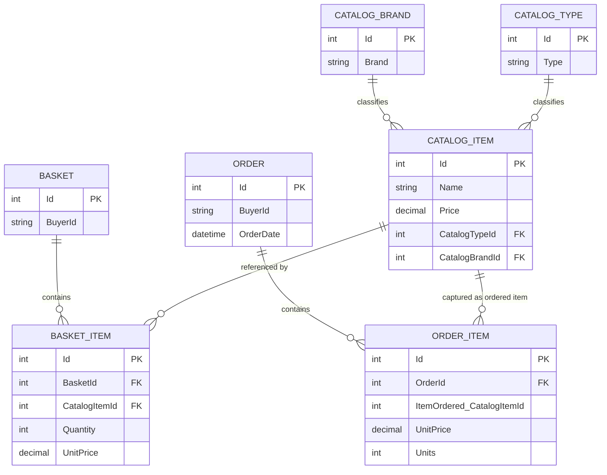

# Data Architecture & Persistence Layer

The data layer is centered on EF Core DbContexts with SQL Server persistence for catalog/order/basket and identity domains.

## Database Configuration

| Service/Module | DB Type | Profile | Driver | Connection | Migration Tool |
|---|---|---|---|---|---|
| Infrastructure/CatalogContext | SQL Server | Development/Docker default | `Microsoft.EntityFrameworkCore.SqlServer` | `CatalogConnection` | EF Core migrations + seed |
| Infrastructure/AppIdentityDbContext | SQL Server | Development/Docker default | `Microsoft.EntityFrameworkCore.SqlServer` | `IdentityConnection` | EF Core migrations + seed |
| Infrastructure/CatalogContext | InMemory | Optional test mode | EF Core InMemory provider | `UseOnlyInMemoryDatabase=true` | None |

## Data Ownership per Service

| Service | Tables Owned | ORM Framework | Caching | Notes |
|---|---|---|---|---|
| Catalog domain | CatalogItems, CatalogBrands, CatalogTypes | EF Core | In-memory | Product catalog entities |
| Basket domain | Baskets, BasketItems | EF Core | In-memory | Customer basket aggregate |
| Order domain | Orders, OrderItems | EF Core | In-memory | Order aggregate and item snapshots |
| Identity domain | AspNetUsers, AspNetRoles, related identity tables | ASP.NET Identity EF | None | Authn/Authz persistence |

## Entity Model

## Key Repository Methods

| Service | Repository | Notable Methods | Purpose |
|---|---|---|---|
| Ordering | `IRepository<Order>` | `AddAsync(order)` | Persist newly created orders |
| Basket | `IRepository<Basket>` | `FirstOrDefaultAsync(BasketWithItemsSpecification)` | Load basket aggregate for checkout |
| Catalog | `IRepository<CatalogItem>` | `ListAsync(CatalogItemsSpecification)`, `CountAsync(...)` | Filter and paginate catalog data |
| Web features | `IReadRepository<Order>` | `ListAsync(...)`, `FirstOrDefaultAsync(...)` | Query user order history/details |

## Caching Strategy

The host applications register in-memory caching (`AddMemoryCache`) and use it for runtime caching scenarios. No distributed cache provider, TTL policy file, or second-level ORM cache configuration is present.

## Data Ownership Boundaries

Data ownership is logically separated by aggregate roots inside a shared SQL Server persistence approach, with identity stored in a separate DbContext. Cross-domain access happens through shared repository abstractions inside the same solution rather than cross-service database calls.

### Data Classification & Sensitivity

| Entity | Sensitive Fields | Classification (PII/PHI/PCI/None) | Controls in Place |
|---|---|---|---|
| Basket / Order | `BuyerId` | PII | Authenticated access patterns; no field-level masking found |
| Identity user tables | usernames/emails (identity model) | PII | ASP.NET Identity framework controls |
| Catalog entities | product metadata | None | Not applicable |

No PHI or PCI-specific entity storage was detected in the inspected domain model.
