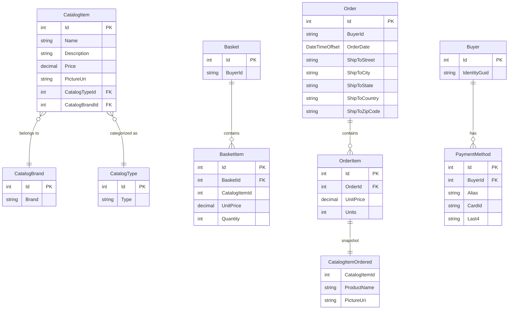

# Data Architecture & Persistence Layer

eShopOnWeb uses Entity Framework Core with two separate `DbContext` classes backed by SQL Server: `CatalogContext` owns all domain entities (catalog, basket, order), while `AppIdentityDbContext` manages ASP.NET Core Identity users and roles.

## Database Configuration

| Service/Module | DB Type | Profile | Driver | Connection | Migration Tool |
|---------------|---------|---------|--------|-----------|----------------|
| Infrastructure (CatalogContext) | SQL Server | Development / Docker | Microsoft.EntityFrameworkCore.SqlServer 8.0.2 | LocalDB (`Microsoft.eShopOnWeb.CatalogDb`) in dev; Azure SQL via Key Vault in production | EF Core Migrations (programmatic seed via `CatalogContextSeed`) |
| Infrastructure (AppIdentityDbContext) | SQL Server | Development / Docker | Microsoft.EntityFrameworkCore.SqlServer 8.0.2 | LocalDB (`Microsoft.eShopOnWeb.Identity`) in dev; Azure SQL via Key Vault in production | EF Core Migrations (programmatic seed via `AppIdentityDbContextSeed`) |
| Infrastructure (InMemory) | In-Memory | Test | Microsoft.EntityFrameworkCore.InMemory 8.0.2 | Not persisted | No migrations; seeded per-test |

HiLo sequences are used for PK generation on `CatalogItem` (`catalog_hilo`), `CatalogBrand` (`catalog_brand_hilo`), and `CatalogType` (`catalog_type_hilo`). Schema management is code-first via EF Migrations; initial data is populated by seeder classes (`CatalogContextSeed`, `AppIdentityDbContextSeed`). See `configuration-inventory.md` for the full connection string and environment variable inventory.

## Data Ownership per Service

| Service | Tables / Entities Owned | ORM Framework | Caching | Notes |
|---------|------------------------|--------------|---------|-------|
| Infrastructure / CatalogContext | Catalog, CatalogBrands, CatalogTypes, Baskets, BasketItems, Orders, OrderItems | EF Core 8.0.2 | IMemoryCache (in Web layer) | Single shared database; all domain entities in one context |
| Infrastructure / AppIdentityDbContext | AspNetUsers, AspNetRoles, AspNetUserRoles, AspNetUserClaims, etc. | EF Core 8.0.2 (IdentityDbContext) | None | Standard ASP.NET Core Identity schema |

## Entity Model

## Key Repository Methods

All data access goes through the generic `EfRepository<T>` which implements both `IRepository<T>` and `IReadRepository<T>` (from Ardalis.Specification). Query composition uses Specification objects.

| Repository / Service | Entity | Notable Methods / Specifications | Purpose |
|---------------------|--------|----------------------------------|---------|
| IRepository&lt;Basket&gt; | Basket | `FirstOrDefaultAsync(BasketWithItemsSpecification)` | Load basket with items eager-loaded |
| IRepository&lt;CatalogItem&gt; | CatalogItem | `ListAsync(CatalogFilterPaginatedSpecification)` | Paged and filtered catalog listing |
| IRepository&lt;CatalogItem&gt; | CatalogItem | `CountAsync(CatalogFilterSpecification)` | Count items matching brand/type filter |
| IRepository&lt;CatalogItem&gt; | CatalogItem | `ListAsync(CatalogItemsSpecification)` | Load specific catalog items by ID list |
| IRepository&lt;Order&gt; | Order | `ListAsync(CustomerOrdersWithItemsSpecification)` | Load all orders for a buyer with items and snapshots |
| IRepository&lt;Order&gt; | Order | `GetByIdAsync(OrderWithItemsByIdSpec)` | Load single order with items |
| IBasketQueryService | Basket / BasketItem | `CountTotalBasketItems(username)` | Aggregate SUM of basket item quantities at DB level (avoids in-memory load) |

The `CustomerOrdersWithItemsSpecification` uses `.Include().ThenInclude()` to eager-load `OrderItems` and their owned `CatalogItemOrdered` snapshots in a single query.

## Caching Strategy

| Cache Provider | Scope | Pattern | Keys | TTL | Rationale |
|---------------|-------|---------|------|-----|-----------|
| `IMemoryCache` (ASP.NET Core in-process) | Web service only | Cache-aside (GetOrCreate) | `items-{pageIndex}-{itemsPage}-{brandId}-{typeId}` | 30 seconds (sliding) | Catalog item pages are read-heavy; brief TTL prevents stale data |
| `IMemoryCache` | Web service only | Cache-aside | `brands` | 30 seconds (sliding) | Brand list is read frequently but changes rarely |
| `IMemoryCache` | Web service only | Cache-aside | `types` | 30 seconds (sliding) | Type list is read frequently but changes rarely |

The `CachedCatalogViewModelService` is a decorator wrapping `CatalogViewModelService`. It is registered conditionally to intercept catalog view model requests. The PublicApi service uses `AddMemoryCache()` but no explicit cache-aside pattern in endpoint handlers. There is no distributed cache (Redis or similar); the in-process cache is not shared across multiple Web instances, making it unsuitable for horizontal scaling without change.

## Data Ownership Boundaries

Both `CatalogContext` and `AppIdentityDbContext` connect to **separate SQL Server databases** (CatalogDb and Identity) within the same SQL Server instance, providing logical separation. There is no microservices boundary or separate deployment unit — both contexts are deployed together as part of the monolithic application.

Cross-context access is avoided at the data layer: the Web and PublicApi projects never query `AppIdentityDbContext` directly for domain operations. The `IdentityTokenClaimService` is the only infrastructure component that reads from `AppIdentityDbContext` (to generate JWT claims), bridging identity to the domain via the user's email/username string used as `BuyerId`.

The `BasketItem.CatalogItemId` is a logical foreign key to `CatalogItem` but is not enforced as a database FK constraint — this allows baskets to reference catalog items without a hard schema dependency, and `CatalogItemOrdered` serves as a denormalized snapshot to preserve order history if catalog data changes.

**Read / Write patterns**: The application is CRUD-oriented with no explicit CQRS separation. The same `EfRepository<T>` implementation handles both reads and writes. The `IReadRepository<T>` interface exists to signal read-only intent but uses the same underlying `DbContext` instance.

### Data Classification & Sensitivity

| Entity | Sensitive Fields | Classification | Controls in Place |
|--------|-----------------|----------------|-------------------|
| Order | BuyerId (email/username), ShipToAddress (Street, City, State, Country, ZipCode) | PII | No encryption-at-rest or field-level masking configured at the application layer; relies on SQL Server TDE if enabled at the server level |
| Buyer | IdentityGuid (maps to ASP.NET Identity user) | PII | No additional controls beyond Identity framework |
| PaymentMethod | CardId (card token), Last4 (last 4 digits of card) | PCI-adjacent | Code comment explicitly notes: "actual card data must be stored in a PCI compliant system, like Stripe"; `CardId` stores a token reference only, not raw PAN. No encryption-at-rest configured at the application layer |
| ApplicationUser (Identity) | Email, UserName, PasswordHash, PhoneNumber | PII | ASP.NET Core Identity hashes passwords (PBKDF2); email and phone stored in plaintext; no field-level encryption |
| BasketItem | BuyerId (via parent Basket) | PII | No controls; basket is linked to username string |

**Summary**: PII is present in `Order`, `Buyer`, and ASP.NET Identity tables. Payment data is stored as a tokenized reference only (not raw card numbers), but the token itself (`CardId`) has no additional application-level encryption. No data masking, column-level encryption, or audit logging is configured at the application layer.
