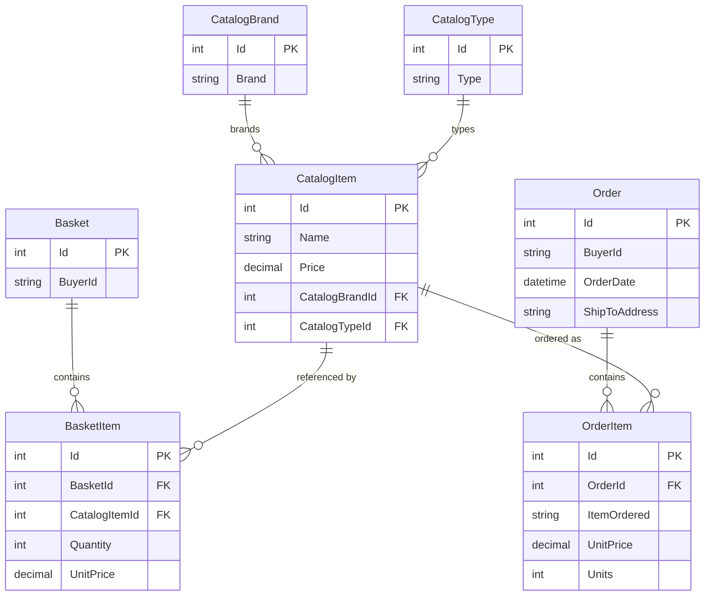

# Data Architecture & Persistence Layer

The data layer is centered on EF Core with SQL Server for persistent storage and optional in-memory databases for local/test operation. Core entities model catalog, basket, and order domains with identity data stored in a separate context.

## Database Configuration

| Service/Module | DB Type | Profile | Driver | Connection | Migration Tool |
|---|---|---|---|---|---|
| Web | SQL Server | Development/Default | EF Core SqlServer | `CatalogConnection`, `IdentityConnection` from appsettings/user secrets | EF Core migrations via `Database.Migrate()` during seed |
| Web | SQL Server | Docker | EF Core SqlServer | SQL edge container connection strings in `appsettings.Docker.json` | EF Core migrations via seed path |
| Web | SQL Server + Key Vault-resolved strings | Production | EF Core SqlServer + Azure Key Vault config provider | Key names from `AZURE_SQL_*` settings resolved from Key Vault | EF Core migrations via seed path |
| PublicApi | SQL Server | Development/Default | EF Core SqlServer | `CatalogConnection`, `IdentityConnection` from appsettings | EF Core migrations via `Database.Migrate()` during seed |
| PublicApi | SQL Server | Docker | EF Core SqlServer | SQL edge container connection strings in `appsettings.Docker.json` | EF Core migrations via seed path |
| Infrastructure | InMemory (optional) | UseOnlyInMemoryDatabase=true | EF Core InMemory | Named databases `Catalog` and `Identity` | No schema migration required |

## Data Ownership per Service

| Service | Tables Owned | ORM Framework | Caching | Notes |
|---|---|---|---|---|
| Catalog/Ordering domain (CatalogContext) | CatalogItems, CatalogBrands, CatalogTypes, Baskets, BasketItems, Orders, OrderItems | EF Core | In-memory cache in Web/API read paths | Single context for catalog, basket, and order aggregates |
| Identity domain (AppIdentityDbContext) | AspNetUsers, AspNetRoles and related identity tables | ASP.NET Core Identity + EF Core | None explicit in identity context | Separate identity context with shared SQL backend |

## Entity Model

## Key Repository Methods

| Service | Repository | Notable Methods | Purpose |
|---|---|---|---|
| Catalog/Basket/Order | `IRepository<T>` + `EfRepository<T>` | `AddAsync`, `UpdateAsync`, `DeleteAsync`, `ListAsync`, `CountAsync`, `FirstOrDefaultAsync` | Core CRUD and specification-driven queries |
| Basket workflow | `IRepository<Basket>` in `BasketService` | `FirstOrDefaultAsync(BasketWithItemsSpecification)`, `UpdateAsync`, `DeleteAsync` | Basket retrieval by buyer, merge, and persistence |
| Order workflow | `IRepository<Order>` in `OrderService` | `AddAsync(order)`, `ListAsync(spec)` | Order creation and user order retrieval |
| Catalog query paths | `IRepository<CatalogItem>` and related | `ListAsync(CatalogFilterSpecification)`, `CountAsync` | Filtering and paged catalog browsing |

## Caching Strategy

| Layer | Provider | Pattern | Notes |
|---|---|---|---|
| Web services | `IMemoryCache` | Cache-aside | `CachedCatalogViewModelService` wraps catalog view model generation |
| Public API | `AddMemoryCache` registered | Cache-aside (limited) | Primarily available for endpoint/service-level optimization |
| Persistence layer | None | N/A | EF Core default tracking, no explicit distributed cache |

## Data Ownership Boundaries

Data is logically separated into two EF Core contexts (catalog/order domain and identity domain) but usually stored in the same SQL Server engine via separate databases. Cross-module access is handled through in-process service calls and repository abstractions rather than direct cross-service DB access, because the solution is a modular monolith rather than independently deployed microservices.

### Data Classification & Sensitivity

| Entity | Sensitive Fields | Classification (PII/PHI/PCI/None) | Controls in Place |
|---|---|---|---|
| Basket | BuyerId | PII | Application-level identity auth; no field-level encryption in entity mapping |
| Order | BuyerId, ShipToAddress | PII | Authenticated flows and SQL transport security by deployment config |
| Identity user tables | User profile and credentials metadata | PII | ASP.NET Core Identity with hashed credentials |
| CatalogItem/CatalogBrand/CatalogType | Product metadata | None | Not sensitive by default |
