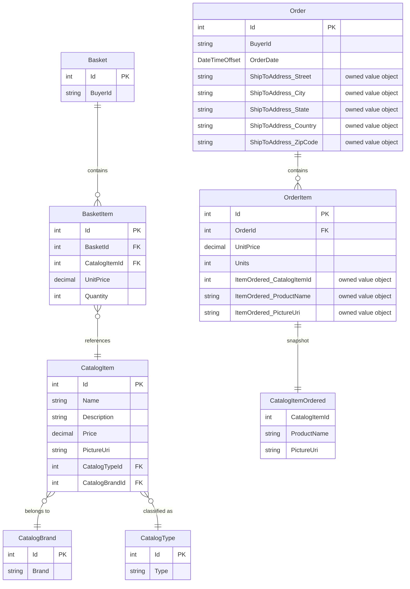

# Data Architecture & Persistence Layer

eShopOnWeb uses EF Core 8 with SQL Server as its primary data store, managing 8 domain entities across two DbContexts (CatalogContext for business data and AppIdentityDbContext for user identity).

## Database Configuration

| Service/Module | DB Type | Profile/Environment | Driver | Migration Tool | Seed Data |
|---------------|---------|-------------------|--------|---------------|-----------|
| Infrastructure (CatalogContext) | SQL Server | Development, Docker | Microsoft.EntityFrameworkCore.SqlServer 8.0.2 | EF Core Migrations (3 migration files) | CatalogContextSeed (programmatic — brands, types, items) |
| Infrastructure (CatalogContext) | In-Memory | Test / InMemory fallback | Microsoft.EntityFrameworkCore.InMemory 8.0.2 | None (schema auto-created) | CatalogContextSeed |
| Infrastructure (AppIdentityDbContext) | SQL Server | Development, Docker | Microsoft.EntityFrameworkCore.SqlServer 8.0.2 | EF Core Migrations (1 migration file) | AppIdentityDbContextSeed (admin + demo users) |
| Infrastructure (AppIdentityDbContext) | In-Memory | Test / InMemory fallback | Microsoft.EntityFrameworkCore.InMemory 8.0.2 | None | Seed skipped |

Schema management behavior: `CatalogContextSeed` calls `catalogContext.Database.Migrate()` automatically on startup when SQL Server is detected, applying any pending EF Core migrations. In-memory databases skip migration and are schema-created by EF automatically.

## Data Ownership per Service

| Service | Tables/Entities Owned | ORM Framework | Caching | Notes |
|---------|----------------------|--------------|---------|-------|
| Infrastructure / CatalogContext | Catalog (CatalogItem), CatalogBrands, CatalogTypes, Baskets, BasketItems, Orders, OrderItems | EF Core 8 (Fluent API config) | Web: IMemoryCache (30s sliding); BlazorAdmin: Browser LocalStorage (1 min TTL) | All business data in single shared DB |
| Infrastructure / AppIdentityDbContext | AspNetUsers, AspNetRoles, AspNetUserRoles, AspNetUserClaims, etc. (ASP.NET Identity schema) | EF Core 8 (IdentityDbContext) | None | Identity schema is separate logical DB |

## Entity Model

**EF Core Configuration highlights:**
- `CatalogItem` maps to table `Catalog`; PK uses Hi-Lo sequence (`catalog_hilo`)
- `CatalogBrand` and `CatalogType` also use Hi-Lo sequences (`catalog_brand_hilo`, `catalog_type_hilo`)
- `Order.ShipToAddress` (Address value object) is configured as an **owned entity** — stored as columns on the Orders table
- `OrderItem.ItemOrdered` (CatalogItemOrdered snapshot) is also an **owned entity** — stored inline in OrderItems
- `Basket.Items` and `Order.OrderItems` collections use private backing fields (`_items`, `_orderItems`) with `SetPropertyAccessMode(Field)` to enforce aggregate root encapsulation
- All monetary columns (`UnitPrice`, `Price`, `Budget`) use `decimal(18,2)` column type

## Key Repository Methods

| Service | Repository / Interface | Notable Methods | Purpose |
|---------|----------------------|----------------|---------|
| Infrastructure | `EfRepository<T> : IRepository<T>, IReadRepository<T>` | Inherited from `RepositoryBase<T>` (Ardalis.Specification.EFCore): `AddAsync`, `UpdateAsync`, `DeleteAsync`, `GetByIdAsync`, `ListAsync`, `CountAsync`, `FirstOrDefaultAsync` | Generic CRUD + Specification-based queries for all aggregate roots |
| Infrastructure | `BasketQueryService : IBasketQueryService` | `CountTotalBasketItems(string username)` | Push-down SUM query to DB to count total basket items for a user without loading all items into memory |
| ApplicationCore | `IRepository<CatalogItem>` + `CatalogFilterSpecification` | Used with `CountAsync` and `ListAsync` | Filtered, paged catalog browsing by brand/type |
| ApplicationCore | `IRepository<CatalogItem>` + `CatalogFilterPaginatedSpecification` | Used with `ListAsync` | Offset-paged catalog item list |
| ApplicationCore | `IRepository<CatalogItem>` + `CatalogItemNameSpecification` | Used with `CountAsync` in Create endpoint | Duplicate name check before insert |
| ApplicationCore | `IRepository<Basket>` + `BasketWithItemsSpecification` | Used by `BasketService` | Eagerly load basket with all its items in single query |

## Caching Strategy

| Layer | Provider | Scope | TTL / Eviction | Pattern | Cached Data |
|-------|---------|-------|---------------|---------|------------|
| Web MVC | `IMemoryCache` (ASP.NET in-process) | Per-server process | 30 seconds sliding expiration (`CacheHelpers.DefaultCacheDuration`) | Cache-aside via decorator (`CachedCatalogViewModelService`) | Catalog item pages (by pageIndex/pageSize/brand/type), brand list, type list |
| Blazor Admin | Browser `localStorage` (via Blazored.LocalStorage) | Per browser tab/session | 1 minute absolute TTL (`CacheEntry.DateCreated.AddMinutes(1)`) | Cache-aside via decorator (`CachedCatalogItemServiceDecorator`, `CachedCatalogLookupDataServiceDecorator`) | Catalog items list (`"items"` key), catalog brands, catalog types |

**Rationale:** Catalog data (brands, types, item listings) is read frequently on every page load but changes rarely (admin-only mutations). Caching the MVC view models for 30 seconds avoids redundant DB queries under typical web traffic. The Blazor WASM admin uses browser localStorage because there is no server-side session — each admin user's browser independently caches API responses.

**No distributed cache** (Redis, SQL Server session, Azure Cache) is configured. This means the Web MVC in-memory cache is not shared across multiple instances — horizontal scaling requires cache invalidation coordination or accepting cache inconsistency between instances.

## Data Ownership Boundaries

**Shared database model:** All business data (catalog, baskets, orders) resides in a single `CatalogDb` SQL Server database. There is no database-per-service or schema-per-aggregate isolation. Both the Web MVC application and the PublicApi application connect to the same `CatalogDb` via separate `EfRepository` instances registered in each service's DI container. Identity data lives in a logically separate `Identity` database but is physically co-located on the same SQL Server instance in development.

**Cross-service data access:** The Web MVC and PublicApi are the only two services that access the database directly — there is no inter-service HTTP data query (no service calling another service's REST API to access data it doesn't own). Both services own direct EF Core connections to `CatalogDb`.

**Read/write patterns:** No CQRS separation. Both `IRepository<T>` (read+write) and `IReadRepository<T>` (read-only) interfaces are declared, but in practice both are backed by the same `EfRepository<T>` implementation with full read/write access. The separation is architectural intent only, not enforced at the DB level.

**Basket lifecycle:** Baskets are persisted in `CatalogDb` (not session or Redis). When an anonymous user checks out, the basket `BuyerId` is updated to the logged-in user's username via `SetNewBuyerId`.

### Data Classification and Sensitivity

| Entity | Sensitive Fields | Classification | Controls in Place |
|--------|----------------|---------------|------------------|
| Order | BuyerId (username/email), ShipToAddress (Street, City, State, Country, ZipCode) | PII | None — stored in plaintext in SQL Server; no encryption-at-rest, no field masking |
| Basket | BuyerId (username/email) | PII | None — stored in plaintext |
| OrderItem | ItemOrdered.ProductName (product snapshot — no PII) | None | N/A |
| CatalogItem | Name, Description, Price, PictureUri (product data — no PII) | None | N/A |
| AspNetUsers (Identity) | Email, NormalizedEmail, PasswordHash, PhoneNumber, SecurityStamp | PII + Credentials | Password stored as ASP.NET Identity PBKDF2 hash; email stored in plaintext; no field-level encryption |

**Summary:** The Order and Basket aggregates store PII (shipping addresses, buyer identifiers). The ASP.NET Identity tables store user emails and hashed passwords. No encryption-at-rest, data masking, or column-level access controls are configured. For production deployments handling real customer data, encryption-at-rest should be enabled at the SQL Server or Azure SQL level (Transparent Data Encryption), and consideration should be given to hashing or encrypting the `BuyerId` field in Orders and Baskets.
