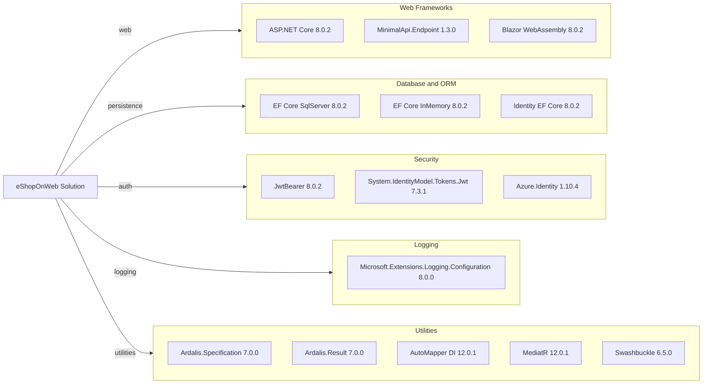

# Dependency Map

This .NET solution uses centrally managed NuGet packages with a moderate dependency surface across web, API, data, security, and utility areas. The map below highlights declared non-test dependencies by category.

## Dependencies

### Dependency Summary

| Category | Count | Key Libraries | Notes |
|---|---:|---|---|
| Web Frameworks | 3 | ASP.NET Core, MinimalApi.Endpoint, Blazor | Main HTTP/UI stack for MVC, API, and admin UI |
| Database / ORM | 3 | EF Core SqlServer, EF Core InMemory, Identity EF Core | SQL Server primary persistence with in-memory option |
| Security | 3 | JwtBearer, System.IdentityModel.Tokens.Jwt, Azure.Identity | JWT auth plus optional Key Vault integration |
| Logging | 1 | Microsoft.Extensions.Logging.Configuration | Standard ASP.NET Core logging configuration |
| Utilities | 5 | Ardalis.*, AutoMapper, MediatR, Swashbuckle | Domain patterns, mapping, mediation, API documentation |

### Version & Compatibility Risks

The solution targets .NET 8 and uses package versions mostly aligned to 8.0.x, but baseline test output already flags known advisories in `System.Text.Json` 8.0.3 and `Azure.Identity` 1.10.4. These should be reviewed during modernization and dependency refresh.

### Notable Observations

- Versions are centrally managed in `Directory.Packages.props`, reducing drift across projects.
- Both SQL Server and InMemory providers are declared, enabling production and test/dev persistence modes.
- Public API uses both controller-based endpoints and Minimal API endpoint classes.
- Swagger/annotations dependencies are explicitly included for API contract visibility.

## Test Dependencies

| Framework | Version | Notes |
|---|---|---|
| xUnit | 2.7.0 | Primary unit and integration test framework |
| xunit.runner.visualstudio | 2.5.6 | Visual Studio test runner integration |
| xunit.runner.console | 2.7.0 | Console execution support |
| Microsoft.NET.Test.Sdk | 17.9.0 | .NET test hosting infrastructure |
| MSTest.TestFramework / Adapter | 3.2.2 | Additional test compatibility packages |
| coverlet.collector | 6.0.2 | Code coverage collection |
| NSubstitute | 5.1.0 | Mocking framework in test projects |

Total test-scope dependencies: 7

The test stack is complete for unit, functional, and integration test execution and includes mocking and coverage tooling.
