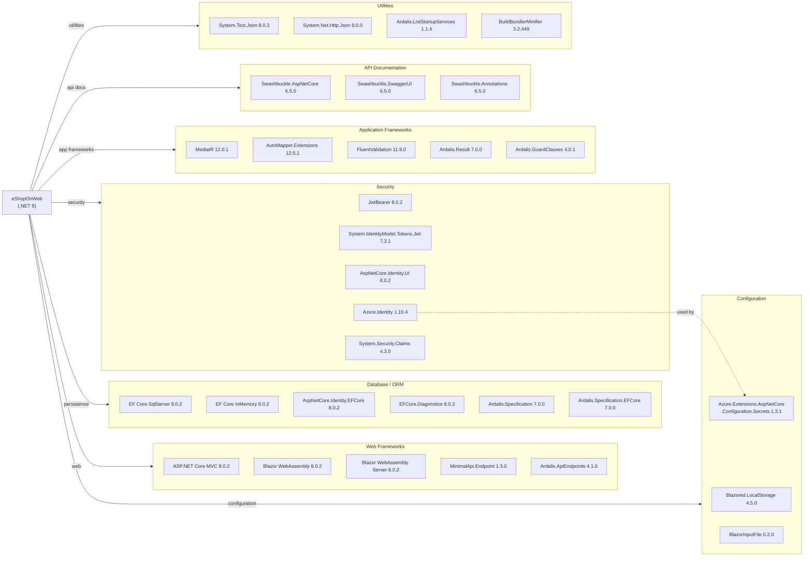

# Dependency Map

eShopOnWeb is a .NET 8 e-commerce reference application with 34 declared production dependencies and 8 test dependencies managed centrally via `Directory.Packages.props`.

## Dependencies

### Dependency Summary

| Category | Count | Key Libraries | Notes |
|----------|-------|--------------|-------|
| Web Frameworks | 5 | ASP.NET Core MVC 8.0.2, Blazor WebAssembly 8.0.2, MinimalApi.Endpoint 1.3.0 | Dual-frontend: server MVC + client Blazor WASM |
| Database / ORM | 6 | EF Core SqlServer 8.0.2, Ardalis.Specification 7.0.0 | Centrally versioned; in-memory for dev/test |
| Security | 5 | JWT ****** Azure.Identity 1.10.4 | JWT for API; cookie auth for web; Azure identity for Key Vault |
| Configuration | 3 | Azure Key Vault extension 1.3.1, Blazored.LocalStorage 4.5.0 | BlazorInputFile 0.2.0 is legacy/unmaintained |
| Application Frameworks | 5 | MediatR 12.0.1, AutoMapper 12.0.1, FluentValidation 11.9.0 | Clean Architecture support libraries |
| API Documentation | 3 | Swashbuckle.AspNetCore 6.5.0 | Three Swashbuckle packages for full Swagger UI + annotations |
| Utilities | 4 | System.Text.Json 8.0.3, BuildBundlerMinifier 3.2.449 | BuildBundlerMinifier is a build-time-only tool |

### Version and Compatibility Risks

The application runs on ASP.NET Core 8.0.2 (LTS, supported until November 2026), which is stable but not the latest (.NET 9/10 is available). The `System.IdentityModel.Tokens.Jwt` v7.3.1 is from the Microsoft.IdentityModel family that has had several breaking changes in recent major versions — upgrading to .NET 9/10 may require testing JWT validation behavior. `BlazorInputFile` v0.2.0 is a community package that has been superseded by the built-in `InputFile` component in Blazor, making it a dead dependency. `Swashbuckle.AspNetCore` v6.5.0 is not maintained for .NET 9+ (the community has moved to the built-in OpenAPI support in .NET 9), so an upgrade path will require switching to `Microsoft.AspNetCore.OpenApi`. `Azure.Identity` 1.10.4 should be updated to 1.12.x for latest managed identity support on Azure.

### Notable Observations

- **BlazorInputFile is obsolete**: `BlazorInputFile 0.2.0` was a third-party workaround before ASP.NET Core included a native `InputFile` component. It should be removed and replaced with the built-in `<InputFile>` Blazor component.
- **Swashbuckle is end-of-life for .NET 9+**: Microsoft has moved to `Microsoft.AspNetCore.OpenApi` as the built-in OpenAPI package starting .NET 9. Upgrading to .NET 10 will require migrating from Swashbuckle to the new built-in package.
- **Dual ORM presence**: Both `Microsoft.EntityFrameworkCore.SqlServer` and `Microsoft.EntityFrameworkCore.InMemory` are production dependencies (not just test-scoped). In-memory provider is used as a fallback at runtime, which could lead to behavior differences between environments.
- **Central version management**: The use of `Directory.Packages.props` with CPM (Central Package Management) is a good practice that ensures consistent versions across projects; however, `Microsoft.AspNetCore.Mvc 2.2.0` appears in the props file as a stale entry from an older ASP.NET Core 2.x era — it is referenced by the props but not actually needed in modern .NET 8 projects.

## Test Dependencies

| Framework | Version | Notes |
|-----------|---------|-------|
| xunit | 2.7.0 | Primary unit and integration test framework |
| xunit.runner.visualstudio | 2.5.6 | VS Test Explorer runner for xUnit |
| xunit.runner.console | 2.7.0 | CLI runner for xUnit |
| Microsoft.NET.Test.Sdk | 17.9.0 | MSBuild test target infrastructure |
| NSubstitute | 5.1.0 | Mocking framework for unit tests |
| NSubstitute.Analyzers.CSharp | 1.0.17 | Roslyn analyzer companion for NSubstitute |
| Microsoft.AspNetCore.Mvc.Testing | 8.0.2 | In-process test server for functional/integration tests |
| coverlet.collector | 6.0.2 | Code coverage collector |
| MSTest.TestAdapter | 3.2.2 | MSTest adapter (declared but not actively used) |
| MSTest.TestFramework | 3.2.2 | MSTest framework (declared but not actively used) |

Total test-scope dependencies: 10

The test infrastructure is well-structured with xUnit as the primary framework, NSubstitute for mocking, and `Microsoft.AspNetCore.Mvc.Testing` enabling full end-to-end functional tests via an in-process test host. No contract testing library (e.g., Pact) is present. The presence of both MSTest and xUnit packages in the central props is redundant — MSTest adapter and framework are declared but not used in any test project.
