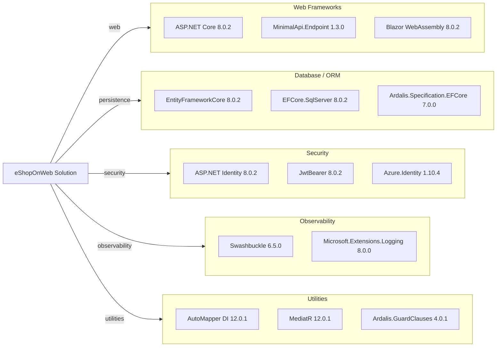

# Dependency Map

This .NET solution declares centralized package versions and project dependencies across web, API, infrastructure, core, and test projects.

## Dependencies

### Dependency Summary

| Category | Count | Key Libraries | Notes |
|---|---:|---|---|
| Web Frameworks | 3 | ASP.NET Core, Blazor, MinimalApi.Endpoint | Primary host/runtime stack |
| Database / ORM | 3 | EF Core, SQL Server provider, Ardalis.Specification EF adapter | Repository + specification-based querying |
| Security | 3 | ASP.NET Identity, JWT Bearer, Azure Identity | Cookie/JWT auth plus cloud identity integration |
| Observability | 2 | Swashbuckle, Microsoft logging extensions | API docs and runtime logging |
| Utilities | 3 | AutoMapper, MediatR, GuardClauses | Mapping, messaging patterns, validation guards |

### Version & Compatibility Risks

`Azure.Identity` 1.10.4 and `System.Text.Json` 8.0.3 are flagged during restore with known advisory warnings, and several packages remain pinned to early .NET 8 patch levels. These should be reviewed during modernization to reduce vulnerability and compatibility risk.

### Notable Observations

- Package versioning is centrally managed through `Directory.Packages.props`.
- Test frameworks are isolated to test projects and not mixed into production project references.
- The solution combines MVC, Razor Pages, Blazor, and Minimal APIs, increasing dependency diversity.

## Test Dependencies

| Framework | Version | Notes |
|---|---|---|
| xUnit | 2.7.0 | Primary test framework |
| xUnit runner (VS/console) | 2.5.6 / 2.7.0 | IDE and CLI execution |
| Microsoft.NET.Test.Sdk | 17.9.0 | Test host integration |
| MSTest.TestFramework / Adapter | 3.2.2 | Included in package management |
| coverlet.collector | 6.0.2 | Code coverage collection |
| NSubstitute | 5.1.0 | Mocking/substitution library |

Total test-scope dependencies: 6

Test infrastructure is mature with unit, integration, functional, and API integration test projects.
