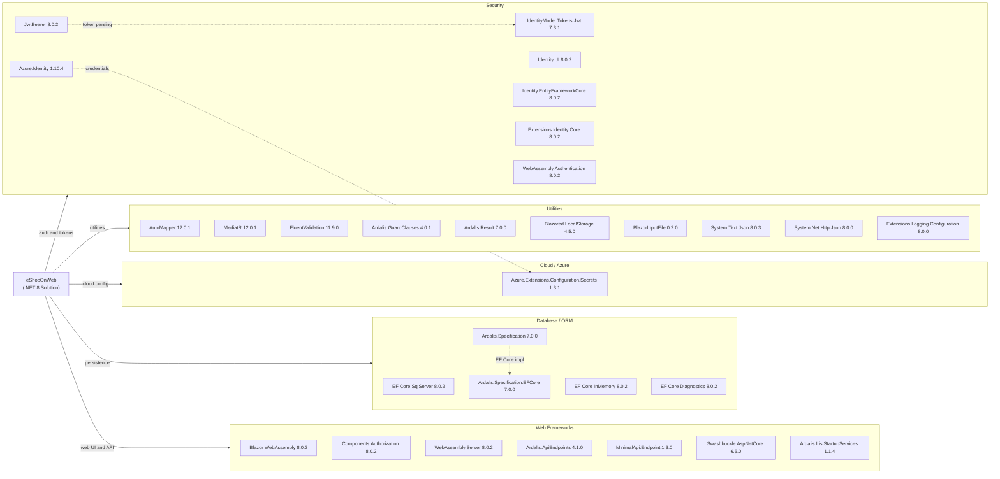

# Dependency Map

eShopOnWeb is a reference .NET 8 ASP.NET Core e-commerce application managed via central package versioning (`Directory.Packages.props`). It declares approximately 40 production-scope NuGet packages spanning web frameworks, ORM, security, cloud integration, and utilities.

## Dependencies

### Dependency Summary

| Category | Count | Key Libraries | Notes |
|----------|-------|--------------|-------|
| Web Frameworks | 7 | Blazor WebAssembly 8.0.2, Ardalis.ApiEndpoints 4.1.0, Swashbuckle 6.5.0 | Dual-frontend: Razor Pages + Blazor WASM admin |
| Database / ORM | 5 | EF Core SqlServer 8.0.2, Ardalis.Specification 7.0.0 | Centrally versioned; InMemory provider for tests |
| Security | 7 | ASP.NET Core Identity 8.0.2, JwtBearer 8.0.2, Azure.Identity 1.10.4 | Cookie + JWT dual-auth strategy |
| Cloud / Azure | 1 | Azure.Extensions.Configuration.Secrets 1.3.1 | Key Vault integration for production secrets |
| Utilities | 10 | AutoMapper 12.0.1, MediatR 12.0.1, FluentValidation 11.9.0 | CQRS, mapping, validation utilities |

### Version & Compatibility Risks

The solution targets .NET 8 (LTS, supported until November 2026) and all Microsoft packages are consistently pinned to `8.0.2` via `Directory.Packages.props`. `BlazorInputFile v0.2.0` is a community package that predates the official `InputFile` component introduced in .NET 6 — it has seen no releases since 2020 and may be safely replaced with the built-in `InputFile` component. `System.IdentityModel.Tokens.Jwt v7.3.1` is maintained by Microsoft Identity but lags slightly behind the `9.x` series; no breaking changes are expected for the current usage pattern. `Swashbuckle.AspNetCore v6.5.0` is compatible with .NET 8 but the project is no longer actively maintained by its original author; Microsoft now ships `Microsoft.AspNetCore.OpenApi` as the recommended replacement for .NET 9+. `Ardalis.Specification v7.0.0` and related Ardalis packages are in active maintenance and compatible with EF Core 8.

### Notable Observations

- **Central Package Management**: All versions are centrally managed in `Directory.Packages.props` using property-based version variables (`$(AspNetVersion)`, `$(EntityFramworkCoreVersion)`), which simplifies coordinated upgrades but contains a typo: `EntityFramworkCoreVersion` (missing 'e') — this does not affect builds but could cause confusion during maintenance.
- **BlazorInputFile is obsolete**: `BlazorInputFile v0.2.0` duplicates functionality now built into ASP.NET Core and Blazor; it is a migration candidate in any .NET upgrade.
- **Dual-auth stack**: The solution simultaneously registers Cookie authentication (for Razor Pages) and JWT ****** the Public API and Blazor WASM), requiring careful ordering in the middleware pipeline. This complexity would be a migration concern when moving to newer auth patterns.
- **No explicit caching or messaging dependencies**: The application has no declared Redis, MemoryCache, or message-broker client packages at the application level; the `CachedCatalogViewModelService` appears to use an in-process decorator pattern rather than a distributed cache, which limits scalability.

## Test Dependencies

| Framework / Library | Version | Notes |
|--------------------|---------|-------|
| Microsoft.NET.Test.Sdk | 17.9.0 | Core test SDK |
| xunit | 2.7.0 | Primary unit test framework |
| xunit.runner.visualstudio | 2.5.6 | Visual Studio test runner |
| xunit.runner.console | 2.7.0 | CLI test runner |
| MSTest.TestAdapter | 3.2.2 | MSTest adapter (used alongside xUnit) |
| MSTest.TestFramework | 3.2.2 | MSTest framework |
| NSubstitute | 5.1.0 | Mocking library |
| NSubstitute.Analyzers.CSharp | 1.0.17 | Roslyn analyzers for NSubstitute |
| coverlet.collector | 6.0.2 | Code coverage collection |
| Microsoft.AspNetCore.Mvc.Testing | 8.0.2 | Integration/functional test host |

Total test-scope dependencies: **10**

The test suite uses both xUnit (primary) and MSTest (secondary) frameworks in the same solution, which adds tooling overhead. Coverage is collected via `coverlet`. Integration and functional tests leverage `Microsoft.AspNetCore.Mvc.Testing` for in-process test hosting. No contract testing or mutation testing library is present.
