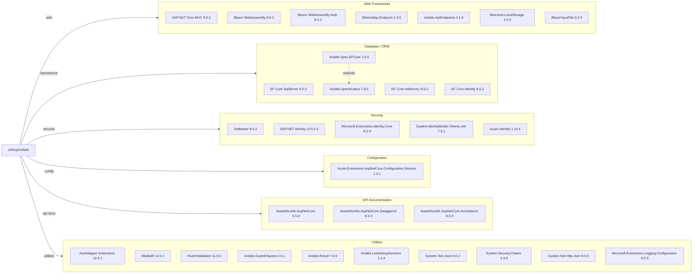

# Dependency Map

eShopOnWeb is an ASP.NET Core 8 reference e-commerce application consisting of six production projects (Web, PublicApi, BlazorAdmin, BlazorShared, ApplicationCore, Infrastructure) with a total of ~30 distinct external NuGet package dependencies managed centrally via `Directory.Packages.props`.

## Dependencies

### Dependency Summary

| Category | Count | Key Libraries | Notes |
|----------|-------|---------------|-------|
| Web Frameworks | 7 | ASP.NET Core MVC 8.0.2, Blazor WebAssembly 8.0.2, Ardalis.ApiEndpoints 4.1.0 | Dual frontend: MVC + Blazor WASM admin |
| Database / ORM | 5 | EF Core SqlServer 8.0.2, Ardalis.Specification 7.0.0 | SQL Server with in-memory testing support |
| Security | 5 | JwtBearer 8.0.2, Azure.Identity 1.10.4, System.IdentityModel.Tokens.Jwt 7.3.1 | JWT + Cookie auth; Azure Managed Identity for prod |
| Configuration | 1 | Azure.Extensions.AspNetCore.Configuration.Secrets 1.3.1 | Azure Key Vault integration |
| API Documentation | 3 | Swashbuckle.AspNetCore 6.5.0 | OpenAPI / Swagger for PublicApi |
| Utilities | 10 | AutoMapper 12.0.1, MediatR 12.0.1, FluentValidation 11.9.0, Ardalis.GuardClauses 4.0.1 | General-purpose helpers |

### Version & Compatibility Risks

All production dependencies target .NET 8.0 and are at stable, recent versions. The `System.Security.Claims` package (v4.3.0) is an older out-of-band release — it is built-in to .NET 8 and the separate NuGet reference is redundant. `System.IdentityModel.Tokens.Jwt` (7.3.1) is from the Microsoft Identity Model library, which was superceded by the `Microsoft.IdentityModel.*` 8.x line; upgrading to .NET 10 may require bumping this package. `Ardalis.Specification` is at v7 which targets EF Core 8; a future EF Core 10 upgrade will need a corresponding Ardalis.Specification upgrade. `Swashbuckle.AspNetCore` (6.5.0) is not officially supported for .NET 9+ minimal API; migration to `Microsoft.AspNetCore.OpenApi` or `Scalar` should be considered.

### Notable Observations

- **Dual authentication scheme**: Both cookie-based auth (Razor Pages/MVC) and JWT bearer (Blazor admin/PublicApi) are used in the same Web host, increasing security surface area.
- **Redundant package references**: `System.Security.Claims` and `System.Net.Http.Json` are inbox APIs in .NET 8 and do not need explicit NuGet references; these can be removed.
- **No caching library**: The project includes a `CachedCatalogViewModelService` but relies only on ASP.NET Core's built-in `IMemoryCache` — no external distributed cache (Redis) is declared.
- **Swashbuckle compatibility**: `Swashbuckle.AspNetCore` 6.5.0 has known issues with .NET 9/10 minimal APIs and will require replacement when upgrading beyond .NET 8.

## Test Dependencies

| Framework | Version | Notes |
|-----------|---------|-------|
| xunit | 2.7.0 | Primary test runner for unit and functional tests |
| xunit.runner.visualstudio | 2.5.6 | VS test adapter for xunit |
| xunit.runner.console | 2.7.0 | CLI test runner |
| MSTest.TestAdapter | 3.2.2 | MSTest adapter (used in integration tests) |
| MSTest.TestFramework | 3.2.2 | MSTest assertions |
| Microsoft.NET.Test.Sdk | 17.9.0 | .NET test host |
| Microsoft.AspNetCore.Mvc.Testing | 8.0.2 | In-process integration test host |
| NSubstitute | 5.1.0 | Mocking framework |
| NSubstitute.Analyzers.CSharp | 1.0.17 | Roslyn analyzers for NSubstitute |
| coverlet.collector | 6.0.2 | Code coverage collector |

Total test-scope dependencies: 10

Both xunit and MSTest are used across the test projects (UnitTests and FunctionalTests use xunit; PublicApiIntegrationTests uses MSTest), which adds minor inconsistency. No contract-testing library (e.g., Pact) or load-testing framework is present.
