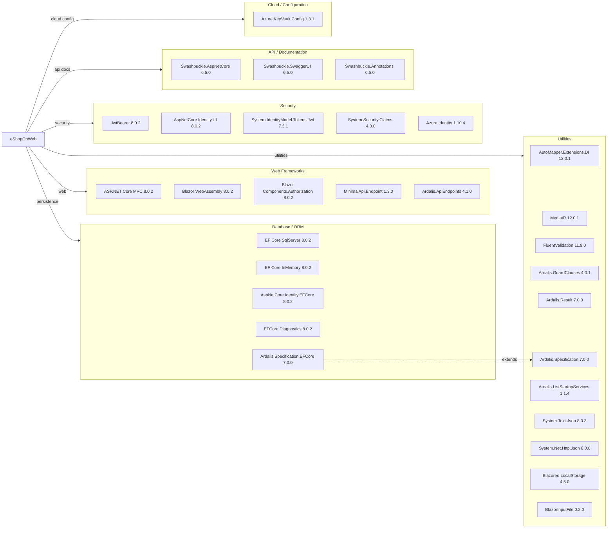

# Dependency Map

eShopOnWeb is an ASP.NET Core 8 e-commerce reference application. It declares **38 production-scoped NuGet packages** across all projects, centrally managed via `Directory.Packages.props`.

## Dependencies

### Dependency Summary

| Category | Count | Key Libraries | Notes |
|---|---|---|---|
| Web Frameworks | 5 | ASP.NET Core MVC 8.0.2, Blazor WebAssembly 8.0.2, Ardalis.ApiEndpoints 4.1.0 | Dual UI: server-side MVC + client-side Blazor WASM admin |
| Database / ORM | 5 | EF Core SqlServer 8.0.2, Ardalis.Specification.EFCore 7.0.0 | Uses specification pattern on top of EF Core |
| Security | 5 | JwtBearer 8.0.2, Azure.Identity 1.10.4, System.IdentityModel.Tokens.Jwt 7.3.1 | Cookie auth for web; JWT for API; Azure Managed Identity for production |
| API / Documentation | 3 | Swashbuckle.AspNetCore 6.5.0 | Full Swagger/OpenAPI integration on the Public API |
| Cloud / Configuration | 1 | Azure.Extensions.AspNetCore.Configuration.Secrets 1.3.1 | Key Vault integration for prod secrets |
| Utilities | 11 | AutoMapper 12.0.1, MediatR 12.0.1, FluentValidation 11.9.0, Ardalis packages | Domain-focused utility set; clean architecture helpers |

### Version & Compatibility Risks

All core ASP.NET Core and EF Core packages are on version **8.0.2**, which corresponds to .NET 8 LTS (supported until November 2026). `System.IdentityModel.Tokens.Jwt 7.3.1` is current. `Ardalis.Specification 7.0.0` and `Ardalis.Specification.EntityFrameworkCore 7.0.0` are stable. `BlazorInputFile 0.2.0` is a community package that has seen minimal updates and may need evaluation as a migration risk since ASP.NET Core 8 ships built-in file input support (`InputFile`). `Swashbuckle.AspNetCore 6.5.0` was the last stable version before the project was archived — migrating to NSwag or Microsoft.AspNetCore.OpenApi should be considered.

### Notable Observations

- **Swashbuckle.AspNetCore is archived**: Version 6.5.0 is the final release of the Swashbuckle project, which is no longer maintained. The PublicApi project should migrate to `Microsoft.AspNetCore.OpenApi` (built into .NET 9+) or NSwag.
- **BlazorInputFile is unmaintained**: `BlazorInputFile 0.2.0` predates the native `InputFile` component available since ASP.NET Core 5; this community package should be replaced.
- **Dual Ardalis.Specification references**: Both `Ardalis.Specification` (7.0.0) and `Ardalis.Specification.EntityFrameworkCore` (7.0.0) are referenced. The EFCore package already depends on the base package, so the direct reference in ApplicationCore is intentional for interface definitions.
- **Central Package Management**: The solution uses `Directory.Packages.props` with `ManagePackageVersionsCentrally=true`, ensuring all projects share consistent dependency versions — a good modernization baseline.

## Test Dependencies

| Framework | Version | Notes |
|---|---|---|
| xunit | 2.7.0 | Primary test framework used across all test projects |
| xunit.runner.visualstudio | 2.5.6 | VS test runner adapter |
| xunit.runner.console | 2.7.0 | CLI test runner |
| MSTest.TestAdapter | 3.2.2 | Secondary test adapter (PublicApiIntegrationTests) |
| MSTest.TestFramework | 3.2.2 | MSTest framework (PublicApiIntegrationTests) |
| Microsoft.NET.Test.Sdk | 17.9.0 | Core test platform SDK |
| Microsoft.AspNetCore.Mvc.Testing | 8.0.2 | In-process integration testing via WebApplicationFactory |
| Microsoft.EntityFrameworkCore.InMemory | 8.0.2 | In-memory DB for integration/unit tests |
| NSubstitute | 5.1.0 | Mocking framework for unit tests |
| NSubstitute.Analyzers.CSharp | 1.0.17 | Roslyn analyzer for NSubstitute usage |
| coverlet.collector | 6.0.2 | Code coverage collector |

Total test-scope dependencies: **11**

The project uses both xUnit (primary) and MSTest (PublicApiIntegrationTests), which introduces minor inconsistency but is not a migration blocker. `Microsoft.AspNetCore.Mvc.Testing` enables realistic end-to-end functional tests against the full ASP.NET Core pipeline. Code coverage is collected via coverlet and a `CodeCoverage.runsettings` file is present at the repository root.
