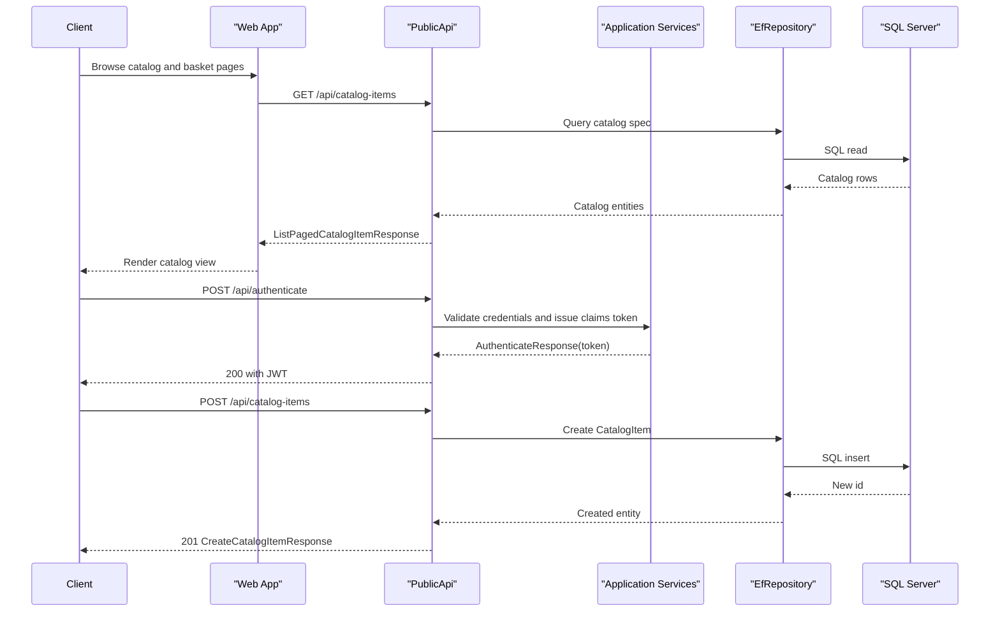

# API & Service Communication Contracts

eShopOnWeb exposes a combined API surface through a PublicApi service (catalog and authentication endpoints) and Web MVC/Razor controllers for authenticated user workflows. Communication is primarily synchronous over HTTP with in-process service/repository calls.

## Service Catalog

| Service | Port | Category | Purpose |
|---|---|---|---|
| Web (`src/Web`) | 5000/5001 (dev), 5106 (docker mapped) | API Layer | Customer-facing MVC/Razor app and order/account workflows |
| PublicApi (`src/PublicApi`) | 5098/5099 (dev), 5200 (docker mapped) | API Layer | Catalog CRUD/listing endpoints and token authentication |
| BlazorAdmin (`src/BlazorAdmin`) | Hosted by Web app | Business | Admin UI experience consuming PublicApi endpoints |
| SQL Edge container (`docker-compose`) | 1433 | Infrastructure | Backing relational store for catalog and identity data |

## API Endpoints Inventory

| Service | Method | Path | Request Type | Response Type |
|---|---|---|---|---|
| PublicApi | GET | `api/catalog-items` | Query params (`pageSize`,`pageIndex`,`catalogBrandId`,`catalogTypeId`) via `ListPagedCatalogItemRequest` | `ListPagedCatalogItemResponse` |
| PublicApi | GET | `api/catalog-items/{catalogItemId}` | Path param via `GetByIdCatalogItemRequest` | `GetByIdCatalogItemResponse` |
| PublicApi | POST | `api/catalog-items` | `CreateCatalogItemRequest` body | `CreateCatalogItemResponse` (201) |
| PublicApi | PUT | `api/catalog-items` | `UpdateCatalogItemRequest` body | `UpdateCatalogItemResponse` |
| PublicApi | DELETE | `api/catalog-items/{catalogItemId}` | Path param via `DeleteCatalogItemRequest` | `DeleteCatalogItemResponse` |
| PublicApi | GET | `api/catalog-brands` | None | `ListCatalogBrandsResponse` |
| PublicApi | GET | `api/catalog-types` | None | `ListCatalogTypesResponse` |
| PublicApi | POST | `api/authenticate` | `AuthenticateRequest` body | `AuthenticateResponse` (JWT token on success) |
| Web | GET | `Order/MyOrders` | Authenticated user context | View model collection from `GetMyOrders` handler |
| Web | GET | `Order/Detail/{orderId}` | Path param `orderId` | `OrderDetailViewModel` (or bad request) |
| Web | GET/POST | `User` / `User/Logout` | User identity + token cache key | User info / logout response |

## Management & Observability Endpoints

| Service | Endpoint | Custom Metrics (if any) |
|---|---|---|
| PublicApi | `/swagger`, `/swagger/v1/swagger.json` | None explicitly registered |
| Web | `/health` | Health status JSON from registered checks |
| Web | `home_page_health_check` | Tagged health check endpoint |
| Web | `api_health_check` | Tagged health check endpoint |

## DTOs & Contracts

The API contract is centered on request/response DTO classes in `src/PublicApi/*Endpoints/*Request.cs` and `*Response.cs` files, plus `CatalogItemDto`, `CatalogBrandDto`, and `CatalogTypeDto`. `AuthenticateResponse` carries a JWT token and status flags. Contract classes are mutable C# classes (not records), serialized through default ASP.NET Core JSON handling (`System.Text.Json`) with OpenAPI metadata generated by Swashbuckle.  

Service-level domain entities (`CatalogItem`, `Basket`, `Order`, `OrderItem`, `Buyer`) are distinct from API DTOs and are not directly exposed as persistence models at the API boundary.

## Communication Patterns

The solution uses synchronous HTTP communication between browser/admin clients and the two ASP.NET services, then synchronous in-process service/repository calls to persistence. No message broker or async event bus is declared. Resilience in data access is handled via SQL Server retry-on-failure options (`EnableRetryOnFailure`) on DbContext configuration; no explicit circuit breaker library is configured. Service discovery is static via configured base URLs and docker-compose service names rather than dynamic registration.  

Startup ordering in docker-compose expresses dependency on SQL container before web/api startup. API security posture includes cookie authentication for Web and JWT bearer + role-based authorization on selected PublicApi endpoints (for example catalog item write operations). TLS is used in local HTTPS profiles; docker profile examples use HTTP bindings.

## Service Technology Matrix

| Service | Web | Data Access | Discovery | Gateway | Actuator | Cache | Metrics |
|---|---|---|---|---|---|---|---|
| Web | MVC + Razor Pages + Blazor hosting | EF Core via repositories | None (configured URLs) | No | Health checks | IMemoryCache | Health endpoints |
| PublicApi | Minimal API + Controllers | EF Core via repositories | None (configured URLs) | No | Swagger/OpenAPI | IMemoryCache | Swagger + logs |
| BlazorAdmin | Blazor components | API client to PublicApi | None | No | None | Browser/local state | None |

## Service Communication Sequence

