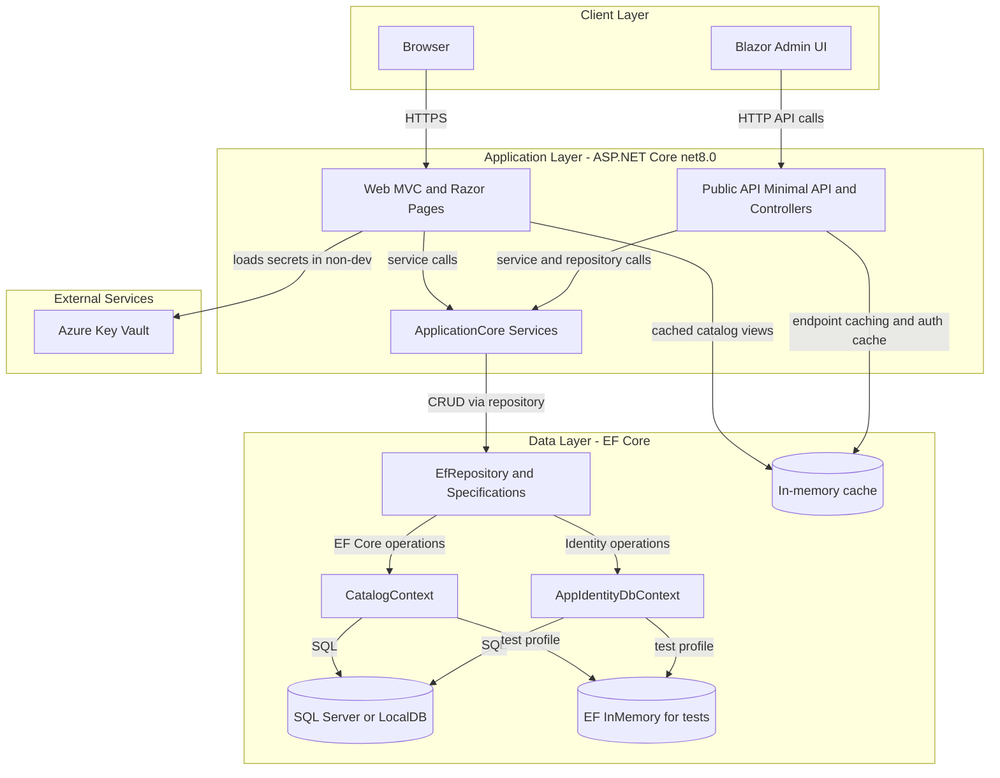
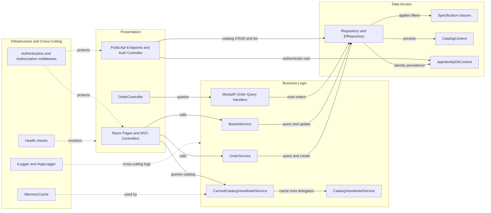

# Architecture Diagram

This document summarizes the current eShopOnWeb architecture at two levels: high-level runtime structure and key component relationships.

## Application Architecture

### Technology Stack Summary

| Layer | Technology | Version | Purpose |
|---|---|---|---|
| Presentation | ASP.NET Core MVC/Razor Pages | net8.0 | Customer web experience and account/order pages |
| API | ASP.NET Core Controllers + MinimalApi.Endpoint | net8.0 | Catalog/authentication APIs for web and Blazor admin |
| Business Logic | ApplicationCore services + specifications | net8.0 | Basket/order/catalog business rules and orchestration |
| Data Access | Entity Framework Core + Ardalis.Specification | EF Core 8.0.2 | Persistence and query abstraction |
| Security | ASP.NET Core Identity + JWT/Cookies | ASP.NET 8.0.2 | User auth, token issuance, role enforcement |

### Data Storage & External Services

The application persists catalog/order and identity data in SQL Server/LocalDB via `CatalogContext` and `AppIdentityDbContext`, with optional EF in-memory databases for test-like profiles. In non-development hosting, the web app resolves connection strings from Azure Key Vault. Both web and API layers also use in-memory cache for read-heavy UI and token-revocation scenarios.

### Key Architectural Decisions

- Uses a layered architecture with `ApplicationCore` for domain/business logic and `Infrastructure` for EF Core/identity implementations.
- Uses repository plus specification patterns (`EfRepository`, `CatalogFilterSpecification`, etc.) to centralize query logic.
- Supports multiple runtime modes: local development, Docker, and cloud with Key Vault-backed secret resolution.

## Component Relationships

### Component Inventory

| Component | Layer | Type | Responsibility |
|---|---|---|---|
| `Program` (Web) | Presentation | Startup composition root | Configures middleware, data sources, auth, health checks |
| `Program` (PublicApi) | Presentation | Startup composition root | Configures API routes, JWT auth, swagger, endpoint registration |
| `OrderController` | Presentation | MVC Controller | Serves authenticated order history/detail views |
| `CatalogItem*Endpoint` classes | Presentation | Minimal API endpoints | Expose catalog list/get/create/update/delete APIs |
| `BasketService` | Business Logic | Domain service | Basket item add/update/delete and basket transfer |
| `OrderService` | Business Logic | Domain service | Creates orders from basket contents |
| `CatalogViewModelService` | Business Logic | UI service | Builds catalog listing/filter view models |
| `CachedCatalogViewModelService` | Business Logic | Decorator service | Wraps catalog view-model service with memory cache |
| `EfRepository<T>` | Data Access | Repository | Generic persistence operations using EF Core |
| `CatalogContext` / `AppIdentityDbContext` | Data Access | DbContext | Domain/identity persistence boundary |
