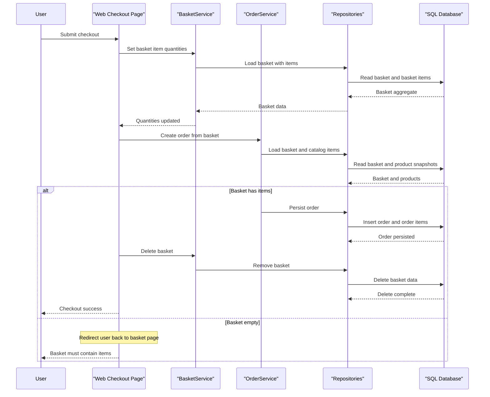

# Core Business Workflows

eShopOnWeb supports core online shopping flows: browsing catalog items, managing a basket, authenticating users, and creating orders from checked-out basket contents. Workflows are implemented across Web UI pages, PublicApi endpoints, and shared domain services.

## Domain Entities

| Entity | Service / Bounded Context | Description | Key Relationships |
|---|---|---|---|
| CatalogItem | Catalog context | Product offered for sale | Linked to CatalogBrand and CatalogType; referenced by basket/order items |
| CatalogBrand | Catalog context | Brand classification | One brand can map to many catalog items |
| CatalogType | Catalog context | Product type classification | One type can map to many catalog items |
| Basket | Shopping context | Customer transient shopping cart | Contains many BasketItem rows |
| BasketItem | Shopping context | Selected product and quantity in basket | Links basket to a catalog item |
| Order | Ordering context | Completed purchase request | Contains many OrderItem rows and shipping address |
| OrderItem | Ordering context | Snapshot of purchased product details | Belongs to one order |
| ApplicationUser | Identity context | User principal for login/authorization | Drives authenticated order and account operations |

## Service-to-Domain Mapping

| Service | Domain Context | Owned Entities | External Dependencies |
|---|---|---|---|
| Web | Customer shopping UI | Uses Basket, Order, Catalog views | Depends on ApplicationCore services, repositories, Identity |
| PublicApi | Catalog and auth API | Uses Catalog and auth contracts | Depends on repositories, Identity, token claim service |
| ApplicationCore | Domain logic | Basket, Order, Catalog aggregates | Depends on repository abstractions and URI composer |
| Infrastructure | Persistence and identity | Catalog/order/identity storage models | Depends on EF Core SQL providers |

## Primary Workflows

### Workflow 1: Browse Catalog and Filter Results

1. User opens catalog page in Web.
2. `CatalogViewModelService` retrieves catalog items with brand/type filter specifications.
3. Cached wrapper (`CachedCatalogViewModelService`) returns cached results when available; otherwise reads from repository.
4. UI renders paged product list and available brand/type filters.

### Workflow 2: Add Item to Basket and Update Quantities

1. User posts selected catalog item from basket/index flow.
2. Basket workflow resolves current buyer identity (authenticated username or cookie GUID).
3. `BasketService.AddItemToBasket` creates basket if missing, then adds or increments item quantity.
4. User can post update actions; `SetQuantities` applies per-item quantities and removes empty items.

### Workflow 3: Checkout and Create Order

1. Authenticated user submits checkout from basket page.
2. Basket quantities are updated and validated.
3. `OrderService.CreateOrderAsync` loads basket with items, verifies non-empty basket, resolves current catalog pricing snapshot, and builds order items.
4. Order is persisted and basket is deleted.
5. User is redirected to checkout success page; empty basket exceptions redirect back to basket.

## Cross-Service Data Flows

Primary data flow is internal and synchronous within the same solution: Web UI and PublicApi call shared domain services/repositories, which persist through Infrastructure EF contexts. Blazor admin and client flows call PublicApi endpoints for catalog/auth operations. Fallback behavior for catalog browsing is cache-first in Web; on cache miss the system falls back to repository reads. No distributed service choreography or message-bus fan-out is declared.

## Business Workflow Sequence

## Business Rules & Decision Logic

- Basket identity rule: authenticated users use username; anonymous users use a long-lived cookie GUID.
- Quantity management rule: basket quantities must be non-negative and zero-quantity items are removed from the basket.
- Checkout validation rule: orders cannot be created from an empty basket (`EmptyBasketOnCheckoutException`).
- Price snapshot rule: order creation captures current catalog item details and prices into `OrderItem` records.
- Authorization rule: order history/detail and checkout are restricted to authenticated users.
