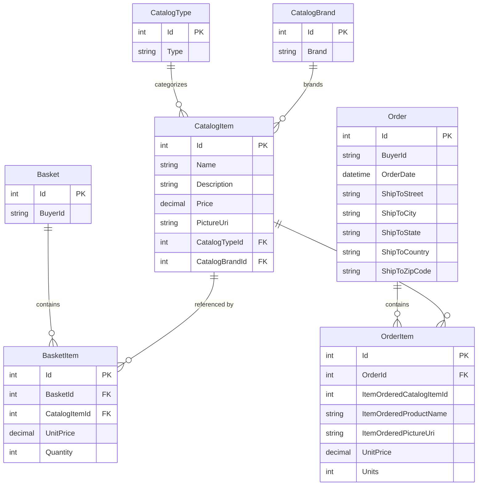

# Data Architecture & Persistence Layer

The data layer uses Entity Framework Core contexts for catalog/order and identity persistence, with SQL Server/LocalDB as the main store and optional in-memory providers for specific runtime/testing scenarios.

## Database Configuration

| Service/Module | DB Type | Profile | Driver | Connection | Migration Tool |
|---|---|---|---|---|---|
| Web | SQL Server LocalDB | Development default | `Microsoft.EntityFrameworkCore.SqlServer` | `ConnectionStrings:CatalogConnection`, `IdentityConnection` in appsettings | EF Core migrations and startup seeding |
| PublicApi | SQL Server LocalDB | Development default | `Microsoft.EntityFrameworkCore.SqlServer` | Same connection-string pattern as Web | EF Core migrations and startup seeding |
| Web/PublicApi | SQL Server (container) | Docker | SQL Edge over SQL Server provider | `Server=sqlserver,1433...` in `appsettings.Docker.json` | EF Core migrations and startup seeding |
| Infrastructure dependency mode | EF InMemory | `UseOnlyInMemoryDatabase=true` path | `Microsoft.EntityFrameworkCore.InMemory` | Logical names `Catalog`, `Identity` | No schema migration; runtime in-memory |

## Data Ownership per Service

| Service | Tables Owned | ORM Framework | Caching | Notes |
|---|---|---|---|---|
| Infrastructure/Catalog context | Catalog, CatalogBrands, CatalogTypes, Baskets, BasketItems, Orders, OrderItems | EF Core | Indirect via Web/PublicApi IMemoryCache | Primary domain persistence boundary |
| Infrastructure/Identity context | ASP.NET Identity tables (`AspNetUsers`, roles, claims, etc.) | EF Core Identity | Token revoke entries cached in memory | Supports cookie and JWT auth flows |
| Web UI services | No direct table ownership | Uses repository abstractions over EF Core | IMemoryCache with 30s sliding expiration | Caches catalog brands/types/items for read paths |
| PublicApi endpoints | No direct table ownership | Uses repository abstractions over EF Core | IMemoryCache available | Handles CRUD contract operations |

## Entity Model

## Key Repository Methods

| Service | Repository | Notable Methods | Purpose |
|---|---|---|---|
| ApplicationCore | `IRepository<Basket>` | `FirstOrDefaultAsync(BasketWithItemsSpecification)`, `UpdateAsync`, `DeleteAsync` | Retrieve and mutate basket aggregate with children |
| ApplicationCore | `IRepository<CatalogItem>` | `ListAsync(CatalogItemsSpecification)`, `CountAsync(CatalogItemNameSpecification)` | Resolve basket-order price snapshots and enforce unique item names |
| ApplicationCore | `IRepository<Order>` | `AddAsync`, `ListAsync(CustomerOrdersSpecification)` | Persist orders and query user order history |
| Web query handlers | `IReadRepository<Order>` | `ListAsync(CustomerOrdersSpecification)`, `FirstOrDefaultAsync(OrderWithItemsByIdSpec)` | Build order list/detail read models |
| PublicApi endpoints | `IRepository<CatalogItem>` | `AddAsync`, `UpdateAsync`, `DeleteAsync`, `GetByIdAsync`, paged spec queries | CRUD contract implementation for catalog endpoints |

## Caching Strategy

Caching is in-process and centered on `IMemoryCache`.

| Cache Area | Provider | TTL/Expiration | Pattern | Rationale |
|---|---|---|---|---|
| Catalog list/filters in Web | IMemoryCache (`CachedCatalogViewModelService`) | Sliding expiration, 30 seconds | Cache-aside | Reduce repeated catalog list/lookup DB reads |
| Identity revoke key checks | IMemoryCache | Short-lived token-key entries | Write and lookup | Prevent use of revoked auth tokens during session |
| PublicApi memory cache registration | IMemoryCache | Default policy unless endpoint-specific | Cache-aside-ready | Supports future endpoint-level caching extensions |

## Data Ownership Boundaries

The application uses a shared relational store model where catalog, basket, order, and identity contexts all persist into SQL Server instances. Boundaries are primarily logical (separate DbContext classes and entity groups) rather than separate databases per service in default setup. Cross-service access is largely in-process via shared repository abstractions in the same solution; no remote cross-service data federation is implemented.

### Data Classification & Sensitivity

| Entity | Sensitive Fields | Classification (PII/PHI/PCI/None) | Controls in Place |
|---|---|---|---|
| `Order` (owned address) | Street, City, State, Country, ZipCode | PII | Access gated behind authenticated user workflows; no explicit field-level masking found |
| ASP.NET Identity user | Username, email and identity claims | PII | ASP.NET Identity auth/authorization; no explicit data masking/encryption-at-field in code |
| `Basket` / `Order` | BuyerId | PII (identifier) | Authenticated flows for checkout/order actions |
| Catalog entities | Product names/descriptions/prices | None | Not sensitive |
