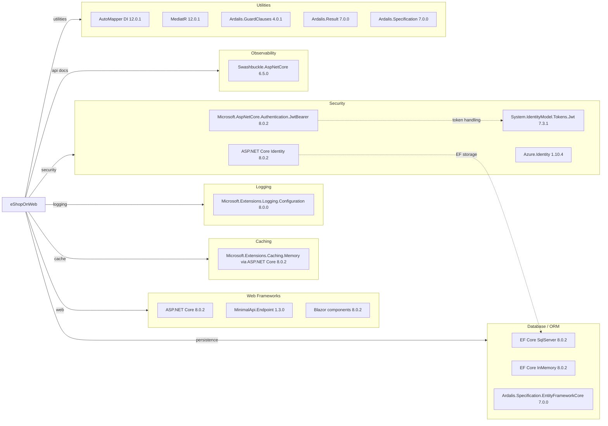

# Dependency Map

This dependency map summarizes declared external dependencies for eShopOnWeb across its .NET projects, grouped by functional role (excluding test-scope packages from the main diagram).

## Dependencies

### Dependency Summary

| Category | Count | Key Libraries | Notes |
|---|---:|---|---|
| Web Frameworks | 3 | ASP.NET Core, MinimalApi.Endpoint, Blazor | Mixed MVC/Razor/Blazor UI plus API endpoint style |
| Database / ORM | 3 | EF Core SqlServer, EF Core InMemory, Ardalis.Specification.EFCore | SQL Server in production/dev, in-memory option for tests |
| Caching | 1 | ASP.NET Core memory caching | In-process cache only |
| Logging | 1 | Microsoft.Extensions.Logging.Configuration | Standard ASP.NET logging stack |
| Security | 4 | Identity, JWT Bearer, System.IdentityModel.Tokens.Jwt, Azure.Identity | Cookie + JWT auth; Azure identity for Key Vault integration |
| Observability | 1 | Swashbuckle.AspNetCore | OpenAPI/Swagger generation for PublicApi |
| Utilities | 5 | AutoMapper, MediatR, Ardalis libraries | Mapping, mediator patterns, guard/result/specification helpers |

### Version & Compatibility Risks

The solution targets `net8.0` and several packages already have upgrade pressure noted by assessment outputs (for example `Azure.Identity 1.10.4` and `System.Text.Json 8.0.3` with known advisories). `Microsoft.AspNetCore.Mvc 2.2.0` remains in central package definitions and can create compatibility friction during net10 upgrades.

### Notable Observations

- Central package management (`Directory.Packages.props`) is enabled, which simplifies coordinated upgrades across projects.
- Security and web concerns are split between cookie identity (Web) and JWT bearer (PublicApi), increasing cross-service auth compatibility requirements.
- Both SQL Server and EF in-memory providers are referenced broadly, indicating runtime profile-dependent persistence behavior.
- Swashbuckle packages are version-locked and should be reviewed for compatibility before net10 migration.

## Test Dependencies

| Framework | Version | Notes |
|---|---|---|
| xUnit | 2.7.0 | Primary unit/integration/functional test framework |
| xunit.runner.visualstudio | 2.5.6 | VS test discovery/execution |
| xunit.runner.console | 2.7.0 | CLI test execution in some projects |
| MSTest.TestFramework / Adapter | 3.2.2 | Used by `PublicApiIntegrationTests` |
| Microsoft.NET.Test.Sdk | 17.9.0 | Core .NET test host |
| NSubstitute | 5.1.0 | Test doubles and mocks |
| coverlet.collector | 6.0.2 | Coverage collection |
| dotnet-xunit tool | 2.3.1 | Legacy test CLI tool reference in FunctionalTests |

Total test-scope dependencies: 8

Test infrastructure is mature and includes unit, integration, and functional coverage, but mixed xUnit/MSTest usage and the legacy `dotnet-xunit` tool reference may require cleanup during framework upgrades.
