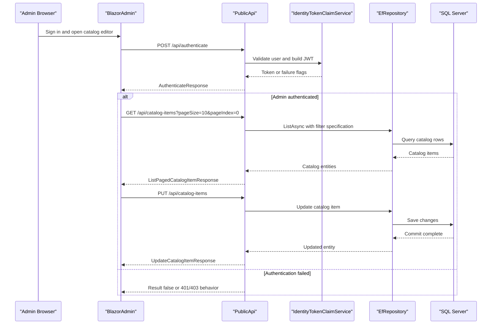

# API & Service Communication Contracts

The solution exposes a modest API surface split between the `PublicApi` project and a few authenticated MVC endpoints in `Web`. Communication is almost entirely synchronous HTTP or in-process service calls, with no message broker or event bus.

## Service Catalog

| Service | Port | Category | Purpose |
|---|---|---|---|
| Web | 5000/5001 locally, 5106 in Docker | API Layer | Main storefront, Razor Pages, checkout, account, and hosted Blazor admin shell |
| PublicApi | 5098/5099 locally, 5200 in Docker | API Layer | Catalog lookup, catalog CRUD, authentication, and Swagger surface |
| BlazorAdmin | Hosted under Web `/admin` | Business | Browser-based admin client for catalog maintenance |
| SQL Server container | 1433 | Infrastructure | External database dependency for catalog/order and identity persistence |

## API Endpoints Inventory

| Service | Method | Path | Request Type | Response Type |
|---|---|---|---|---|
| PublicApi | POST | `/api/authenticate` | `AuthenticateRequest` body | `AuthenticateResponse` with JWT result flags |
| PublicApi | GET | `/api/catalog-items` | Query params `pageSize`, `pageIndex`, `catalogBrandId`, `catalogTypeId` via `ListPagedCatalogItemRequest` | `ListPagedCatalogItemResponse` |
| PublicApi | GET | `/api/catalog-items/{catalogItemId}` | Path param via `GetByIdCatalogItemRequest` | `GetByIdCatalogItemResponse` or `404` |
| PublicApi | POST | `/api/catalog-items` | `CreateCatalogItemRequest` body | `CreateCatalogItemResponse` |
| PublicApi | PUT | `/api/catalog-items` | `UpdateCatalogItemRequest` body | `UpdateCatalogItemResponse` |
| PublicApi | DELETE | `/api/catalog-items/{catalogItemId}` | `DeleteCatalogItemRequest` path/body correlation | `DeleteCatalogItemResponse` |
| PublicApi | GET | `/api/catalog-brands` | None | `ListCatalogBrandsResponse` |
| PublicApi | GET | `/api/catalog-types` | None | `ListCatalogTypesResponse` |
| Web | GET | `/User` | Authenticated caller context | Current user summary |
| Web | POST | `/User/Logout` | Authenticated caller context | Logout result / redirect |
| Web | GET | `/Order/MyOrders` | Authenticated caller context | HTML view of `OrderViewModel` collection |
| Web | GET | `/Order/Detail/{orderId}` | Path param `orderId` | HTML view of order details or `400` |

## Management & Observability Endpoints

| Service | Endpoint | Custom Metrics (if any) |
|---|---|---|
| Web | `/health` | No custom metric names; JSON aggregate health payload |
| Web | `/home_page_health_check` | No custom metrics; checks rendered storefront content |
| Web | `/api_health_check` | No custom metrics; checks `PublicApi` catalog endpoint |
| PublicApi | `/swagger` | None |
| PublicApi | `/swagger/v1/swagger.json` | None |

## DTOs & Contracts

`PublicApi` uses dedicated request/response models rather than exposing EF entities directly. Key contract types include `AuthenticateRequest`/`AuthenticateResponse`, `CatalogItemDto`, `CatalogBrandDto`, `CatalogTypeDto`, `ListPagedCatalogItemRequest`/`ListPagedCatalogItemResponse`, and the create, update, and delete request/response pairs for catalog management. Most DTOs are mutable classes, while the domain layer uses value objects such as `CatalogItemDetails` for internal updates; entity field inventories are better covered in `data-architecture.md`.

The admin client reuses shared contract models from `BlazorShared.Models`, including `CreateCatalogItemRequest`, `CreateCatalogItemResponse`, `PagedCatalogItemResponse`, `CatalogBrandResponse`, and `CatalogTypeResponse`. Serialization is handled by the default ASP.NET Core JSON stack (`System.Text.Json`), and the API surface is described through Swashbuckle-generated OpenAPI metadata.

## Communication Patterns

The repository has no inter-service messaging or asynchronous broker integration. `Web` and `PublicApi` both execute business logic through direct dependency injection into shared repositories and domain services, while `BlazorAdmin` calls `PublicApi` synchronously over HTTP using the configured `baseUrls` values. Database resilience uses SQL Server provider retry support through `EnableRetryOnFailure()` in the production Web data path.

There is no service discovery or API gateway layer; service addresses are configured directly through `appsettings` and launch profiles. Startup ordering matters mainly in Docker or local multi-project runs because `Web` and `PublicApi` both depend on SQL Server, and `Web` health checks additionally expect `PublicApi` to be reachable. Security posture is mixed but present: the Web app uses cookie authentication and ASP.NET Core Identity, while `PublicApi` configures JWT bearer auth and restricts catalog mutation endpoints to the administrator role. HTTPS is used in local launch settings, though Docker examples use plain HTTP between localhost endpoints.

## Service Technology Matrix

| Service | Web | Data Access | Discovery | Gateway | Actuator | Cache | Metrics |
|---|---|---|---|---|---|---|---|
| Web | MVC + Razor Pages | EF Core repositories and MediatR queries | None | No | ASP.NET Core health checks | `IMemoryCache` | Health endpoints only |
| PublicApi | Minimal API + API endpoints + Swagger | EF Core repositories | None | No | Swagger only | `IMemoryCache` registration available | None detected |
| BlazorAdmin | Blazor WebAssembly | Calls `PublicApi` over HTTP | None | No | None | Browser local storage cache | None detected |

## Service Communication Sequence

