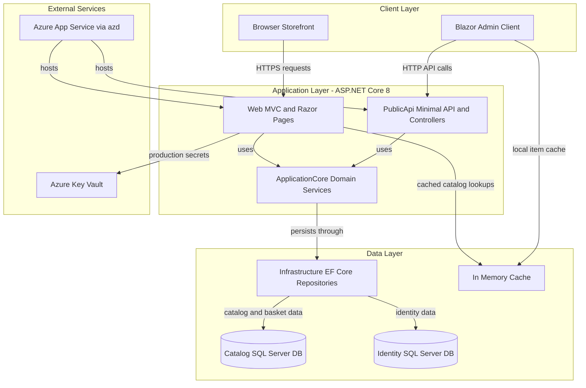
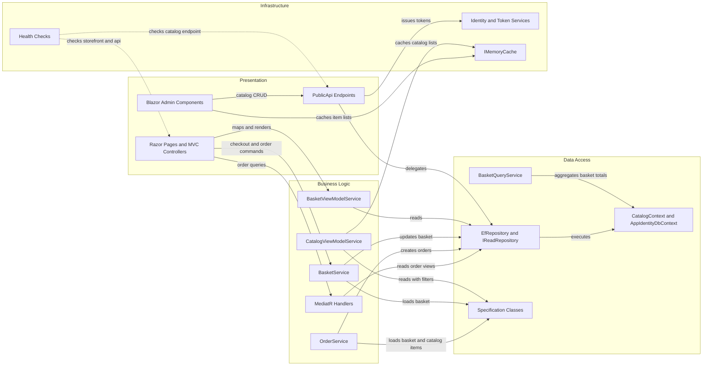

# Architecture Diagram

This repository is a multi-project ASP.NET Core 8 solution centered on a single e-commerce application. It combines an MVC/Razor storefront, a minimal/API endpoint surface, shared domain/infrastructure libraries, and an embedded Blazor admin experience.

## Application Architecture

### Technology Stack Summary

| Layer | Technology | Version | Purpose |
|---|---|---:|---|
| Presentation | ASP.NET Core MVC, Razor Pages | 8.0.2 | Storefront UI, checkout, account and order pages |
| API | MinimalApi.Endpoint, Ardalis.ApiEndpoints, Swashbuckle | 1.3.0, 4.1.0, 6.5.0 | Catalog/admin API surface and Swagger |
| Client | Blazor WebAssembly, Blazored.LocalStorage | 8.0.2, 4.5.0 | Admin UI running inside the Web host |
| Domain | ApplicationCore, MediatR, Ardalis.Specification | custom, 12.0.1, 7.0.0 | Business rules, queries, order and basket orchestration |
| Data | EF Core SQL Server and InMemory | 8.0.2 | Repository-backed persistence and local/test fallback |
| Security | ASP.NET Core Identity, JWT bearer, Azure Key Vault config | 8.0.2, 8.0.2, 1.3.1 | User auth, admin API auth, secret resolution |

### Data Storage & External Services

The application uses two SQL Server-backed EF Core contexts: one for catalog, basket, and order data and one for ASP.NET Core Identity data. Runtime caching is local to the process through `IMemoryCache` in the storefront and browser local storage in the Blazor admin client, while production configuration can be supplemented from Azure Key Vault and Azure App Service deployment settings.

### Key Architectural Decisions

- Uses a modular monolith structure: deployable Web and PublicApi projects share ApplicationCore and Infrastructure rather than communicating through separate microservices.
- Applies repository plus specification patterns on top of EF Core to keep query logic outside controllers and page models.
- Keeps the admin experience as a Blazor WebAssembly client hosted by the Web app while routing catalog management operations through the PublicApi surface.

## Component Relationships

### Component Inventory

| Component | Layer | Type | Responsibility |
|---|---|---|---|
| `Web` controllers and Razor pages | Presentation | MVC and page models | Handle catalog browsing, basket, account, and order flows |
| `PublicApi` endpoint classes | Presentation | Minimal API endpoints and controllers | Expose catalog lookup, catalog CRUD, and authentication contracts |
| `BasketService` | Business Logic | Domain service | Creates, updates, transfers, and deletes baskets |
| `OrderService` | Business Logic | Domain service | Validates baskets and creates orders from basket contents |
| `GetMyOrdersHandler` / `GetOrderDetailsHandler` | Business Logic | MediatR handlers | Read-side order projections for authenticated users |
| `EfRepository<T>` | Data Access | Repository | Generic aggregate persistence via EF Core and specifications |
| `BasketQueryService` | Data Access | Query service | Computes basket totals directly in SQL |
| `CatalogContext` | Data Access | DbContext | Owns catalog, basket, and order persistence |
| `AppIdentityDbContext` | Data Access | DbContext | Owns ASP.NET Core Identity persistence |
| `IdentityTokenClaimService` | Infrastructure | Security service | Generates JWT tokens for authenticated API users |
| `ApiHealthCheck` / `HomePageHealthCheck` | Infrastructure | Health checks | Validate storefront and API availability |
| `CachedCatalogViewModelService` | Infrastructure | Cache decorator | Caches catalog, brand, and type lookups in memory |
