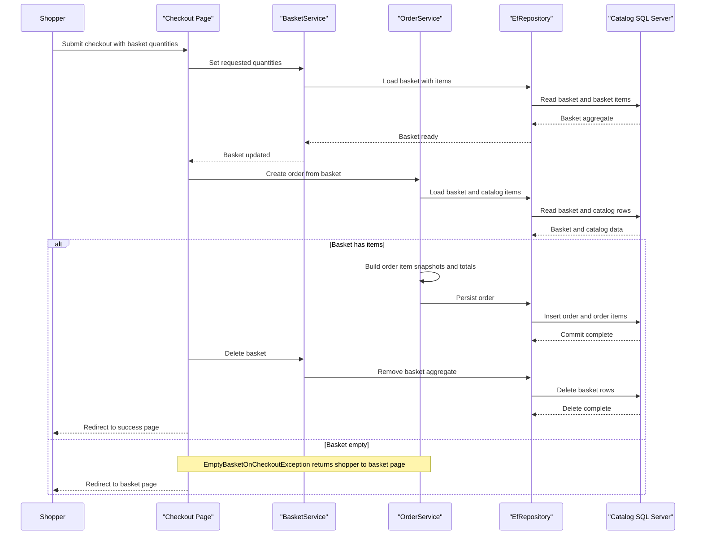

# Core Business Workflows

The application models a simple online store: shoppers browse catalog items, maintain a basket, authenticate, and place orders, while administrators manage the product catalog. The core business logic is concentrated in basket, order, and catalog management services.

## Domain Entities

| Entity | Service / Bounded Context | Description | Key Relationships |
|---|---|---|---|
| CatalogItem | Catalog Management | Sellable product in the storefront | Belongs to one brand and one type; referenced by basket items and order snapshots |
| CatalogBrand | Catalog Management | Product brand classification | One brand to many catalog items |
| CatalogType | Catalog Management | Product type/category classification | One type to many catalog items |
| Basket | Shopping Cart | Customer or anonymous shopping basket | Owns many basket items and is keyed by buyer identity |
| BasketItem | Shopping Cart | Product selection with quantity and price | Belongs to a basket and references a catalog item |
| Order | Ordering | Submitted purchase order | Owns order items and shipping address |
| OrderItem | Ordering | Snapshot of a purchased catalog item | Belongs to an order and embeds ordered item details |
| ApplicationUser | Identity | Authenticated storefront or admin user | Provides identity for baskets, orders, and admin authorization |

## Service-to-Domain Mapping

| Service | Domain Context | Owned Entities | External Dependencies |
|---|---|---|---|
| Web | Storefront and Ordering | Basket, BasketItem, Order, OrderItem | Shared Infrastructure repositories, Identity, BlazorAdmin host |
| PublicApi | Catalog Administration | CatalogItem, CatalogBrand, CatalogType | Shared Infrastructure repositories, Identity token service |
| BlazorAdmin | Admin Back Office | None directly; manipulates catalog DTOs | PublicApi over HTTP |
| Infrastructure | Persistence | EF Core mapping for catalog, order, basket, identity | SQL Server or in-memory providers |

## Primary Workflows

### Workflow 1: Browse catalog and manage basket

A shopper lands on the storefront, filters catalog items by brand or type, and adds products to a basket. `BasketService` either creates a new basket for an anonymous GUID/user name or updates an existing one, while `BasketViewModelService` and `CatalogViewModelService` load and cache the catalog-facing read models.

### Workflow 2: Checkout and place order

An authenticated shopper opens checkout, the page model validates the submitted basket quantities, and `OrderService.CreateOrderAsync` loads the basket and current catalog items. If the basket contains items, the service converts them into `OrderItem` snapshots, creates an `Order`, persists it, and the basket is deleted; if the basket is empty, `EmptyBasketOnCheckoutException` redirects the user back to the basket page.

### Workflow 3: Admin updates the catalog

An administrator signs in through `PublicApi`, receives a JWT, and uses the Blazor admin UI to list, create, update, or delete catalog items. Catalog mutation endpoints are protected with the administrator role, and the client refreshes its cached list after successful changes.

### Workflow 4: Login transfers an anonymous basket

When a user signs in, the login page checks for an anonymous basket cookie. If present, `BasketService.TransferBasketAsync` merges anonymous items into the authenticated basket and deletes the anonymous basket so the shopper keeps previously selected products.

## Cross-Service Data Flows

The repository is primarily a modular monolith, so most business data flows are in-process rather than networked. The notable cross-boundary flow is the Blazor admin client calling `PublicApi` for catalog management; on success, the browser merges the API response into its local cached catalog list. A smaller internal HTTP dependency exists in `Web` health checks, which call `PublicApi` to verify catalog availability.

Because there is no message broker or separate downstream business service, fallback behavior is simple: health checks report unhealthy when the API is unavailable, and admin workflows fail directly on API or authorization errors rather than degrading to partial data.

## Business Workflow Sequence

## Business Rules & Decision Logic

- Basket quantities must be non-negative; zero-quantity items are removed from the basket during updates.
- Checkout requires an authenticated user and a non-empty basket before an order can be created.
- Orders capture a snapshot of catalog item name, picture URI, price, and shipping address so later catalog edits do not change historical orders.
- Anonymous baskets are keyed by a GUID cookie and are merged into the user basket at login.
- Catalog mutations in `PublicApi` require the administrator role, while order history and checkout pages require authenticated users.
