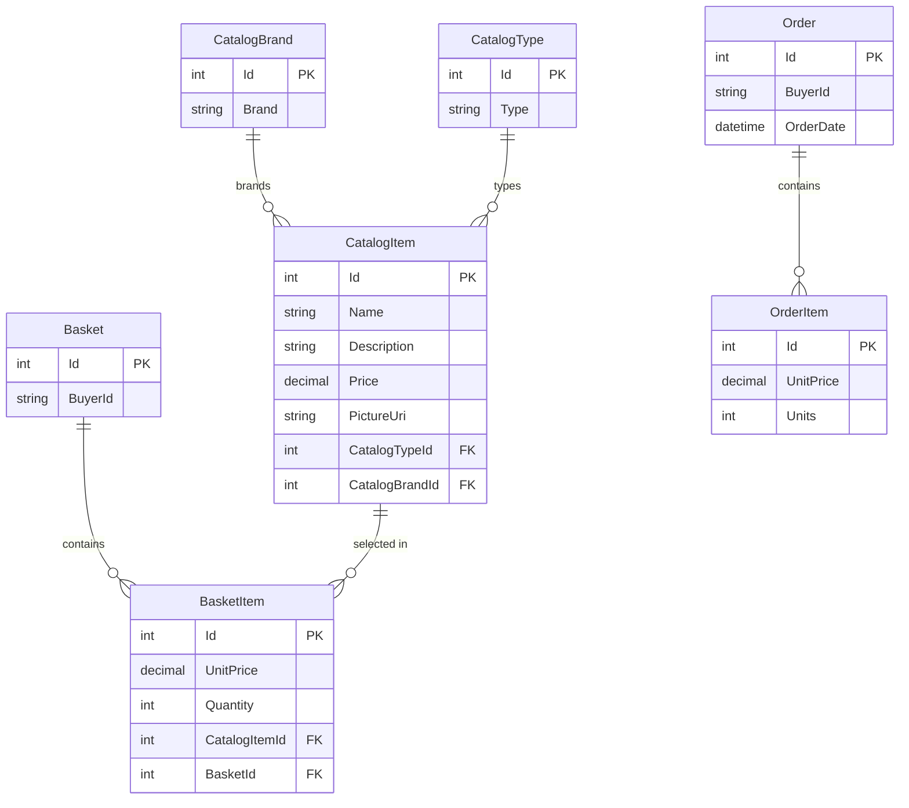

# Data Architecture & Persistence Layer

The data layer is centered on EF Core 8 with two SQL Server-backed contexts and an optional in-memory fallback for lightweight local or test execution. Core persisted entities cover catalog, basket, and order management, while ASP.NET Core Identity stores user credentials separately.

## Database Configuration

| Service/Module | DB Type | Profile | Driver | Connection | Migration Tool |
|---|---|---|---|---|---|
| Web / CatalogContext | SQL Server | Default local, Docker, Production | `Microsoft.EntityFrameworkCore.SqlServer` | `CatalogConnection` from `appsettings` or Azure Key Vault-backed key lookup | EF Core migrations from `Infrastructure` |
| Web / CatalogContext | InMemory | `UseOnlyInMemoryDatabase=true` | `Microsoft.EntityFrameworkCore.InMemory` | Named store `Catalog` | None |
| Web / AppIdentityDbContext | SQL Server | Default local, Docker, Production | `Microsoft.EntityFrameworkCore.SqlServer` | `IdentityConnection` from `appsettings` or Azure Key Vault-backed key lookup | EF Core migrations from `Infrastructure` |
| Web / AppIdentityDbContext | InMemory | `UseOnlyInMemoryDatabase=true` | `Microsoft.EntityFrameworkCore.InMemory` | Named store `Identity` | None |
| PublicApi | SQL Server or InMemory through shared Infrastructure configuration | Development and Docker defaults mirror Web | Shared EF Core providers | Same `CatalogConnection` and `IdentityConnection` semantics as Web | Reuses same EF Core migrations |

Seed data is applied programmatically at startup through `CatalogContextSeed.SeedAsync` and `AppIdentityDbContextSeed.SeedAsync`, so a freshly initialized database is populated without separate SQL seed scripts.

## Data Ownership per Service

| Service | Tables Owned | ORM Framework | Caching | Notes |
|---|---|---|---|---|
| Web | Catalog, Basket, BasketItem, Order, OrderItem, Identity tables | EF Core 8 | `IMemoryCache` for catalog read models | Main source of truth for storefront workflows |
| PublicApi | Reads/writes the same Catalog and Identity tables | EF Core 8 | `IMemoryCache` available for process-local reads | Shares the same physical store as Web; not isolated |
| BlazorAdmin | None directly | None; HTTP client only | Browser local storage | Delegates persistence to PublicApi |
| Infrastructure | Catalog and Identity DbContexts | EF Core 8 + Ardalis.Specification | None directly | Encapsulates repository and query access |

## Entity Model

`Order` owns an embedded `Address` value object (`Street`, `City`, `State`, `Country`, `ZipCode`) and `OrderItem` owns a snapshot value object `CatalogItemOrdered`, so those values travel with the order even if the underlying catalog item later changes.

## Key Repository Methods

| Service | Repository | Notable Methods | Purpose |
|---|---|---|---|
| Shared domain services | `IRepository<T>` / `IReadRepository<T>` via `EfRepository<T>` (`src/Infrastructure/Data/EfRepository.cs`) | `GetByIdAsync`, `AddAsync`, `UpdateAsync`, `DeleteAsync`, `ListAsync`, `FirstOrDefaultAsync`, `CountAsync` | Generic aggregate persistence against `CatalogContext` |
| Basket flows | `BasketWithItemsSpecification` (`src/ApplicationCore/Specifications/BasketWithItemsSpecification.cs`) | Loads a basket and eagerly includes its items by basket id or buyer id | Supports add/update/delete/transfer basket workflows |
| Catalog listing | `CatalogFilterSpecification`, `CatalogFilterPaginatedSpecification`, `CatalogItemsSpecification` | Filter by brand/type, page catalog items, load catalog items by id list | Powers storefront filtering and checkout item snapshot creation |
| Order reads | `CustomerOrdersSpecification`, `CustomerOrdersWithItemsSpecification`, `OrderWithItemsByIdSpec` | Load orders for a buyer and include order items | Supports order history and order detail screens |
| Basket reporting | `BasketQueryService.CountTotalBasketItems` (`src/Infrastructure/Data/Queries/BasketQueryService.cs`) | SQL-side aggregate over basket item quantities | Avoids in-memory summation for basket badges |

## Caching Strategy

The storefront wraps `CatalogViewModelService` with `CachedCatalogViewModelService`, using `IMemoryCache` and a 30-second sliding expiration for catalog pages, brand lists, and type lists. The Blazor admin client separately caches catalog items and lookup data in browser local storage for one minute through decorator services such as `CachedCatalogItemServiceDecorator`. There is no distributed cache or second-level EF cache configured; caching is cache-aside and local to each process or browser session.

## Data Ownership Boundaries

The application uses a shared-database modular monolith model rather than database-per-service isolation. `Web` and `PublicApi` both access the same catalog/order database and the same identity database through shared Infrastructure classes, so cross-module data access is direct repository or DbContext access instead of REST composition or event-driven replication.

Read/write responsibilities are still conceptually separated: storefront pages own customer-facing basket and order flows, while `PublicApi` owns admin-facing catalog CRUD contracts. Query specialization is handled with specifications and dedicated query services instead of a distinct CQRS datastore.

### Data Classification & Sensitivity

| Entity | Sensitive Fields | Classification | Controls in Place |
|---|---|---|---|
| `Order` + owned `Address` | Street, City, State, Country, ZipCode | PII | Stored in SQL Server; no explicit masking or encryption-at-rest settings are defined in repo config |
| `ApplicationUser` (Identity) | User name, email, password hash, security tokens | PII | Managed by ASP.NET Core Identity; authentication enforced in app, but no field-level masking config is declared |
| `Basket` | `BuyerId` (authenticated user name or anonymous GUID) | Internal / PII-adjacent | Application-level access controls only |
| `CatalogItem`, `CatalogBrand`, `CatalogType` | None | None | Public catalog data |

