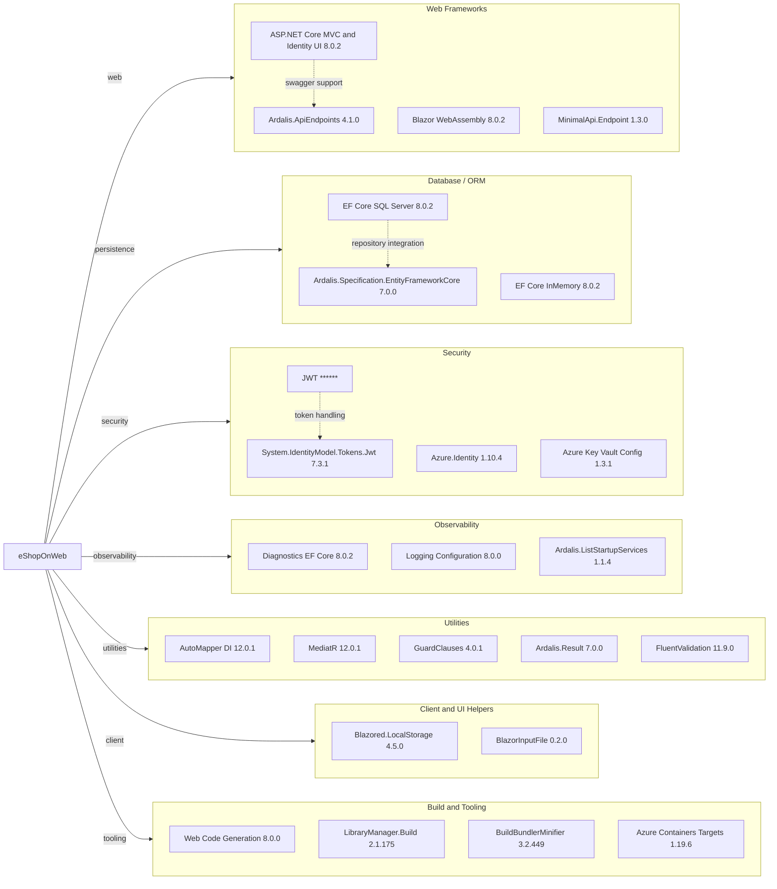

# Dependency Map

The eShopOnWeb solution centrally manages 42 production dependencies and 8 test dependencies through `Directory.Packages.props`. The main dependency surface is typical for an ASP.NET Core 8 modular monolith with EF Core, Identity, Swagger, Blazor, and a small set of supporting libraries.

## Dependencies

### Dependency Summary

| Category | Count | Key Libraries | Notes |
|---|---:|---|---|
| Web Frameworks | 4 | ASP.NET Core MVC/Identity UI, Blazor WebAssembly, MinimalApi.Endpoint, Ardalis.ApiEndpoints | Supports storefront UI, admin client, and API endpoints |
| Database / ORM | 3 | EF Core SQL Server, EF Core InMemory, Ardalis.Specification.EntityFrameworkCore | SQL Server is the main persistence path; in-memory is used for local/test scenarios |
| Security | 4 | Azure.Identity, Azure Key Vault config, JwtBearer, System.IdentityModel.Tokens.Jwt | Combines Azure secret access with JWT-based API auth |
| Observability | 3 | Diagnostics.EntityFrameworkCore, Logging.Configuration, ListStartupServices | Mostly diagnostics and service registration visibility |
| Utilities | 5 | AutoMapper, MediatR, GuardClauses, Ardalis.Result, FluentValidation | Shared application plumbing and validation helpers |
| Client and UI Helpers | 2 | Blazored.LocalStorage, BlazorInputFile | Support client-side admin caching and file uploads |
| Build and Tooling | 4 | Web Code Generation, LibraryManager, BuildBundlerMinifier, Azure Containers Targets | Developer tooling and container-oriented build support |

### Version & Compatibility Risks

The solution targets `net8.0`, which is current, but the baseline restore already flagged `Azure.Identity` 1.10.4 and `System.Text.Json` 8.0.3 for known vulnerabilities. The dependency set also mixes newer ASP.NET Core 8 packages with older helper packages such as `Microsoft.AspNetCore.Mvc` 2.2.0 and `BlazorInputFile` 0.2.0, which are worth reviewing during future modernization or dependency refresh work.

### Notable Observations

- Package versions are managed centrally in `Directory.Packages.props`, which simplifies coordinated upgrades across all projects.
- Both `Microsoft.EntityFrameworkCore.SqlServer` and `Microsoft.EntityFrameworkCore.InMemory` are first-class dependencies, reflecting the split between persistent and lightweight local/test execution paths.
- The repository uses two endpoint styles side-by-side in `PublicApi`: Minimal API endpoints and `Ardalis.ApiEndpoints` controller-style endpoints.
- Security-sensitive dependencies are concentrated in the web/API tier rather than isolated into a gateway or separate auth service.

## Test Dependencies

| Framework | Version | Notes |
|---|---:|---|
| xUnit | 2.7.0 | Primary unit, integration, and functional test framework |
| xUnit runner visualstudio | 2.5.6 | IDE and CLI runner integration |
| xUnit runner console | 2.7.0 | Console execution support |
| MSTest.TestFramework / Adapter | 3.2.2 | Used by PublicApi integration tests |
| Microsoft.AspNetCore.Mvc.Testing | 8.0.2 | Boots ASP.NET Core apps in integration/functional tests |
| NSubstitute | 5.1.0 | Test doubles and interaction assertions |
| coverlet.collector | 6.0.2 | Code coverage collection |
| Microsoft.NET.Test.Sdk | 17.9.0 | Test host and runner plumbing |

Total test-scope dependencies: 8

The test stack is mature and already covers unit, integration, functional, and API-hosted scenarios. There is no separate contract-testing framework, but the existing ASP.NET Core test host coverage is strong for this repository structure.
