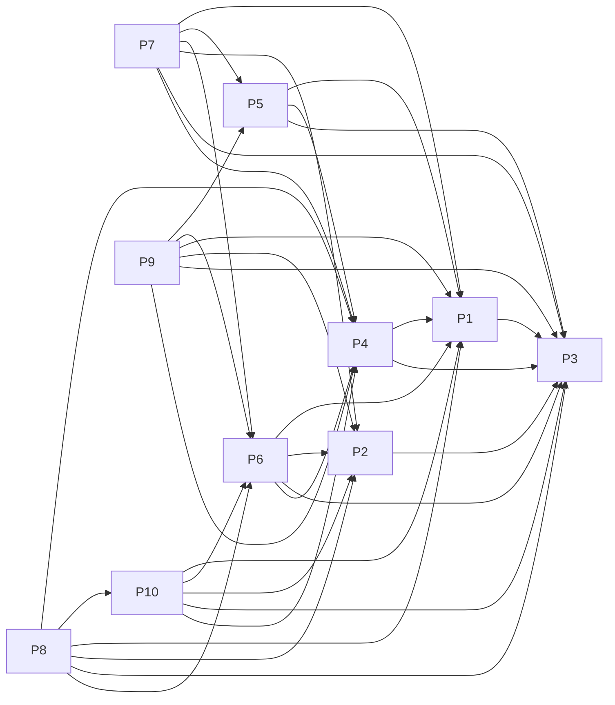

# Projects and dependencies analysis

This document provides a comprehensive overview of the projects and their dependencies in the context of upgrading to .NETCoreApp,Version=v10.0.

## Table of Contents

- [Executive Summary](#executive-Summary)
  - [High-level Metrics](#highlevel-metrics)
  - [Projects Compatibility](#projects-compatibility)
  - [Package Compatibility](#package-compatibility)
  - [API Compatibility](#api-compatibility)
  - [Binding Redirect Configuration](#binding-redirect-configuration)
- [Aggregate NuGet packages details](#aggregate-nuget-packages-details)
- [Top API Migration Challenges](#top-api-migration-challenges)
  - [Technologies and Features](#technologies-and-features)
  - [Most Frequent API Issues](#most-frequent-api-issues)
- [Projects Relationship Graph](#projects-relationship-graph)
- [Project Details](#project-details)

  - [src/ApplicationCore/ApplicationCore.csproj](#srcapplicationcoreapplicationcorecsproj)
  - [src/BlazorAdmin/BlazorAdmin.csproj](#srcblazoradminblazoradmincsproj)
  - [src/BlazorShared/BlazorShared.csproj](#srcblazorsharedblazorsharedcsproj)
  - [src/Infrastructure/Infrastructure.csproj](#srcinfrastructureinfrastructurecsproj)
  - [src/PublicApi/PublicApi.csproj](#srcpublicapipublicapicsproj)
  - [src/Web/Web.csproj](#srcwebwebcsproj)
  - [tests/FunctionalTests/FunctionalTests.csproj](#testsfunctionaltestsfunctionaltestscsproj)
  - [tests/IntegrationTests/IntegrationTests.csproj](#testsintegrationtestsintegrationtestscsproj)
  - [tests/PublicApiIntegrationTests/PublicApiIntegrationTests.csproj](#testspublicapiintegrationtestspublicapiintegrationtestscsproj)
  - [tests/UnitTests/UnitTests.csproj](#testsunittestsunittestscsproj)

## Executive Summary

### High-level Metrics

| Metric | Count | Status |
| :--- | :---: | :--- |
| Total Projects | 10 | All require upgrade |
| Total NuGet Packages | 48 | 24 need upgrade |
| Total Code Files | 302 |  |
| Total Code Files with Incidents | 35 |  |
| Total Lines of Code | 12159 |  |
| Total Number of Issues | 152 |  |
| Estimated LOC to modify | 96+ | at least 0.8% of codebase |

### Projects Compatibility

| Project | Target Framework | Difficulty | Package Issues | API Issues | Binding Issues | Est. LOC Impact | Description |
| :--- | :---: | :---: | :---: | :---: | :---: | :---: | :--- |
| [src/ApplicationCore/ApplicationCore.csproj](#srcapplicationcoreapplicationcorecsproj) | net8.0 | 🟢 Low | 3 | 2 | 0 | 2+ | ClassLibrary, Sdk Style = True |
| [src/BlazorAdmin/BlazorAdmin.csproj](#srcblazoradminblazoradmincsproj) | net8.0 | 🟢 Low | 7 | 6 | 0 | 6+ | AspNetCore, Sdk Style = True |
| [src/BlazorShared/BlazorShared.csproj](#srcblazorsharedblazorsharedcsproj) | net8.0 | 🟢 Low | 0 | 0 | 0 |  | ClassLibrary, Sdk Style = True |
| [src/Infrastructure/Infrastructure.csproj](#srcinfrastructureinfrastructurecsproj) | net8.0 | 🟢 Low | 4 | 4 | 0 | 4+ | ClassLibrary, Sdk Style = True |
| [src/PublicApi/PublicApi.csproj](#srcpublicapipublicapicsproj) | net8.0 | 🟢 Low | 11 | 15 | 0 | 15+ | AspNetCore, Sdk Style = True |
| [src/Web/Web.csproj](#srcwebwebcsproj) | net8.0 | 🟢 Low | 13 | 25 | 0 | 25+ | AspNetCore, Sdk Style = True |
| [tests/FunctionalTests/FunctionalTests.csproj](#testsfunctionaltestsfunctionaltestscsproj) | net8.0 | 🟢 Low | 3 | 33 | 0 | 33+ | DotNetCoreApp, Sdk Style = True |
| [tests/IntegrationTests/IntegrationTests.csproj](#testsintegrationtestsintegrationtestscsproj) | net8.0 | 🟢 Low | 2 | 0 | 0 |  | DotNetCoreApp, Sdk Style = True |
| [tests/PublicApiIntegrationTests/PublicApiIntegrationTests.csproj](#testspublicapiintegrationtestspublicapiintegrationtestscsproj) | net8.0 | 🟢 Low | 1 | 11 | 0 | 11+ | DotNetCoreApp, Sdk Style = True |
| [tests/UnitTests/UnitTests.csproj](#testsunittestsunittestscsproj) | net8.0 | 🟢 Low | 2 | 0 | 0 |  | DotNetCoreApp, Sdk Style = True |

### Package Compatibility

| Status | Count | Percentage |
| :--- | :---: | :---: |
| ✅ Compatible | 24 | 50.0% |
| ⚠️ Incompatible | 5 | 10.4% |
| 🔄 Upgrade Recommended | 19 | 39.6% |
| ***Total NuGet Packages*** | ***48*** | ***100%*** |

### API Compatibility

| Category | Count | Impact |
| :--- | :---: | :--- |
| 🔴 Binary Incompatible | 24 | High - Require code changes |
| 🟡 Source Incompatible | 21 | Medium - Needs re-compilation and potential conflicting API error fixing |
| 🔵 Behavioral change | 51 | Low - Behavioral changes that may require testing at runtime |
| ✅ Compatible | 12936 |  |
| ***Total APIs Analyzed*** | ***13032*** |  |

## Aggregate NuGet packages details

| Package | Current Version | Suggested Version | Projects | Description |
| :--- | :---: | :---: | :--- | :--- |
| Ardalis.ApiEndpoints | 4.1.0 |  | [PublicApi.csproj](#srcpublicapipublicapicsproj) | ✅Compatible |
| Ardalis.GuardClauses | 4.0.1 |  | [ApplicationCore.csproj](#srcapplicationcoreapplicationcorecsproj) | ✅Compatible |
| Ardalis.ListStartupServices | 1.1.4 |  | [Web.csproj](#srcwebwebcsproj) | ✅Compatible |
| Ardalis.Result | 7.0.0 |  | [ApplicationCore.csproj](#srcapplicationcoreapplicationcorecsproj) | ✅Compatible |
| Ardalis.Specification | 7.0.0 |  | [ApplicationCore.csproj](#srcapplicationcoreapplicationcorecsproj) [Web.csproj](#srcwebwebcsproj) | ✅Compatible |
| Ardalis.Specification.EntityFrameworkCore | 7.0.0 |  | [Infrastructure.csproj](#srcinfrastructureinfrastructurecsproj) | ✅Compatible |
| AutoMapper.Extensions.Microsoft.DependencyInjection | 12.0.1 |  | [PublicApi.csproj](#srcpublicapipublicapicsproj) [Web.csproj](#srcwebwebcsproj) | ⚠️NuGet package is deprecated |
| Azure.Extensions.AspNetCore.Configuration.Secrets | 1.3.1 |  | [Web.csproj](#srcwebwebcsproj) | ✅Compatible |
| Azure.Identity | 1.10.4 | 1.21.0 | [Web.csproj](#srcwebwebcsproj) | NuGet package contains security vulnerability |
| Blazored.LocalStorage | 4.5.0 |  | [BlazorAdmin.csproj](#srcblazoradminblazoradmincsproj) | ✅Compatible |
| BlazorInputFile | 0.2.0 |  | [BlazorAdmin.csproj](#srcblazoradminblazoradmincsproj) [BlazorShared.csproj](#srcblazorsharedblazorsharedcsproj) | ✅Compatible |
| coverlet.collector | 6.0.2 |  | [PublicApiIntegrationTests.csproj](#testspublicapiintegrationtestspublicapiintegrationtestscsproj) | ✅Compatible |
| FluentValidation | 11.9.0 |  | [BlazorShared.csproj](#srcblazorsharedblazorsharedcsproj) | ✅Compatible |
| MediatR | 12.0.1 |  | [Web.csproj](#srcwebwebcsproj) | ✅Compatible |
| Microsoft.AspNetCore.Authentication.JwtBearer | 8.0.2 | 10.0.8 | [PublicApi.csproj](#srcpublicapipublicapicsproj) [Web.csproj](#srcwebwebcsproj) | NuGet package upgrade is recommended |
| Microsoft.AspNetCore.Components.Authorization | 8.0.2 | 10.0.8 | [BlazorAdmin.csproj](#srcblazoradminblazoradmincsproj) | NuGet package upgrade is recommended |
| Microsoft.AspNetCore.Components.WebAssembly | 8.0.2 | 10.0.8 | [BlazorAdmin.csproj](#srcblazoradminblazoradmincsproj) | NuGet package upgrade is recommended |
| Microsoft.AspNetCore.Components.WebAssembly.Authentication | 8.0.2 | 10.0.8 | [BlazorAdmin.csproj](#srcblazoradminblazoradmincsproj) | NuGet package upgrade is recommended |
| Microsoft.AspNetCore.Components.WebAssembly.DevServer | 8.0.2 | 10.0.8 | [BlazorAdmin.csproj](#srcblazoradminblazoradmincsproj) | NuGet package upgrade is recommended |
| Microsoft.AspNetCore.Components.WebAssembly.Server | 8.0.2 | 10.0.8 | [Web.csproj](#srcwebwebcsproj) | NuGet package upgrade is recommended |
| Microsoft.AspNetCore.Diagnostics.EntityFrameworkCore | 8.0.2 | 10.0.8 | [PublicApi.csproj](#srcpublicapipublicapicsproj) [Web.csproj](#srcwebwebcsproj) | NuGet package upgrade is recommended |
| Microsoft.AspNetCore.Identity.EntityFrameworkCore | 8.0.2 | 10.0.8 | [Infrastructure.csproj](#srcinfrastructureinfrastructurecsproj) [PublicApi.csproj](#srcpublicapipublicapicsproj) [Web.csproj](#srcwebwebcsproj) | NuGet package upgrade is recommended |
| Microsoft.AspNetCore.Identity.UI | 8.0.2 | 10.0.8 | [PublicApi.csproj](#srcpublicapipublicapicsproj) [Web.csproj](#srcwebwebcsproj) | NuGet package upgrade is recommended |
| Microsoft.AspNetCore.Mvc.Testing | 8.0.2 | 10.0.8 | [FunctionalTests.csproj](#testsfunctionaltestsfunctionaltestscsproj) [PublicApiIntegrationTests.csproj](#testspublicapiintegrationtestspublicapiintegrationtestscsproj) | NuGet package upgrade is recommended |
| Microsoft.EntityFrameworkCore.InMemory | 8.0.2 | 10.0.8 | [FunctionalTests.csproj](#testsfunctionaltestsfunctionaltestscsproj) [Infrastructure.csproj](#srcinfrastructureinfrastructurecsproj) [IntegrationTests.csproj](#testsintegrationtestsintegrationtestscsproj) [PublicApi.csproj](#srcpublicapipublicapicsproj) [Web.csproj](#srcwebwebcsproj) | NuGet package upgrade is recommended |
| Microsoft.EntityFrameworkCore.SqlServer | 8.0.2 | 10.0.8 | [Infrastructure.csproj](#srcinfrastructureinfrastructurecsproj) [PublicApi.csproj](#srcpublicapipublicapicsproj) [Web.csproj](#srcwebwebcsproj) | NuGet package upgrade is recommended |
| Microsoft.EntityFrameworkCore.Tools | 8.0.2 | 10.0.8 | [PublicApi.csproj](#srcpublicapipublicapicsproj) [Web.csproj](#srcwebwebcsproj) | NuGet package upgrade is recommended |
| Microsoft.Extensions.Identity.Core | 8.0.2 | 10.0.8 | [BlazorAdmin.csproj](#srcblazoradminblazoradmincsproj) | NuGet package upgrade is recommended |
| Microsoft.Extensions.Logging.Configuration | 8.0.0 | 10.0.8 | [BlazorAdmin.csproj](#srcblazoradminblazoradmincsproj) | NuGet package upgrade is recommended |
| Microsoft.NET.Test.Sdk | 17.9.0 |  | [FunctionalTests.csproj](#testsfunctionaltestsfunctionaltestscsproj) [IntegrationTests.csproj](#testsintegrationtestsintegrationtestscsproj) [PublicApiIntegrationTests.csproj](#testspublicapiintegrationtestspublicapiintegrationtestscsproj) [UnitTests.csproj](#testsunittestsunittestscsproj) | ✅Compatible |
| Microsoft.VisualStudio.Azure.Containers.Tools.Targets | 1.19.6 |  | [PublicApi.csproj](#srcpublicapipublicapicsproj) | ⚠️NuGet package is incompatible |
| Microsoft.VisualStudio.Web.CodeGeneration.Design | 8.0.0 | 10.0.2 | [PublicApi.csproj](#srcpublicapipublicapicsproj) [Web.csproj](#srcwebwebcsproj) | NuGet package upgrade is recommended |
| Microsoft.Web.LibraryManager.Build | 2.1.175 |  | [Web.csproj](#srcwebwebcsproj) | ✅Compatible |
| MinimalApi.Endpoint | 1.3.0 |  | [PublicApi.csproj](#srcpublicapipublicapicsproj) | ✅Compatible |
| MSTest.TestAdapter | 3.2.2 |  | [PublicApiIntegrationTests.csproj](#testspublicapiintegrationtestspublicapiintegrationtestscsproj) | ✅Compatible |
| MSTest.TestFramework | 3.2.2 |  | [PublicApiIntegrationTests.csproj](#testspublicapiintegrationtestspublicapiintegrationtestscsproj) | ✅Compatible |
| NSubstitute | 5.1.0 |  | [IntegrationTests.csproj](#testsintegrationtestsintegrationtestscsproj) [UnitTests.csproj](#testsunittestsunittestscsproj) | ✅Compatible |
| NSubstitute.Analyzers.CSharp | 1.0.17 |  | [IntegrationTests.csproj](#testsintegrationtestsintegrationtestscsproj) [UnitTests.csproj](#testsunittestsunittestscsproj) | ✅Compatible |
| Swashbuckle.AspNetCore | 6.5.0 |  | [PublicApi.csproj](#srcpublicapipublicapicsproj) | ✅Compatible |
| Swashbuckle.AspNetCore.Annotations | 6.5.0 |  | [PublicApi.csproj](#srcpublicapipublicapicsproj) | ✅Compatible |
| Swashbuckle.AspNetCore.SwaggerUI | 6.5.0 |  | [PublicApi.csproj](#srcpublicapipublicapicsproj) | ✅Compatible |
| System.IdentityModel.Tokens.Jwt | 7.3.1 |  | [Infrastructure.csproj](#srcinfrastructureinfrastructurecsproj) [PublicApi.csproj](#srcpublicapipublicapicsproj) [Web.csproj](#srcwebwebcsproj) | ⚠️NuGet package is deprecated |
| System.Net.Http.Json | 8.0.0 | 10.0.8 | [BlazorAdmin.csproj](#srcblazoradminblazoradmincsproj) | NuGet package upgrade is recommended |
| System.Security.Claims | 4.3.0 |  | [ApplicationCore.csproj](#srcapplicationcoreapplicationcorecsproj) | NuGet package functionality is included with framework reference |
| System.Text.Json | 8.0.3 | 10.0.8 | [ApplicationCore.csproj](#srcapplicationcoreapplicationcorecsproj) | NuGet package upgrade is recommended |
| xunit | 2.7.0 |  | [FunctionalTests.csproj](#testsfunctionaltestsfunctionaltestscsproj) [IntegrationTests.csproj](#testsintegrationtestsintegrationtestscsproj) [UnitTests.csproj](#testsunittestsunittestscsproj) | ⚠️NuGet package is deprecated |
| xunit.runner.console | 2.7.0 |  | [UnitTests.csproj](#testsunittestsunittestscsproj) | ⚠️NuGet package is deprecated |
| xunit.runner.visualstudio | 2.5.6 |  | [FunctionalTests.csproj](#testsfunctionaltestsfunctionaltestscsproj) [IntegrationTests.csproj](#testsintegrationtestsintegrationtestscsproj) [UnitTests.csproj](#testsunittestsunittestscsproj) | ✅Compatible |

## Top API Migration Challenges

### Technologies and Features

| Technology | Issues | Percentage | Migration Path |
| :--- | :---: | :---: | :--- |
| IdentityModel & Claims-based Security | 12 | 12.5% | Windows Identity Foundation (WIF), SAML, and claims-based authentication APIs that have been replaced by modern identity libraries. WIF was the original identity framework for .NET Framework. Migrate to Microsoft.IdentityModel.* packages (modern identity stack). |

### Most Frequent API Issues

| API | Count | Percentage | Category |
| :--- | :---: | :---: | :--- |
| T:System.Net.Http.HttpContent | 32 | 33.3% | Behavioral Change |
| T:System.Uri | 12 | 12.5% | Behavioral Change |
| M:Microsoft.Extensions.DependencyInjection.OptionsConfigurationServiceCollectionExtensions.Configure''1(Microsoft.Extensions.DependencyInjection.IServiceCollection,Microsoft.Extensions.Configuration.IConfiguration) | 5 | 5.2% | Binary Incompatible |
| M:Microsoft.Extensions.Configuration.ConfigurationBinder.Get''1(Microsoft.Extensions.Configuration.IConfiguration) | 4 | 4.2% | Binary Incompatible |
| M:System.Uri.#ctor(System.String) | 3 | 3.1% | Behavioral Change |
| M:System.IdentityModel.Tokens.Jwt.JwtSecurityTokenHandler.WriteToken(Microsoft.IdentityModel.Tokens.SecurityToken) | 3 | 3.1% | Binary Incompatible |
| M:System.IdentityModel.Tokens.Jwt.JwtSecurityTokenHandler.CreateToken(Microsoft.IdentityModel.Tokens.SecurityTokenDescriptor) | 3 | 3.1% | Binary Incompatible |
| T:System.IdentityModel.Tokens.Jwt.JwtSecurityTokenHandler | 3 | 3.1% | Binary Incompatible |
| M:System.IdentityModel.Tokens.Jwt.JwtSecurityTokenHandler.#ctor | 3 | 3.1% | Binary Incompatible |
| M:System.Exception.#ctor(System.Runtime.Serialization.SerializationInfo,System.Runtime.Serialization.StreamingContext) | 2 | 2.1% | Source Incompatible |
| T:Microsoft.Extensions.DependencyInjection.ServiceCollectionExtensions | 2 | 2.1% | Binary Incompatible |
| T:Microsoft.Extensions.DependencyInjection.IdentityEntityFrameworkBuilderExtensions | 2 | 2.1% | Source Incompatible |
| M:Microsoft.Extensions.DependencyInjection.IdentityEntityFrameworkBuilderExtensions.AddEntityFrameworkStores''1(Microsoft.AspNetCore.Identity.IdentityBuilder) | 2 | 2.1% | Source Incompatible |
| M:Microsoft.Extensions.Logging.ConsoleLoggerExtensions.AddConsole(Microsoft.Extensions.Logging.ILoggingBuilder) | 2 | 2.1% | Behavioral Change |
| M:System.Uri.#ctor(System.String,System.UriKind) | 1 | 1.0% | Behavioral Change |
| P:Microsoft.AspNetCore.Authentication.JwtBearer.JwtBearerOptions.TokenValidationParameters | 1 | 1.0% | Source Incompatible |
| P:Microsoft.AspNetCore.Authentication.JwtBearer.JwtBearerOptions.SaveToken | 1 | 1.0% | Source Incompatible |
| P:Microsoft.AspNetCore.Authentication.JwtBearer.JwtBearerOptions.RequireHttpsMetadata | 1 | 1.0% | Source Incompatible |
| T:Microsoft.AspNetCore.Authentication.JwtBearer.JwtBearerDefaults | 1 | 1.0% | Source Incompatible |
| F:Microsoft.AspNetCore.Authentication.JwtBearer.JwtBearerDefaults.AuthenticationScheme | 1 | 1.0% | Source Incompatible |
| T:Microsoft.Extensions.DependencyInjection.JwtBearerExtensions | 1 | 1.0% | Source Incompatible |
| M:Microsoft.Extensions.DependencyInjection.JwtBearerExtensions.AddJwtBearer(Microsoft.AspNetCore.Authentication.AuthenticationBuilder,System.Action{Microsoft.AspNetCore.Authentication.JwtBearer.JwtBearerOptions}) | 1 | 1.0% | Source Incompatible |
| M:System.TimeSpan.FromMinutes(System.Double) | 1 | 1.0% | Source Incompatible |
| M:Microsoft.AspNetCore.Builder.ExceptionHandlerExtensions.UseExceptionHandler(Microsoft.AspNetCore.Builder.IApplicationBuilder,System.String) | 1 | 1.0% | Behavioral Change |
| T:Microsoft.AspNetCore.Builder.MigrationsEndPointExtensions | 1 | 1.0% | Source Incompatible |
| M:Microsoft.AspNetCore.Builder.MigrationsEndPointExtensions.UseMigrationsEndPoint(Microsoft.AspNetCore.Builder.IApplicationBuilder) | 1 | 1.0% | Source Incompatible |
| M:Microsoft.Extensions.Configuration.ConfigurationBinder.GetValue(Microsoft.Extensions.Configuration.IConfiguration,System.Type,System.String) | 1 | 1.0% | Binary Incompatible |
| T:Microsoft.Extensions.DependencyInjection.DatabaseDeveloperPageExceptionFilterServiceExtensions | 1 | 1.0% | Source Incompatible |
| M:Microsoft.Extensions.DependencyInjection.DatabaseDeveloperPageExceptionFilterServiceExtensions.AddDatabaseDeveloperPageExceptionFilter(Microsoft.Extensions.DependencyInjection.IServiceCollection) | 1 | 1.0% | Source Incompatible |
| T:Microsoft.AspNetCore.Identity.IdentityBuilderUIExtensions | 1 | 1.0% | Source Incompatible |
| M:Microsoft.AspNetCore.Identity.IdentityBuilderUIExtensions.AddDefaultUI(Microsoft.AspNetCore.Identity.IdentityBuilder) | 1 | 1.0% | Source Incompatible |
| T:Microsoft.Extensions.Configuration.AzureKeyVaultConfigurationExtensions | 1 | 1.0% | Source Incompatible |

## Projects Relationship Graph

Legend:
📦 SDK-style project
⚙️ Classic project

## Project Details

