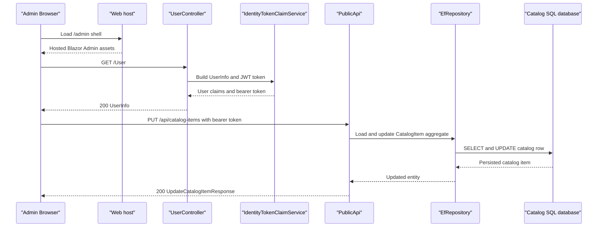

# API & Service Communication Contracts

eShopOnWeb exposes two main HTTP surfaces: a server-rendered Web host for storefront and account workflows, and a PublicApi host for catalog administration and token-based integration scenarios. Communication is entirely synchronous over HTTP/HTTPS, with the hosted admin client calling the PublicApi after obtaining user context and JWT claims from the Web host.

## Service Catalog

| Service | Port | Category | Purpose |
|---|---|---|---|
| Web | 5001/5000 locally, 5106 in Docker | API Layer | Serves MVC views, Razor Pages, Identity UI, user token endpoints, and health probes |
| PublicApi | 5099/5098 locally, 5200 in Docker | API Layer | Exposes catalog lookup and catalog item CRUD endpoints plus Swagger documentation |
| ApplicationCore | N/A | Business | Contains domain services, specifications, and MediatR request contracts shared by both hosts |
| Infrastructure | N/A | Infrastructure | Supplies EF Core contexts, repository implementation, Identity token generation, and seeding |

## API Endpoints Inventory

| Service | Method | Path | Request Type | Response Type |
|---|---|---|---|---|
| Web | GET | `/User` | Authenticated cookie or anonymous request | `UserInfo` JSON with claims and JWT token when signed in |
| Web | POST | `/User/Logout` | No body | `200 OK` |
| Web | GET | `/Order/MyOrders` | Authenticated user identity | MVC view of `IEnumerable<OrderViewModel>` |
| Web | GET | `/Order/Detail/{orderId}` | Path parameter `orderId` | MVC view of `OrderDetailViewModel` or `400 BadRequest` |
| Web | GET / POST | `/Manage/{action}` | Identity form posts by action | Identity management views and redirects |
| PublicApi | POST | `/api/authenticate` | `AuthenticateRequest` body | `AuthenticateResponse` |
| PublicApi | GET | `/api/catalog-items` | Query params in `ListPagedCatalogItemRequest` | `ListPagedCatalogItemResponse` |
| PublicApi | GET | `/api/catalog-items/{catalogItemId}` | `GetByIdCatalogItemRequest` path parameter | `GetByIdCatalogItemResponse` |
| PublicApi | POST | `/api/catalog-items` | `CreateCatalogItemRequest` body | `CreateCatalogItemResponse` |
| PublicApi | PUT | `/api/catalog-items` | `UpdateCatalogItemRequest` body | `UpdateCatalogItemResponse` |
| PublicApi | DELETE | `/api/catalog-items/{catalogItemId}` | `DeleteCatalogItemRequest` path parameter | `DeleteCatalogItemResponse` |
| PublicApi | GET | `/api/catalog-brands` | None | `ListCatalogBrandsResponse` |
| PublicApi | GET | `/api/catalog-types` | None | `ListCatalogTypesResponse` |

## Management & Observability Endpoints

| Service | Endpoint | Custom Metrics (if any) |
|---|---|---|
| Web | `/health` | None detected |
| Web | `/home_page_health_check` | None detected |
| Web | `/api_health_check` | None detected |
| PublicApi | `/swagger` | None detected |
| PublicApi | `/swagger/v1/swagger.json` | None detected |

## DTOs & Contracts

The PublicApi uses mutable request and response classes such as `AuthenticateRequest`, `AuthenticateResponse`, `CreateCatalogItemRequest`, `UpdateCatalogItemRequest`, `DeleteCatalogItemRequest`, `CatalogItemDto`, `CatalogBrandDto`, and `CatalogTypeDto` to define its JSON contracts. The Web host exposes `UserInfo`, `OrderViewModel`, `OrderDetailViewModel`, `BasketViewModel`, and related view models as server-side response contracts for pages and AJAX-style user identity calls.

Contract ownership is clearly split: the Web host owns user/session and storefront view contracts, while the PublicApi owns admin-facing catalog contracts. DTOs are mostly mutable classes rather than immutable records, with `CatalogItem.CatalogItemDetails` being the notable internal immutable record struct used inside the domain model. OpenAPI documentation is generated through Swashbuckle at `/swagger`, and JSON serialization follows the default ASP.NET Core / `System.Text.Json` pipeline with AutoMapper used for catalog DTO projection.

## Communication Patterns

Communication is synchronous and request-response oriented:

- Browsers call the Web host for storefront pages, order history, and user-session operations.
- The hosted Blazor admin client runs under the Web host but calls `PublicApi` over HTTPS for catalog listing and CRUD operations.
- Both `Web` and `PublicApi` access the same SQL-backed EF Core contexts directly through `EfRepository<T>`; there is no message broker, event bus, or background queue in the repository.
- In production, SQL Server connections are configured with `EnableRetryOnFailure()`, giving database calls a built-in retry policy. No circuit breaker, bulkhead, or timeout policy library such as Polly is configured.
- Service discovery is not used. Endpoints are addressed by configured base URLs (`baseUrls.apiBase` and `baseUrls.webBase`) rather than by logical registry names.
- Security posture is present at the API boundary: the Web host uses ASP.NET Identity plus cookie authentication for protected pages, and the PublicApi configures JWT bearer authentication plus a restrictive CORS policy based on the configured Web base URL. Both hosts redirect HTTP traffic to HTTPS.
- Startup ordering matters only in simple ways: the Web and PublicApi services expect SQL Server availability and seed their databases during application startup.

## Service Technology Matrix

| Service | Web | Data Access | Discovery | Gateway | Actuator | Cache | Metrics |
|---|---|---|---|---|---|---|---|
| Web | MVC, Razor Pages, hosted Blazor | EF Core repositories, MediatR read models | None | Hosts admin shell and issues user JWT context | Health checks at three routes | `IMemoryCache` | None detected |
| PublicApi | Minimal APIs, API controller, Swagger | EF Core repositories | None | No | Swagger only | `IMemoryCache` registered | None detected |
| ApplicationCore | None | Domain services and specifications only | None | No | No | None | None |

## Service Communication Sequence

