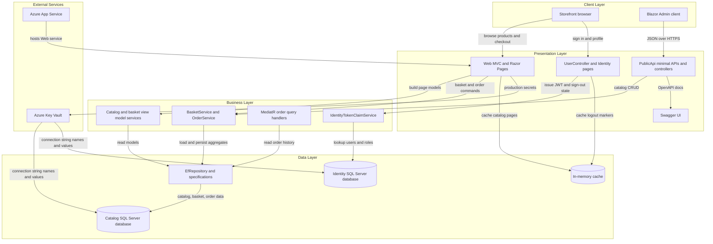
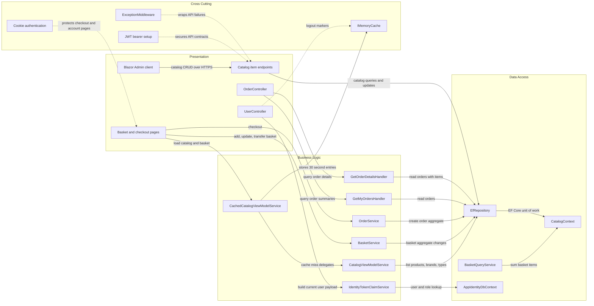

# Architecture Diagram

eShopOnWeb is a modular ASP.NET Core 8 reference application that serves a server-rendered storefront and a separate JSON API for catalog administration. The solution keeps business rules in shared application libraries while the Web and PublicApi hosts each expose a tailored presentation surface over the same data stores.

## Application Architecture

### Technology Stack Summary

| Layer | Technology | Version | Purpose |
|---|---|---|---|
| Presentation | ASP.NET Core MVC, Razor Pages, Blazor host | 8.0 | Serves the storefront, Identity UI, and hosted admin experience |
| API | ASP.NET Core minimal APIs, controllers, Swashbuckle | 8.0 / 6.5.0 | Exposes catalog and authentication endpoints for admin and integration clients |
| Business | ApplicationCore services, MediatR, Ardalis.Specification | 8.0 / 12.0.1 / 7.0.0 | Encapsulates basket, order, catalog querying, and domain rules |
| Data | EF Core SQL Server and Identity stores | 8.0.2 | Persists catalog, basket, order, and user identity data |
| Cloud Hosting | Azure App Service, Azure Key Vault, Azure SQL | IaC in repo | Supports production deployment and secret-backed connection strings |

### Data Storage & External Services

The solution uses SQL Server for both catalog/order data and ASP.NET Identity data, with separate connection strings for the catalog and identity stores. During local or Docker development those connections point to LocalDB or the `azure-sql-edge` container, while production hosting reads Azure SQL connection strings from Azure Key Vault. The Web host also uses `IMemoryCache` to cache catalog listings and logout markers.

### Key Architectural Decisions

- Uses a modular monolith design: `Web` and `PublicApi` are separate hosts, but they share `ApplicationCore` and `Infrastructure` libraries and access the same backing databases.
- Applies the repository and specification patterns through `EfRepository<T>` and Ardalis.Specification to keep business logic independent from EF Core query details.
- Switches infrastructure behavior by environment, using in-memory databases for lightweight scenarios, SQL Server for normal operation, and Azure Key Vault for production secret resolution.

## Component Relationships

### Component Inventory

| Component | Layer | Type | Responsibility |
|---|---|---|---|
| Basket and checkout pages | Presentation | Razor Page models | Manage basket cookies, quantity updates, checkout, and success navigation |
| OrderController | Presentation | MVC controller | Returns order history and order detail views for signed-in users |
| UserController | Presentation | API controller | Returns current user claims and handles logout state for the hosted admin client |
| Catalog item endpoints | Presentation | Minimal API endpoints | Expose paged catalog listing and catalog CRUD operations from `PublicApi` |
| CachedCatalogViewModelService | Business Logic | Application service | Caches catalog pages, brands, and types for short-lived storefront reads |
| BasketService | Business Logic | Domain service | Adds items, merges guest baskets, updates quantities, and deletes baskets |
| OrderService | Business Logic | Domain service | Validates basket contents and creates persisted orders from basket items |
| GetMyOrdersHandler / GetOrderDetailsHandler | Business Logic | MediatR handlers | Build order summary and detail view models from repository queries |
| EfRepository | Data Access | Generic repository | Executes specification-driven CRUD operations over EF Core contexts |
| CatalogContext / AppIdentityDbContext | Data Access | DbContext | Persist catalog/order aggregates and ASP.NET Identity records |
