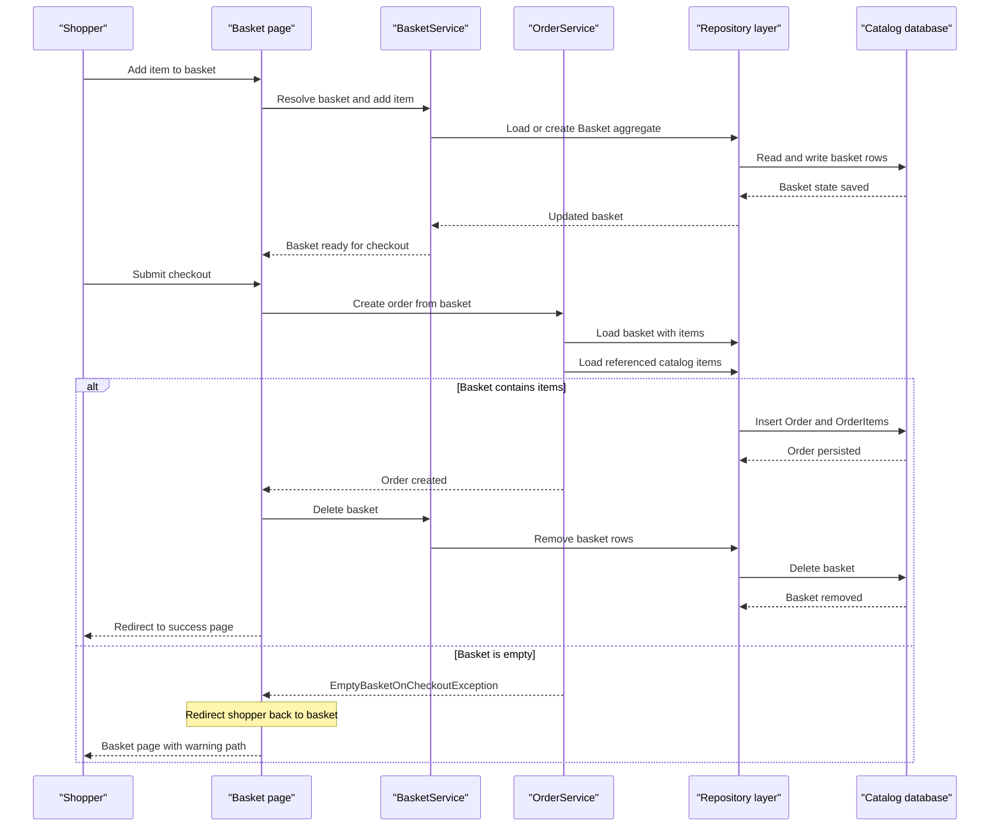

# Core Business Workflows

eShopOnWeb models a simple online store where shoppers browse a catalog, manage a basket, and place orders, while administrators maintain catalog data through a hosted admin experience. The business logic intentionally stays compact, making the repository a good example of domain services and modular web workflows rather than a full commerce platform.

## Domain Entities

| Entity | Service / Bounded Context | Description | Key Relationships |
|---|---|---|---|
| CatalogItem | Catalog | Sellable product with name, picture, price, brand, and type | Belongs to one `CatalogBrand` and one `CatalogType`; appears in baskets and orders |
| CatalogBrand | Catalog | Brand taxonomy for catalog browsing and admin maintenance | Groups many `CatalogItem` records |
| CatalogType | Catalog | Product type taxonomy | Classifies many `CatalogItem` records |
| Basket | Shopping | Shopper-owned working cart before purchase | Contains many `BasketItem` lines |
| BasketItem | Shopping | Quantity and price snapshot for an item currently in a basket | References a `CatalogItem`; belongs to one `Basket` |
| Order | Ordering | Completed purchase with shipping destination and item snapshots | Contains many `OrderItem` lines |
| OrderItem | Ordering | Purchased item snapshot captured at checkout | Belongs to one `Order` and stores ordered-product details |
| ApplicationUser | Identity | Registered storefront or admin account | Can own baskets and orders through identity name matching |

## Service-to-Domain Mapping

| Service | Domain Context | Owned Entities | External Dependencies |
|---|---|---|---|
| Web | Catalog browsing, basket, checkout, account management | `CatalogItem`, `Basket`, `BasketItem`, `Order`, `OrderItem`, `ApplicationUser` views | SQL-backed repositories, ASP.NET Identity, hosted Blazor admin client |
| PublicApi | Catalog administration | `CatalogItem`, `CatalogBrand`, `CatalogType` | Shared SQL-backed repositories and ASP.NET Identity |
| ApplicationCore | Domain orchestration | Basket and order aggregates plus specifications | Repository abstractions and URI composition |
| Infrastructure | Persistence and identity integration | EF Core contexts and Identity entities | SQL Server / LocalDB / InMemory providers |

## Primary Workflows

### Workflow 1: Browse and filter the catalog

1. A shopper lands on the storefront and requests catalog data through the Web host.
2. `CachedCatalogViewModelService` checks `IMemoryCache` for the requested page, brand filter, and type filter.
3. On cache miss, `CatalogViewModelService` queries `CatalogItem`, `CatalogBrand`, and `CatalogType` through repository specifications.
4. Product pictures are normalized through `IUriComposer`, then the Web host returns the page model to the browser.
5. Subsequent reads reuse the 30-second cache window, reducing database round-trips.

### Workflow 2: Add items to basket and checkout

1. A shopper posts product details from the basket page.
2. The page model resolves the current or anonymous basket identity from the authentication context or cookie.
3. `BasketService.AddItemToBasket` loads or creates the shopper basket, then adds or increments the item line.
4. During checkout, the page model updates quantities and calls `OrderService.CreateOrderAsync`.
5. `OrderService` validates that the basket exists and is not empty, loads current catalog item details, builds `OrderItem` snapshots, and persists a new `Order` aggregate.
6. After successful order creation, the basket is deleted and the shopper is redirected to the success page.
7. If checkout is attempted on an empty basket, `EmptyBasketOnCheckoutException` redirects the shopper back to the basket page.

### Workflow 3: Maintain catalog as an administrator

1. An administrator opens the hosted `/admin` experience served by the Web project.
2. The Web host returns `UserInfo` with claims and a JWT token for the signed-in user.
3. The Blazor admin client calls `PublicApi` catalog endpoints to list, create, update, or delete catalog items.
4. PublicApi endpoints validate route and payload contracts, load the target aggregate, apply updates, and persist through the shared repository layer.
5. Updated catalog data becomes visible to the storefront after cache entries expire or refresh.

## Cross-Service Data Flows

The most important cross-service flow is the admin experience: the Web host is responsible for user session management and token issuance, while the PublicApi owns the catalog-management HTTP contract. The browser therefore composes its work across both services: it authenticates against Web, obtains a bearer token, then sends catalog CRUD requests to PublicApi. Under the hood both services talk to the same SQL-backed catalog store, so the API boundary is service-level, not data-level. If the PublicApi is unavailable, the admin experience cannot modify catalog data, but the customer-facing storefront can still browse cached or directly queried catalog pages from the Web host.

## Business Workflow Sequence

## Business Rules & Decision Logic

- Basket ownership is determined by authenticated user name when signed in, otherwise by a long-lived anonymous basket cookie.
- Adding an existing product to the basket increases quantity instead of creating duplicate basket lines.
- Basket quantities must remain within non-negative integer bounds; zero-quantity lines are removed from the basket.
- Checkout requires a non-empty basket. The guard clause `EmptyBasketOnCheckout` blocks order creation when no purchasable items remain.
- Orders snapshot product name, picture, unit price, and quantity at checkout time so later catalog edits do not rewrite past order history.
- Admin catalog editing is role-protected through ASP.NET Identity and administrator role membership.
- Transactions remain implicit at the EF Core unit-of-work level; there is no saga or asynchronous compensation workflow in the repository.
