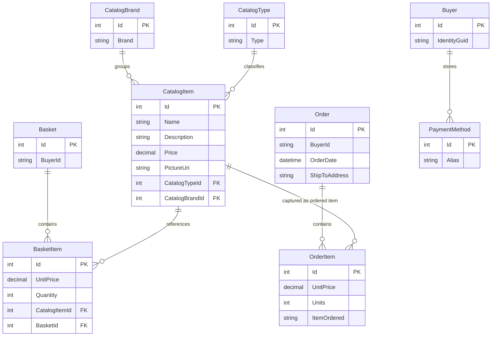

# Data Architecture & Persistence Layer

eShopOnWeb uses EF Core over a small set of storefront and identity aggregates, with SQL Server as the primary persistence technology and optional in-memory providers for lightweight runs. Data access is centralized through `CatalogContext`, `AppIdentityDbContext`, generic repositories, and specification objects rather than custom repository classes per aggregate.

## Database Configuration

| Service/Module | DB Type | Profile | Driver | Connection | Migration Tool |
|---|---|---|---|---|---|
| Web | SQL Server LocalDB | Default / Development | `Microsoft.EntityFrameworkCore.SqlServer` | `ConnectionStrings:CatalogConnection`, `ConnectionStrings:IdentityConnection` in `appsettings.json` | EF Core `Database.Migrate()` during startup seed |
| Web | SQL Server container (`azure-sql-edge`) | Docker | `Microsoft.EntityFrameworkCore.SqlServer` | `appsettings.Docker.json` points to `sqlserver:1433` | EF Core `Database.Migrate()` during startup seed |
| Web | Azure SQL databases | Production | `Microsoft.EntityFrameworkCore.SqlServer` | Connection string names resolved from Azure Key Vault via `AZURE_SQL_*` settings | EF Core `Database.Migrate()` during startup seed |
| Web / PublicApi | In-memory databases | When `UseOnlyInMemoryDatabase=true` | `Microsoft.EntityFrameworkCore.InMemory` | No external connection string required | No migrations; provider creates ephemeral stores |
| PublicApi | SQL Server LocalDB or Docker | Development / Docker | `Microsoft.EntityFrameworkCore.SqlServer` | Same `CatalogConnection` and `IdentityConnection` shape as Web | EF Core `Database.Migrate()` during startup seed |

## Data Ownership per Service

| Service | Tables Owned | ORM Framework | Caching | Notes |
|---|---|---|---|---|
| Web storefront | `Catalog`, `CatalogBrand`, `CatalogType`, `Baskets`, `BasketItems`, `Orders`, `OrderItems` | EF Core 8 via `CatalogContext` | `IMemoryCache` for catalog pages and lookups | Primary reader and writer for basket and checkout workflows |
| PublicApi | `Catalog`, `CatalogBrand`, `CatalogType` plus shared reads of other catalog-store data | EF Core 8 via `CatalogContext` | `IMemoryCache` registered, not heavily used in endpoints | Admin-facing API over the shared catalog store |
| Identity subsystem | ASP.NET Identity tables in the identity database | ASP.NET Identity on EF Core 8 via `AppIdentityDbContext` | Logout markers in `IMemoryCache` | Shared by Web and PublicApi for user and role resolution |

## Entity Model

## Key Repository Methods

| Service | Repository | Notable Methods | Purpose |
|---|---|---|---|
| Web / PublicApi | `IRepository<T>` via `EfRepository<T>` | `AddAsync`, `UpdateAsync`, `DeleteAsync`, `ListAsync(spec)`, `FirstOrDefaultAsync(spec)`, `CountAsync(spec)` | Shared generic CRUD and specification-based querying over catalog, basket, and order aggregates |
| Web | `BasketQueryService` | `CountTotalBasketItems(string username)` | Executes aggregate basket quantity calculation directly in SQL rather than in-memory |
| ApplicationCore | `BasketWithItemsSpecification` | Includes basket items by basket id or buyer id | Loads a complete basket aggregate for update, transfer, and checkout |
| ApplicationCore | `CatalogItemsSpecification` | Filters catalog items by id array | Resolves basket lines into the current product snapshots needed for order creation |
| ApplicationCore | `CustomerOrdersSpecification`, `OrderWithItemsByIdSpec` | Includes order items and ordered item snapshots | Drives order history and order detail views |

## Caching Strategy

The data layer uses in-process `IMemoryCache` rather than distributed caching. `CachedCatalogViewModelService` caches catalog item pages, brand lookups, and type lookups with a sliding expiration of 30 seconds, which reduces repeated read pressure against `CatalogContext` for popular storefront queries. `UserController` also writes short-lived logout markers into the same memory cache to help invalidate identity cookies by compound cache key.

## Data Ownership Boundaries

The application uses logical separation rather than database-per-service isolation. `CatalogContext` owns the storefront data model, and `AppIdentityDbContext` owns the authentication model, but both the Web and PublicApi hosts read and write those stores directly. Cross-service access therefore happens in two ways: the browser talks to `PublicApi` over HTTP for admin actions, and both hosts talk directly to the same SQL-backed EF Core stores internally. Read patterns are mostly query-driven through specifications and MediatR handlers, while write patterns mutate aggregates in place through `BasketService`, `OrderService`, and PublicApi catalog endpoints.

### Data Classification & Sensitivity

| Entity | Sensitive Fields | Classification (PII/PHI/PCI/None) | Controls in Place |
|---|---|---|---|
| CatalogItem / CatalogBrand / CatalogType | None identified | None | Standard SQL persistence only |
| Basket | `BuyerId` | PII when it maps to a user identity | No field-level masking or encryption configured in application code |
| Order | `BuyerId`, shipping address fields | PII | No field-level masking or encryption configured in application code |
| ApplicationUser (identity store) | `UserName`, `Email` | PII | ASP.NET Identity manages credentials; no explicit field-level encryption or masking configuration is present in the repo |
| Buyer / PaymentMethod | Identity reference only, no card data in repository | PII / None | No PCI storage detected; payment methods are modeled but not implemented with card details |
