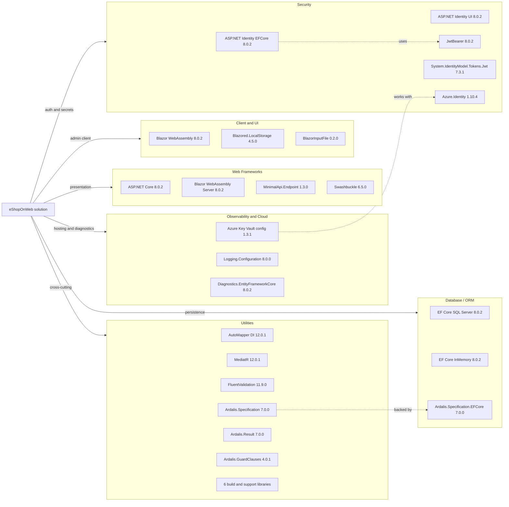

# Dependency Map

eShopOnWeb declares a centrally managed .NET 8 dependency set shared across ten projects, with most non-test packages concentrated in the web, API, data-access, and client-facing presentation layers. The solution has roughly 30 declared non-test packages and 9 test-scoped packages in central package management.

## Dependencies

### Dependency Summary

| Category | Count | Key Libraries | Notes |
|---|---:|---|---|
| Web Frameworks | 4 | ASP.NET Core, Blazor WebAssembly Server, MinimalApi.Endpoint, Swashbuckle | Powers the storefront, hosted admin shell, and PublicApi surface |
| Database / ORM | 3 | EF Core SQL Server, EF Core InMemory, Ardalis.Specification.EntityFrameworkCore | SQL Server is the primary store; InMemory is used for lightweight and test scenarios |
| Security | 5 | ASP.NET Identity, JwtBearer, Azure.Identity, System.IdentityModel.Tokens.Jwt | Covers cookie auth, JWT issuance, and Azure credential flows |
| Observability and Cloud | 3 | Azure Key Vault configuration, Logging.Configuration, Diagnostics.EntityFrameworkCore | No dedicated tracing stack; diagnostics stay within ASP.NET Core and EF packages |
| Client and UI | 3 | Blazor WebAssembly, Blazored.LocalStorage, BlazorInputFile | Supports the hosted admin client and browser-side state |
| Utilities | 8 | AutoMapper, MediatR, FluentValidation, Ardalis.* libraries | Domain helpers, mapping, CQRS, validation, and build-time tooling |

### Version & Compatibility Risks

The solution is aligned to .NET 8 today, but several packages already show upgrade pressure: `Azure.Identity` 1.10.4 and `System.Text.Json` 8.0.3 have known advisories surfaced by restore and upgrade assessment tooling, and legacy utilities such as `BlazorInputFile`, `BuildBundlerMinifier`, and `Microsoft.Web.LibraryManager.Build` are likely to need review when targeting newer frameworks such as `net10.0`.

### Notable Observations

- Central package management in `Directory.Packages.props` keeps versions consistent across all application and test projects.
- The repository uses both server-rendered ASP.NET Core and a hosted Blazor WebAssembly admin client, so presentation dependencies span classic MVC and browser-side packages.
- Security-related concerns are split between ASP.NET Identity packages and Azure credential/configuration packages, which is useful for modernization planning because authentication and secret storage are separate concerns.
- There is no separate messaging or distributed caching dependency tree; the application remains a modular monolith with direct database access and in-process caching.

## Test Dependencies

| Framework | Version | Notes |
|---|---|---|
| xUnit | 2.7.0 | Primary unit, integration, and functional test framework |
| xunit.runner.visualstudio | 2.5.6 | Visual Studio and `dotnet test` runner integration |
| xunit.runner.console | 2.7.0 | Additional console runner for unit test execution |
| MSTest.TestFramework | 3.2.2 | Used by `PublicApiIntegrationTests` alongside MVC test hosting |
| MSTest.TestAdapter | 3.2.2 | Enables MSTest discovery in the integration test project |
| Microsoft.NET.Test.Sdk | 17.9.0 | Standard test host infrastructure |
| Microsoft.AspNetCore.Mvc.Testing | 8.0.2 | Boots the Web and PublicApi apps in test servers |
| NSubstitute | 5.1.0 | Mocking library used in unit and integration tests |
| coverlet.collector | 6.0.2 | Coverage data collection |

Total test-scoped dependencies: 9

Test coverage includes unit, integration, functional, and API-hosted tests, which is a healthy baseline for modernization work. The only notable concern is that some older runner and MSTest helper packages may need version alignment if the solution moves beyond .NET 8.
